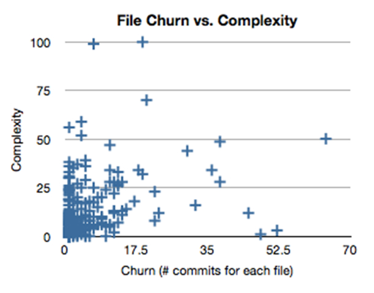

# Getting Empirical about Refactoring

by Michael Feathers

https://www.stickyminds.com/article/getting-empirical-about-refactoring

> Often when we refactor, we look at local areas of code. If we take a wider view, using information from our version control systems, we can get a better sense of the effects of our refactoring efforts.

🏷️ Tags: `agile`, `refactoring`, `churn`, `complexity`, `vcs`, `metrics`, `legacy-code`

## Introduction

* Most effective approach for refactoring: making it part of your daily practice is the way to go
* The net effect of this is that some parts of our code get better over time and other parts don’t
* The only problem with this chain of reasoning is that it’s hard to be diligent
  * So, we can gather information that helps us understand the impact of our refactoring decisions
  * Metrics from our version control system (file churn)
  * Metrics from current complexity

## File churn

* Number of commits for every file in a particular project’s code repository. The files are sorted in order of increasing commits
  * Also known as the number of times a file has been modified

* Typical scenario in most of the code repositories is: we can see that there are some files that have been changed extremely frequently, but the vast majority have only a few changes
* Looking at the figure (...) we should concentrate on the files on the right side of the graph. Unfortunately, this isn’t the complete picture

## Complexity

* To narrow down our refactoring candidates even further, we can take complexity into account

* The upper right quadrant is particularly important
  * These files have a high degree of complexity, and they change quite frequently
  * These classes are particularly ripe for a refactoring investment
* In healthy code, most of the files are in the lower left quadrant
  * I call this the *healthy closure* region
  * Abstractions here have low complexity and don’t change much
* The upper left is what I call the *cowboy* region
  * This is complex code that sprang from someone’s head and didn’t seem to grow incrementally
* The last region—the bottom right—is very interesting. I call it the *fertile ground*
  * It can consist of files that are somewhat configurational, but often there are also files that act as incubators for new abstractions
  * The files churn frequently, but their complexity remains low

## Conclusion

* I've been finding that this "churn vs. complexity view" helps me
  * Finding good refactoring candidates
  * Giving me a good snapshot view of the design, commit, and refactoring styles of a team
* Quite often, metrics views of code are restricted to static measures of code quality. Adding the time dimension through VCS history gives us a broader view
* We can use that view to guide our refactoring decisions
