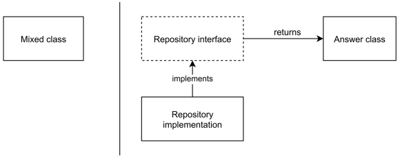

# Advanced Web Application Architecture

by Matthias Noback

------

> The missing manual for making your web applications **future-proof**
>
> Web applications deserve to outlive the currently fashionable framework. Your **application's core use cases deserve to be decoupled from their surrounding infrastructure**. And all of your domain-specific code **needs to be testable**; it has to be tested after all.
>
> This book helps you get your web applications back in shape. It contains many **techniques for decoupling from infrastructure** (like the framework, the database, or remote web services).

* [Leanpub](https://leanpub.com/web-application-architecture/)
* [Source code application sample](https://enjoy.gitstore.app/repositories/matthiasnoback/read-with-the-author)
* [Link registry for the book](https://advwebapparch.com)

Related resources

* Noback's blogposts
  * [Is all code in vendor infrastructure code?](https://matthiasnoback.nl/2020/02/is-all-code-in-vendor-infrastructure-code/)
  * Dividing responsibilities - [Part 1](https://matthiasnoback.nl/2019/07/dividing-responsibilities-part-1/) and [Part 2](https://matthiasnoback.nl/2019/07/dividing-responsibilities-part-2/)

------

## Preface

* The characteristics of some common types of objects: *controllers*, *entities*, *value objects*, *repositories*, *event subscribers*, etc. (...) how these different types of objects find their natural place in a set of architectural layers
* This book is a showcase of design patterns, about how these different objects work all together in a "well-architected" application
  * As a guide to decoupling your domain model and your application's use from the infrastructure (the framework, the database, and so on)
* Start using a standard set of layers (called **Domain**, **Application**, and **Infrastructure**) you can easily mark:
  * your **decoupled use cases** code as **Ports**
  * and the **supporting implementation** code as **Adapters**
* Using layers, ports and adapters → A great way to standardizing your high-level architecture
  * If your app is supposed to live longer than two years → decoupling from infra is a safe bet
  * If not, that might be a good reason not to care about
* Software **always** becomes a mess, **even** if you follow all the known best practices for software design. But with this practices, it **takes more time** to become a mess

## Part I. Decoupling from infrastructure

### Introduction

* Why is separating infrastructure concerns from your core application logic so important?
  * It leads to a domain model that can be **developed in a *domain-driven* way**
  * It leads to application code that is very **easy to test**, and to develop in a **test-driven way**
* Make a **clear distinction** between the core code of your application, and the infrastructure code that supports it
* Both types of core are **equally important**, but thet **shoudn't live together** (in the same classes, neither in the same layer)
* Distinction between infrastructure code and non-infrastructure code (core code) → **Not all code in vendor is infrastructure code**
  * Usually, most of the code in `vendor/` should be considered infrastructure code (your web framework which facilitates communication with browsers and external systems via HTTP, the ORM which communicates with the database, etc.)
  * Nevertheless, code placed in a particular directory **doesn't determine** whether or not something is infrastructure code
  * What matters is **what** the code **does**, **and what it needs** to do that (see the rules)
  * Some `vendor/`code could be considered core code, **even though** it's not written by you or for your application specifically
* We'll define core code by introducing **two rules for it**. Any code that **doesn't follow both rules at the same time**, should be considered infrastructure code
  * **Rule 1. No dependencies on external systems**. Core code doesn't directly depend on external systems, nor does it depend on code written for interacting with a specific type of external system
  * **Rule 2. No special context needed**. Core code doesn't need a specific environment to run in, nor does it have dependencies that are designed to run in a specific context only
* Notes about the Rule 1
  * An external system is something that **lives outside** your application (a database, a remote web service, the system's clock, the file system, etc.)
  * Core code should be able to run without these external dependencies
  * When code follows the first rule, it means you can run it in **complete isolation**
  * Automated test for core code will be **very easy to write** (no database setup/teardown, no internet connection, no hard disk I/O, etc.)
* Notes about the Rule 2
  * Only if code doesn't require a special context, **and also hasn't been designed** to run in a special context, can it be considered core code
  * Not having to create a special context for code to run it makes easy to write automated tests
* All of the domain code and the application's use cases should be core code, and **not rely on or be coupled to** surrounding infrastructure

**As a summary**

* Distintion between core and infrastructure code
  * **Core** code is code that can be executen in **any context**
  * **Infrastructure** code is the opposite, it **needs external systems, special setup, or** is designed to run in a **specific context** only

### The domain model

When we deal with domain models, we have to cover:

* Extracting an entity and a repository (from code that interacts with databases)
* Using an entity to protect the model (against inconsistent data)
* Mapping the entity to a database table (using a repository pattern)
* Providing an entity witg identity (**before** saving it)

#### SQL statements all over the place

First approach is using SQL statements all over the place. Why bad?

* This approach ends up with a mixed code in controller: database code, exposed database estructure, SQL code mixed with PHP one, code not object oriented, no use of entity pattern, etc
* So, this way is hard to find the "story" (*the intention*) or scenario (*use case*) of the controller's action
* Lot of implementation details that obscure the view of higher level steps of the scenario
* Mixing high-level steps (like "save order") with low-level implementation details
  * This directly couples the use case itself to any related technological decisions
  * This makes it very dificult to change directions later on

#### Trying to fix it with a table data gateway

Second approach. Trying to fix it with a [Table Data Gateway](https://www.martinfowler.com/eaaCatalog/tableDataGateway.html) (TDG)

* Traditional solution: pushing SQL statements outside of regular code, using the TDG pattern
* TDG hides the SQL statements (or other implementation details related with databases) behind a simple interface per database table
* In this way, the controller intention is definitely easier to understand, what's going on
* Anyway, the code still remains very table-oriented way, so:
  * We are still very much coupled to the technological decisions we are making in the code
  * And we're stuck using a relational database (table-oriented)
* More problems are that there's nothing preventing us from inserting inconsistent values within the model fields
* TDG is not able to protect the internal consistency of a model

#### Designing an entity

* Before saving an entity (an order, for instance) we should make sure it's complete and correct
* We also want to make sure that what ends up in the database, can safely be used by other parts of the application
* The client has to supply all the required arguments to create an entity, using its constructor
  * We can improve the constructor by doing some basic checks inside of it, ussing assertions
* The entity validates its constructor arguments using assertions
  * Assertions prevent an entity object from being instantiated with invalid data
  * They can provide **basic consistency** for the data it holds (*Sidenote: just basic consistency, no business rules at all*)
* Can we use these assertion functions for validating user input?
  * No. Assertions won't be very useful when we need to validate user input
  * Instead, they should be used by objects as a way to **protect themselves** against incomplete, inconsistenmt or meaningless data
* When we can can call an object an Entity?
  * Is a stateful object that **guarantees its own consistency**
  * Also, is going to be **persisted somehow** (doesn't need to be in a database)
  * It has an identity, a unique value that identifies itself from the other entities

* If we still use the TDG pattern, in order to save an entity we still need a map of columns to values. An associative array (a map) that knows the structure of the table and links it with its values

  * So, it seems that the thing we want to save (an entity, an order e.g.) and the thing that can save it (a TDG, e.g the `OrdersGateway`) turn ou to be incompatible
  * Anyhow, we still want to save the `Order`entity to the database, somehow. We need to find a diferent design for the thing that can do this


#### Introducing a repository

[Repository](https://martinfowler.com/eaaCatalog/repository.html)

* If a certain facility is not yet available in a project, you can apply a programming trick: act as if it was already available

  * Sample: you're looking for a "thing" that can "save" an "Order" to "the database"

  * Just imagine that the thing already exists. Start using it

    ```php
    $order = new Order(/*...*/);
    $lastInsertedId = $orderSaver->insert($order);
    ```

* "Object savers" are usually called repositories. So they are a solution to a common problem: the need to save a domain object, and later reconstitute it

* It's good know that `save()` method has a symmetrical counterpart called `getById()`

  ```php
  interface OrderRepository
  {
      public function save(Order $order): void;
      public function getById(int $orderId): Order;
  }
  ```

#### Mapping entity data to table columns

* Again, the repository needs a map of columns (structure) and values

* Writing an implementation that actually does (saving an entity to the database) is not as straighforward as it seems

* There're different options here

  * **Using an [ORM](https://en.wikipedia.org/wiki/Object-relational_mapping)**

    * This allows to add mapping configuration between the entity properties and the database-table fields
    * Repository is now implemented by injecting an entity manager that interacts with the ORM
    * This solution saves you lot of time, but it may also get you into trouble
      * Example with Doctrine ORM, the problem is not doctrine itself, but using **generic abstractions**
      * Hiding away so many implementation details and so much "magic" behind a single abstract `EntityManagerInterface` means you'll run into trouble sooner or later
    * Several advantages to using a popular ORM
      * Extensive documentation, online examples, etc.
      * Out-of-the-box solutions for common problems like data migrations, fixture loading, etc.
    * It's okay to use an ORM? Rules you can use to stick with it:
      * Only use **simple mapping configuration**. No table inheritance, no "embeddables", no custom types, etc. Just simple mapping
      * Stick to one-to-many associations
      * Reference entities by their ID
      * Don't jump from entity to entity using association fields

  * **Manual mapping**

    * In the past few years, Noback comes to the conclusion more than once tht doing the mapping manuallt, that is, writing the code for this himself, this can be a pretty good solution

    * In this solution, the entity exposes its internal data as an array, doing the mapping inside the repository

      ```php
      final class Order {
          // ...
          public function mappedData(): array {
              return [
                  'field1' => $this->field1,
              ];
          }
      }

      final class SqlOrderRepository implements OrderRepository {
          // ...
          public function save(Order $order): void {
              // ...
              $data = $order->mapperData();
              // with this array, the repository can build the SQL statement
              // making a mapping between entity and database fields
          }
      }
      ```

    * The downside with this is that the `Order` entity has knowledge about the names and types of the database columns. This can be improved making the entity to expose its internal data

      ```php
      final class Order {
          // ...
          public function mappedData(): array {
              return get_object_vars($this);
          }
      }
      ```

    * But, in this way the downside is that it reduces the level of encapsulation of `Order`

      * A related problem with this is, whenever you rename a property, change its type, add or remove properties, you'd also have to go to the repository and change the corresponding mapping code

    * It will be very hard to refactor the `Order` if its internals are no longer private

      * The ability to freely change the internal structure of an obnject is what enables you to improve its design

* Having `mappedData` method where we have column names inside the entity... Doesn't that cause a mix of infrastructure and core code?

  * No. To demostrate that having column names inside an entity class does not automatically turn it into infrastructure code, let's check the rules
  * Has the code of this method dependencies at all? → No
  * Can `mappedData()` run in any context and/or environment, without special setup? → Yes
  * Does `mappedData()` depends on external systems, or has code written to interfacting with a specific type of system? → No
  * So, `mappedData` complies with both rules for core code. because it only does some simple transformations on values in memory (no more)

* How about adding Doctrine mapping annotations to your entity, like `@Entity`, `@Table`, `@Column' , ...?

  * Does that result in mixed code, infrastructure / core code? → No
  * Just instantiating an entity with mapping annotations doesn't require any special setup
  * Calling any method doesn't require any external dependencies to be available
  * So, it should still be considered core code, not infrastructure code

* However, an entity with Doctrine annotations or a `mappedData` method does still contain technical implementation details (like table and column names, column types)

  * So, when you get to the point where you need/want to switch databases after all, you will still have to modify this code
  * *Sidenote*: Anyhow, it's still core code!

#### Generating the identifier earlier

* Previous repository presented the save method in this way

  ```php
  public function save(Order $order): int;
  ```

* By introducing the `OrderRepository` we hide most of the implementation details related to saving orders into database

* But there is one left: the ID of the order:

  * We are saving an inconsistent Order (without id), then we get the last ID and returns it
  * That "last ID" (an integer one) still reveals that the mechanism used to persist an Order uses an auto-incrmeenting integer column dfor the primary ID of an order
  * Not every database technology will support auto-incrementing ID columns, (*Sidenote*: or `int`values for that)
  * Another problem is that the Order entity is supposed to be complete from uts beginning
    * It should hold the minimum set of data, in order to be useful, and consistent in its behaviour
    * Order isn't consistent until the database has finished saving it... this is not good

* So, is better to provide an entity (Order, e.g) with an ID at the moment we instantiate. As a required constructor argument

* Also, delegate the creation of next identities to the repository

  ```php
  interface OrderRepository
  {
        // ...
        public function nextIdentity(): int;
  }
  ```

##### Naive impelentation of `nextIdentity()`

```php
public function nextIdentity(): int
{
    return (int)·this->connection-->execute(
      'SELECT MAX(id) AS highestId FROM orders'
    )->fetchColumn(0) + 1;
}
```

* It has problems, if the application has many concurrent users

##### Naive implementation but using a sequence table

* If you are having concurrency issues, you could switch to another solution with a sequence table at datanase-level

#### Using a value object for the identifier

* To fully encapsulate the actual data type of the identifier, wrap it inside a value object
* This makes the actual identifier a mere implementtion detail of the entity
* We can add a simple `asString()` method to the `OrderId` object value

#### Active Record versus Data Mapper

* [Data Mapper](https://martinfowler.com/eaaCatalog/dataMapper.html) design pattern. [Active Record](https://www.martinfowler.com/eaaCatalog/activeRecord.html) one
* A common alternative for storing entities is the Active Record design pattern
* The entity will be able to load itself from the database, and it can save and delete itself as well

```php
final class Order ActiveRecordEntity
{
    public static function getById(int $orderId): self {/*...*/}
    public function delete(): void;
    public function save(): void;
    // ...
}
```

* There are downsides to it from a design perspective
  * We loose the isolation we need for proper unit testing, by inheriting infrastructure code
  * This code is specific to the framework that owns `ActiveRecordEntity`, so you are making your domain model directly coupled to, and only functional in the presence of that framework
  * Clients of `Order`can do many more things with the object than they most likely should ne allowed to do
* By introducing an abstraction you achieve decoupling from surrounding infrastructure
* Comparing these design patterns, it's clear that data mapper allows for a better separation between core and infrastructure code

#### Rules

The Noback's advice is to mitigate some of the downside by keeping yourself to the following rules:

* Design your Active Record (AR) entities like real entities
* Don't use the same AR entity for changing state and retrieving state
  * Separate your model into a write and a read model
* Don't use your AR entity to navigate from one AR entity to other AR entities
  * If you want to make a change to a different AR entity, fetch it by its ID from the corresponding repository
  * Ignore the fact that an AR entity provides typical service facilities, like saving and deleting
    * Keep using a repository and *[double dispatch](https://books.google.es/books?id=WVQF2PK2tlgC&pg=PA409&dq=%22double+dispatch%22)* to perform these tasks

```php
final class ActiveRecordOrderRepository implements OrderRepository {
    public function save(Order $order): void {
        $order->save();
    }
}
```

* Anyway, the problem doesn't fo away with this AR approach. There will be code inside your AR entity that is framework or ORM-specific

#### Summary

* Trying to separate core code from infrastructure one, we took an intermediate refqctoring step, introducing a table gateway
* Two known design patterns: Entity and Reposiroty
* The repository turned out to be a good place for generating IDs
* Using value objects for those IDs

### Read models and view models

* Different solutions for implementing a read model repository
  * Hiding query complexity behind view models
* Scenario: retrieving the price of an ebook
  * Hiding the low-level implementation details (database, ebooks table, price column, etc)
  * Do it behind a high-level interface, which represents what information we're interested in
* Entity to represent the ebook and retrieve it from its repository

#### Reusing the write model

* Assuming we already have an `Ebook` entity and an `EbookRepository` interface in our project

  ```php
  final class Ebook
  {
      private EbookId $ebbokId;
      private int $price;
      // ...
      public function changePrice(int $newPrice): void {...}
      public function show(): void {...}
      public function hide(): void {...}
  }
  ```

* Seems that the `Ebook`entity is a convenient object to quickly get the information. But there are a couple of issues with reusing an existing entity in a diferent context

  1. Existing object was not designed to **retrieve** information from. Instead, it was designed **to add** new ebooks to our catalog

     So, anywhere we load this entity, we do **with the intention** to manipulate it and save it. If we reuse it in a "retrieval context", we gain access to all other methods that can change state (`changePrice`, `hide`, `show`)

     It's generally a smart idea to limit the number of methods that a client of an object has access to

  2. About reusing objects in general, not just entities. Doing this, the object starts to play too many roles at the same time (...) Soon, it becomes too big to read the code and understand what it does (...) Also, object becomes *resistant* to change, which is a bad quality for objects in general

* But, without any reuse it would become really hard to accomplish anything

  * Keep track of the intended use of objects, and watch for tension in the design
  * You can prevent a lot of this design tension by introducing separate objects foir changing and retrieving information

* Client that needs an object to retrieve information (read) should not use the same object as client that want to make changes to it (write)

* `Ebook` read-only model that its intention is to know the price of the ebook

* Anyway, write `Ebook`entity can have some read methods (getters) that should be necessary as well. Like get the ID of the entity, or the internally recorded events

#### Creating a separate read model

* Frame the question in such a way that it's easy for you to ask. And design the type of answer you want to retrieve:
  * sample question: *give me the price of an ebook with ID <...>*
  * sample answer; an object that represents the price of the ebook (it's intention)
* Two options for modeling the question with code

  * the repository pattern, once more (more common solution)

    ```php
    interface EbookRepository
    {
        /** @throws CouldNotFindEbook */
        public function getById(EbookId $ebookId): Ebook;
    }
    ```

    Useful when you want to group and retrieve more information inside `Ebook`, the `price()` and `title()` for instance.

  * create classes with the same or a similar name as the entity classes themselves. In this case, you have to put the code in a different namespace, to make it easy to distinguish between the read and write model

    ```php
    interface GetPrice
    {
        /** @throws CouldNotFindEbook */
        public function ofEbook(EbookId $ebookId): int;
    }
    ```

    If on the other hand, you only need one single piece of information (the price), you could let go for this solution: a pseudo-entity

  * Taking the first or second approach, as always, would depend on your situation


#### First approach. Read model repository implementations

* Wheter a new Ebook **entity** gets created (by an employee, e.g), there should also be a corresponding `Ebook` **read model** that exposes the ebook price (to the clients e.g)
* Whenever the entity changes, the corresponding read model should also be updated

##### Sharing the underlying data usage

* The simplest solutions. The read model use the same data source of the entity. So, the read model's repository gets its data from the same table and creates an `Ebook read model from the entity's data source
* When write and read models share the same data source, this can lead to new problems
  * Sample: `price` column contains the price of the ebook, in cents. But what if the write model switches to a native decimal representation? The read model would start to provide bad prices, because "1.5€" in the database when cast to an integer (in the read model) will become 1 cent in the application
* One way to reduce the previous risk is to write integration tests for your read model repositories
* Another alternative, is having a single class implementing both the write and read model repository interfaces

##### Using write model domain events to synchronize the read model

* Dispatch a **domain event** for every important change inside the entity

* The read model is then able to update its own state based on the information contained in those events

* What is needed to have

  * An entity that can record domain events internally
  * A domain event for every state change that is relevant to the read model(s)
    * Sample: `PriceChanged` an object that holds the `EbookId`, as well the new price (`int`)
  * A service that subscribes to these domain events and updates the read model according to the changes indicated by the events

* Note that setting the price on the read model **isn't the same** thing as changing the price on the entity

  * The change on the entity is the real change

  * Updating the read model, we're merely **reflecting** that original/real change onto our read model (using information from the dispatched event `PriceChanged`)

    ```php
    final class UpdateEbookReadModel
    {
        // ...
        public function whenPriceChanges(PriceChanged $event): void
        {
            $readModel = $this->readModelRepository->getById($event->ebookId());
            $readModel->setPrice($event->newPrice());
            $this->readModelRepository->save($readModel);
        }
    }
    ```

    * what happens inside save() method? This is an infrastructural concern: do we save it to the same database where we save entities? different databases? are read models stored as documents within Elasticsearch? etc.
    * None of this really matters for the core of the application, since we already have a read model repository interface (a port, an abstraction) which indicates "*I have a particular need, but I don't care how you'll fullfill this need; don't care if you need to talk to something outside the application for it*"
    * What matters is that any client can use the repository interface to get the information it needs

##### Using value objects with internal read models

* A read model is often designed to supoprt a specific use case for one of its clients

* If clients code looks like

  ```php
  // ...
  $ebookPrice = $ebook->price(); // int
  $orderAmountInCents = (int)$request->get('quantity') * $ebookPrice
  // ...
  ```

* What happens if $ebook-price() returns a string instead of an integer?

  * Changing the underlaying data type of a read model's property will affect the clients of that read model

* By using a value object, we can ensure that clients won't rely on raw data, nor on the particular primitive type of that data

* An added benefit is that using value objects allows you to decouple from th einfrastructure

  * Clients can keep using value objects wven if the underlying data type changes

##### A specific typer of read model: the view model

* Introducing a dedicated read model and read model repository because an `OrderController` needed the price of an ebook, this could classify the resulting model as an **internal read model**, since the data it provides is **only used internally** (by the application itself) and never directly shared with or displayed to the user
* On the other hand, there're places in our application where we fetch data in order to show it to the user
* When we need to have a view model for users that needs to render a view model with an HTML template

```php
interface Ebooks
{
    /** @return array<Ebook> */
    public function listAvailableEbooks(): array
}
```

* This `Ebook` class is not the same as the entity class
* Objects of this type will serve as read models for displaying data on an HTML page
* Such read models can be calles **view models**, since they are used to dusplay data to users of external systems
* Most of the data exposed by a view model should be of type `string`, because rendering it (within a Twig template, e.g) is basically an exercise in string concatenation
  * In a view model, `price()` doesn't return a `Price` value object.Returns a string, properly formatted money, including the currency sign and with the correct precission
* Templates in particular shouldn't need to know anything about the domain objects that our application uses internally
  * This means, our view model should only return primitive-type values

##### “ I'm afraid we'll end up with too many classes... ”

* You will definitely have more classes and interfaces when you separate core from infrastructure code

* The interface represents the answer, and the other class is an implementation of the query interface

* After decoupling a query from underlying inrastructure, you will have three elements

  .

* If you want to decouple from infrstructure, this is the way to go
* Anyway, there're several ways to keep the number of elements manageable:
  * Only introduce an interface for objects that actually communicate with something outside your application (this saves some interfaces)
  * Combine several interface methods in a single interface
  * Let a single class implement multiples interfaces (this save some classes)
  * Reuse the "answer" class for different queries (this also saves some classes)
* Keep an eye on tension in the design. Reducing elements has also downsides
  * With fewer interfaces, it can be harder to replace an actual service implementation with a test double. If this happens, reintroduce the interface
  * An interface with many methods can give clients access to many unrelated methods
  * A class that implements multiple interfaces will become hard to maintain. So, only implement intefraces with the exact methods that are truly related
  * If a class starts to be used in too many places, it will be harder to change it, since there are many clients that need to be updated and may potentially break

##### Summary

* We recognize the need to get information about a related entity
* We decided not to combine write and read responsibilities in the same object
* An immutable `Ebook`read model, specialized in providing information; that comes with its own  read model repository interface
* Different alternstives to repository implementations
* Another need is to show some data to the user; created a dedicated view model

### Application services

* 

### Service locators

* 

### External services

* 

### Time and randomness

* 

### Validation

* 

### Conclusion

* 

## Part II. Organizing principles

### Introduction

* 

### Key design patterns

* 

### Architectural layers

* 

### Ports and adapters

* 

### Process modelling

* 

## Part III. Conclusion

### A testing strategy for decoupled applications

* 

### Context is everything

* 
