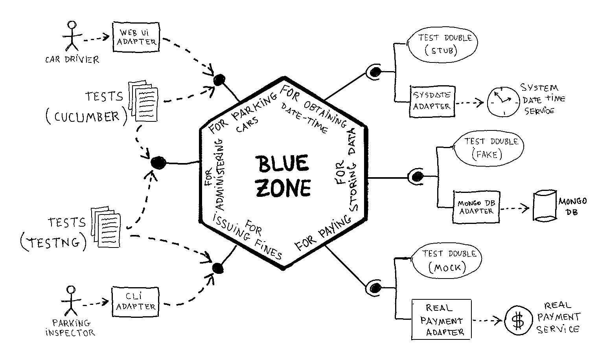
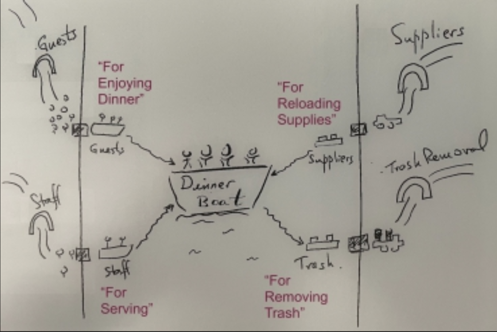
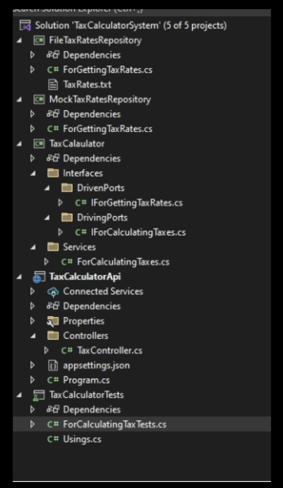

# Hexagonal Architecture Explained

by Alistair Cockburn and Juan Manuel Garrido de Paz

------

> How the Ports & Adapters architecture simplifies your life, and how to implement it

« _Looking at the screen of my laptop, I realized that it was full of code that didn’t let me understand what it did regarding business logic. From that moment I began to search until I discovered the architecture that decouples the business logic from the frameworks: Hexagonal Architecture, more correctly called Ports & Adapters. From that moment until now, I haven’t stopped reading and learning about this pattern._ »

Related resources

* [jmgarridopaz/discounter](jmgarridopaz/discounter) — An implementation of the application included in the "Sample Code" section of "Hexagonal Architecture" pattern
* [Hexagonal architecture](https://alistair.cockburn.us/hexagonal-architecture/)
* [Hexagonal Me](https://jmgarridopaz.github.io/), by Juan Manuel Garrido de Paz
* [Hexagonal Architecture (Ports & Adapters) The 2023 version](https://alistaircockburn.com/Hexagonal%20Budapest%2023-05-18.pdf)
* https://github.com/HexArchBook

------

## Introduction

* This is a preview edition. 1st edition may come next 2025
* Small sample code piece (copy, paste it, give it a try), brief timeline of the pattern, associated costs and benefits

```java
// (...)/ports/driving
interface ForCalculatingTaxes {
  double taxOn(double amount);
}

// (...)/ports/driven
interface ForGettingTaxRates {
  double taxRate(double amount);
}

// (...)
// implements a driving port, and uses a driven port
class TaxCalculator implements ForCalculatingTaxes {
  public TaxCalculator(
    private ForGettingTaxRates taxRateRepository
  ) {}
	public double taxOn(double amount) {
		return amount * taxRateRepository.taxRate(amount);
	}
}

// (...)
class FixedTaxRateRepository implements ForGettingTaxRates {
	public double taxRate(double amount) {
		return 0.15;
	}
}

// (...)
// In this tiny sample, Main acts both as the configurator and also the driving actor
class Main {
	public static void main(String[] args) {
    // Acts as the configurator
    ForGettingTaxRates taxRateRepository = new FixedTaxRateRepository;
    TaxCalculator myCalculator = new TaxCalculator(taxRateRepository);

    // Acts as the driving actor
    System.out.printin(myCalculator.taxOn(100));
}
```

* History and name of the pattern

  * 1988 Pain #1— 1994 Pain #2 — 2000 — 2005 "Ports & Adapters" — 2015 notions of Driving / Driven adapters — 2022 special case of "Component + Strategy" / *required interfaces* concept — 2023 "Configurable Receiver" pattern replacing the "Configurable Dependency" — 2024 This book

  * Why "Hexagonal Architecture"

    * It was a placeholder name before Alistair understood what the sides of the hexagon stood for
    * Not appropriate name, since number six has no meaning

  * History of the name — [Ward's wikiwiki site](http://c2.com/cgi/wiki?PortsAndAdaptersArchitecture)

    > *Somewhere in the mid-90s I started drawing a symmetric architecture in which (...) To break up perceptions about top and bottom and left and right, I drew it with a hexagonal shape (...) I could not identify think of what the "hexagon" meant, but knew it had to have facets, and no number smaller than 5 made visual sense (...)*

* Benefits of this pattern: **Testing** (run system-level tests without production connections; swap out the production connections), **Leakage protection** (detect whenever someone leaks UI and/or technology details into the business logic and **vice versa). Large system separations** (develop/test sections of code independently, connect them according to defined and tested interfaces). **Long-running systems** (replace connections over years). **Domain-Driven Design** (technology elements safety outside application boundary, then free to focus on the domain design)

* Complexity cost

  * Higher cost for type-declared languages than dynamic or type-inferred ones
  * Need of an instance variable / accessor for each driver actor
  * Adds a constructor parameter (or setter function) for each driven actor
  * In type-declared languages
    * You must declare "Required Interfaces"
    * Additional folder structure for the port declarations


### The Original Articles

* History of the pattern, evolution. Original 3 articles
* The Hexagonal (Ports & Adapters) Architecture — HaT Technical Report 2005.02. Date: 2005-09-04
* [Component-plus-Strategy generalizes Ports-and-Adapters](https://alistaircockburn.com/Component%20plus%20strategy.pdf) — Alistair Cockburn, 2022
* [Configurable Receiver Subsumes DependencyInjection and Dependency Lookup](https://alistaircockburn.com/Configurable%20receiver.pdf) — Alistair Cockburn, 2023

## Ports & Adapters defined

* Explains the pattern. Definition of terms. The four elements of the pattern (Apps, Ports, Actor, Adapters), the configurator. WHat is required and specified. Useful tricks

### Glossary

* **Application**, **App**, **Hexagon**, **Core**, **System**, **SuD**, **SuT**. All the business logic, without references to tech nor UI
* **Extended system**. The wider system, including adapters and directly connected technologies (databases, network, UI, external systems)
* **System Under Design** (SUD). Can be any sort of system: hardware, software, an organization, or any combination of those
* **Actor**. _Anything_ (no matter what) with behavior / A thing has behaviour if it is able to execute an "if" statement
* **Primary or driving actor**. Actor that calls / initiates  request / sends message to the app / service. Actors can be primary in some scenarios, secondary in others
  * It is any actor that drives the SUD
  * Analogy: *A Driving Actor presses the gas pedal, initiating action*
* **Secondary or driven actor**. A component or external system that the application interacts with to fulfill its tasks. It is “driven” by requests or commands from the application’s core
  * Analogy: *A Driven Actor is the engine or wheels, responding to the input to produce a result*
* **Interactor**. Piece of software that interacts direcly with the port
  * Analogy 1: Conductor of an Orchestra. The interactor ensures the musicians (driving and driven actors) perform their roles in harmony to produce the desired music (application behavior)
  * Analogy 2. Switchboard Operator. It connects callers (driving actors) to the right lines (driven actors) based on the context of the request
* **Interface**. Set of method definitions declsred by an actor. Specifies a contract
  * **Provided interface**. Defines the services offered by the app. Used by driving interactors, implemented by the app
    * Driving Actors (Adapters) interact with the provided interface of the application

  * **Required interface**. Defines the services needed by the app to perform its function. Implemented by the driven interactors
    * Driven Actors (Adapters) implement the required interface that the application core depends on
* **Port**. Provided or Required interface defined by the app. Created for some intention (eg. `ForPlacingOrders`) 
  * Boundary between the application core and the outside world
  * **Primary or Driving Port**.
  * **Secondary or Driven Port**.
* **Adapter**. Translates requests from an external actor linked to a specific technology, into technologically neutral requests at a port, and vice versa
  * **Primary or Driving adapter**.
  * **Secondary or Driven adapter**.


### Elements: App, Ports, Actors, Adapters

* This pattern is made by these four elements: **Application** (or system) aka the app; the **Ports**, the driving and driven external **Actors**; **Adapters** as needed at each port
* There is a fifth element (officially outside the pattern) that you need: the configurator. The code that connect these four parts
* The applicaion, app, or system
  * Whatever business logic you need. Written only in terms of the business
  * Technology-agnostic. No reference to any particular technology/platform connected to it
  * Ports & Adapters has you identify the places where your application meets the outside world
  * Creates a component, which declares two interfaces
    * Provided interface(s): set of services the app offers to the outside world
    * Required interface(s): for all external entities (promary or secondary) the app defines "I will only talk to you if you talk in my language", and explicitly defines that language
* The ports
  * Defines the boundaries of the application
  * Every interaction between the app and the outside world happens at a port interface
  * Each set of interactions **with a given purpose** (intention) is a port. Interactions grouped by their intentions
  * Convention name: "For doing something" (For + verb-ing + whatever else needed to make the purpose clear). Samples: "For managing he contents of the shopping cart", "For configuring the system", "For sending notifications"
  * Within type-declared languages (eg. Java) the port has to be declared explicitly
  * Within dynamic or type-inferred (eg. Ruby) ports are not explicitly visible
* The external actors
  * Actors that drive the app (Driving actors) — Primary
    * Any entity (human or electronic) that **kicks the app** into action
    * It makes a service request **of the app**
  * Actors that are driven by the app (Driven actors) — Secondary
    * Any entity (human or electronic) that the **app kicks** into action
    * Requesting a service from it
  * Match perfectly with the ports
    * Primary actors become driving actors, which interfact at the driving (primary) ports
    * Secondary actors become driven actors, which interact at the driven (secondary) ports
* The adapters
  * A human sitting at the computer can't directly call the app. Instead, they interact via some UI (CLI, GUI, voice, ...something)
  * These adapters convert human movements into the needed inerface, sllowing the app and the human to interact
  * Adapters are generally needed for ant sott of real.world technology
  * Adapters exist outside the app
* The configurator
  * Something has to connect all the pieces: tell the drivers how to reach the app. Tell the app which driven actors to use
  * It has to know all the players: the app, the driving actors (or their adapters), and the driven actors (or their adapters)
  * How you design the configurator is not specified by the pattern
  * In testing, the test cases act both as the configurator and the driving actor: creates and connects the players, and then drives the app

### Required constraints to meet the pattern

* App defines an interface (provided or required) for all external interactions
* App defines driving ports for the provided interfaces, and driven ports for the driven interfaces
* External actors are not allowed to access anything inside the hexagon directly
* Ports and interfaces, technology-neutral. They use terms hat only express business needs

### Non required things. Up to you

* The patterns says nothing about how to implement the configurator
* It also does not legislate how you name your ports. Nor how granular the ports are
* Nothing about how the code base is organized
* How you organize and design your adapters
* The pattern does not exclude the possibility that you have "nested Ports & Adapters"
* Nothing to say about how you structure your application internally. You're welcome to use DDD or not, separate functions from model or not, etc.

## Code Samples

* A series of samples in several langs. From dead simple to complete samples
* Explore samples, understand how the pattern functions in different envitonments

### The tax calculator

* Simplest one. We have just one driving and one driven port
* Extra: using a broker, instead of a fixed rate repository
  * Shows the use of Dependency Lookup instead of Configurable Receiver in order to configure the Driven Actor
  * Rate repository broker, tells the calculator what rate repository to use by country
  * Introduce a second driven port `ForGettingCountryBasedTaxRateRepository`
  * Second port with one function `repositoryForCountry(country)`
  * Need of a configurator for the broker port
    * One options may be to use constructor injection to srt the broker at the time the TaxCalculator is created

### The web-hexagon

* https://github.com/totheralistair/SmallerWebHexagon

* Tiny cms system. Illustration of a simple application with one user (left) port and one database (right) port

  * The user port is connected to either the web or to a test harness, with or without the server adapter
  * The database port looks up the rate in a database, either in-the-code database, or from a file

* Configurator

  ```ruby
  # run the Smaller Web Hexagon from a browser
  
  require './src/smaller_web_hexagon'
  require './src/rack_http_adapter'
  require './src/raters'
  
  hex = SmallerWebHexagon.new(InCodeRater.new)
  app = RackHttpAdapter.new(hex,"./src/views/")
  
  run app
  ```

### The BlueZone



* https://github.com/HexArchBook/bluezone_pro
* Several driving and driven actors
* Primary driving actors: car driver, parking inspector
* Secondary driven actors: Repository for different rates (by zones), repository for tickets, payment service
* Two driving actors and three driven actors. Five ports:
  * Driving: `ForParkingCars`, `ForCheckingCars`
  * Driven: `ForObtainingRates`, `ForStoringTickets`, `ForPaying`
* More driving ports can also be added. For instance, a port for certain kinds of configuring work: `ForConfiguringApp`

## FAQ — What and How?

### The dinner boat analogy 



### More about Ports and External systems

> *Make a driven port for an external system, not for a domain concept* — Juan

* The pattern says: Put a driven port interface for any "real world thing" (driven actor) that the hexagon needs to talk to
* Instead of putting a driven port for the domain concept, do it for the external system; to represent the conversation with an external system, not just the domain concept
* An external system is basically one whose interface your team can’t change

### How many ports should I have?

* Recommended is to begin with one port for each primary and secondary actor
* There is a rapid increase in complexity and decrease in value as you continue splitting
* The number of driven ports is determined by the number of external systems the app has to talk to

### Hoe do I structure the inside of my app?

* Just one warning is about making hexagons within hexagons, as this pattern does not next. Not impossible, but is easily possible to run into difficulty when trying it

### Where do i put my files?

A suggested folder structure



### What is the development sequence?

1. **Test-to-test**. Create the test as the fist driver of the app, and connect it to a test double
2. Real-to-test
3. Test-to-real
4. Real-to-real

* Alistair's preference is to always do 1 first
* Once step 1 is completed, the architecture is in place. After that, the rest cab be done in any order
* In order to change from one step to other, it is not mandatory to implement the whole business logic at once. The app does not have to be implemented at once for the first or any other step
  * See section 5.2 *How does this relate to Walking Skeleton*

## FAQ — Related Concepts

### How does this relate to use cases?

* The System Under Design in use cases is what we are calling the app
* Primary actors in Use-Cases language are Driving actors in Ports & Adapters language; Seconday actors are Driven actors
* Properly speaking, the concept of ports doesn't exist in use-case modeling

### How does this relate to Walking Skeleton?

* [Walking Skeleton](https://wiki.c2.com/?WalkingSkeleton)

  > a tiny implementation of the system that performs a small end-to-end function. It need not use the final architecture, but it should link together the main architectural components. The architecture and the functionality can then evolve in parallel

* Where Ports & Adapters defines the architecture, Walking Skeleton advises on the process of building it

  * It advises against building the whole application at once, even using only the test harnesses (Step 1 in the development sequence)
  * Instead, it advises to first create the initial nearly-empty transaction in the tests, then to connect the real technologies for that nearly-empty transaction

* You don't have to use Walking Skeleton

* Whole business logic can not be implemented at once for the first step in the sequence

  * you can do little tiny implementation in step 1, add real things in steps 2, 3, 4, ... then back to step 1, and so on

### Is the pattern symmetric or asymmetric?

* The pattern is symmetric, the implementation is asymmetric
* Other patterns, such as Model-View-Controller and its siblings, regulate only the driving side.
* Ports & Adapters differs in that it says the app can have no knowledge of what its external connections are made of, no matter whether they are driving or driven
* The app may never know its driving actors, but the configurator has to hand the app the secondary actors to use at the driven ports. This causes an asymmetry in the code, making for provided interfaces at the driving ports and required interfaces at the driven ports

### Layered, onion, clean, hexagonal: what is the difference?

* Ports & Adapters has only two layers: the inside (the app), and the outside (everything else)
* Ports & Adapters requires that you organize the external actors so they connect to specific ports
* A layered architecture has you separate code by concerns and arrange them from “higher” and “lower,” such that higher-level items call or have a dependency upon lower-level ones.More abstract concerns are placed higher in the architecture, while hardware and drivers sit on the bottom while policy-oriented items rise to the top

### How this relare to DDD?

* They work really well together. Consider Ports & Adapters (P&A) as an architectural precursor of DDD
* Can a bounded context (BC) have ports? Yes
* Are all BC implementations of the P&A pattern? No
* Are Anti-Corruption Layers (ACLs) the adapters of P&A? If a BC does not have ports around it, with their proper tests, then that BC doesn't capture a system boundary as is needed for P&A
* ACL from DDD is a broader concept than the adapter from P&A

### Is CQRS an example of Ports & Adapters?

* CQRS might be implemented using the P&A. Nevertheless, CQRS itself is not inherently an example of P&A

## Summary

* Synopsis of the book. Patern definition in short form

