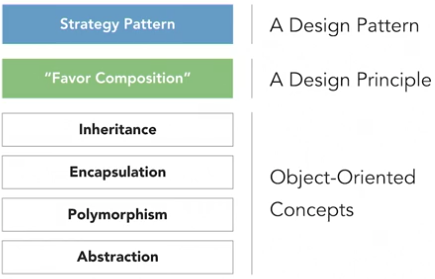

# Advanced Design Patterns: Design Principles

by Eric Freeman – Linkedin Learning

------

> You may be familiar with the fundamental concepts of object-oriented design—inheritance, encapsulation, polymorphism, and abstraction—but there is a set of higher-level design principles that can be used to take your design to the next level. Design principles guide your design decisions to produce software that is more reliable, flexible, and maintainable. Join instructor Eric Freeman as he goes beyond the standard concepts of object-oriented programming to introduce you to the most notable design principles, including encapsulate what varies, favor composition over inheritance, loose coupling, and the SOLID principles. Each lesson includes examples that show how these principles can be used to avoid costly design mistakes and create more maintainable, high-quality software

**Available resources**

-  [Course in Linkedin Learning](https://www.linkedin.com/learning/advanced-design-patterns-design-principles/)

🏷️ Tags: `course`, `2020`, `linkedin`, `oop`, `software-design`, `patterns`, `solid`

------

## Design principles

* Design principles help us to improve our object-oriented design
* They're guidelines and/or advice, but not absolute laws that have to be followed
* Help us avoid bad object-oriented design. Symptoms of this?
  * Regidity. Design that is rigid
  * Fragility. Hard to change due to some dependencies
  * Immobility. It's hard to reuse, not possible to reuse it in places it wasn't designed for
  * Inflexible design, hard to maintain and not resilient to change
* Design principles go beyond those core object-oriented principles: Inheritance, Encapsulation, Polymorphism, Abstraction
* Blindly following these core concepts can often lead in the other direction to the bad quality
* Design principles, bring an additional set of guidelines on top of the core object-oriented concepts
* They give us key insights into how to and not to approach object-oriented design

* For design patterns, we have standard catalogs that document them
* There are no standard catalogs for design principles
* That said, there are a set of fundamental principles:
  * **Encapsulate what varies**. It tells us that if we have part of our design that is changing, say with every new requirement, well then we should encapsulate that part away from the rest of the design
  * **Favor composition over inheritance**. It warrants against the overuse of inheritance and suggests composition as a powerful alternative for extending behavior in our designs
  * **Program to interfaces not implementations**. It encourages us to keep our designs high-level and referring where possible to abstractions or interfaces and not concrete implementations
  * **The loose coupling principle**. It tell us to strive for loosely coupled designs between objects that interact
  * Now there's another set of principles known as the SOLID principles
    * Which were introduced by the software engineer Robert Martin

