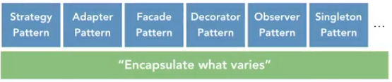
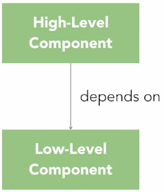
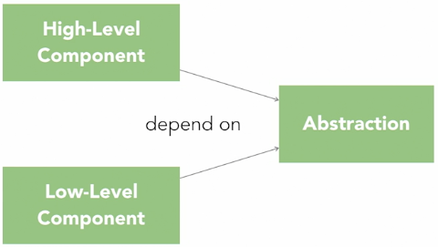

# Advanced Design Patterns: Design Principles

by Eric Freeman – Linkedin Learning

------

> You may be familiar with the fundamental concepts of object-oriented design—inheritance, encapsulation, polymorphism, and abstraction—but there is a set of higher-level design principles that can be used to take your design to the next level. Design principles guide your design decisions to produce software that is more reliable, flexible, and maintainable. Join instructor Eric Freeman as he goes beyond the standard concepts of object-oriented programming to introduce you to the most notable design principles, including encapsulate what varies, favor composition over inheritance, loose coupling, and the SOLID principles. Each lesson includes examples that show how these principles can be used to avoid costly design mistakes and create more maintainable, high-quality software

**Available resources**

-  [Course in Linkedin Learning](https://www.linkedin.com/learning/advanced-design-patterns-design-principles/)

🏷️ Tags: `course`, `2020`, `linkedin`, `oop`, `software-design`, `patterns`, `solid`, `principles`

------

## Design principles

* Design principles help us to improve our **object-oriented design**
* They're guidelines and/or advice, but **not absolute laws** that have to be followed
* Help us avoid **bad** object-oriented design. Symptoms of this?
  * **Rigidity**. Design that is rigid
  * **Fragility**. Hard to change due to some dependencies
  * **Immobility**. It's hard to reuse, not possible to reuse it in places it wasn't designed for
  * **Inflexible design**, hard to maintain and not resilient to change
* Design principles go beyond those core object-oriented principles: Inheritance, Encapsulation, Polymorphism, Abstraction
* Blindly following these core concepts can often lead in the other direction to the bad quality
* Design principles, bring an **additional set of guidelines** on top of the core object-oriented concepts
* They give us **key insights** into how to and not to approach object-oriented design

* For **design patterns**, we have standard catalogues that document them
* There are no standard catalogues for **design principles**
* That said, there are a set of fundamental principles:
  * **Encapsulate what varies**. It tells us that if we have part of our design that is changing, say with every new requirement, well then we should encapsulate that part away from the rest of the design
  * **Favour composition over inheritance**. It warrants against the overuse of inheritance and suggests composition as a powerful alternative for extending behaviour in our designs
  * **Program to interfaces, not implementations**. It encourages us to keep our designs high-level and refer, where possible, to abstractions or interfaces and not concrete implementations
  * **The loose coupling principle**. It tells us to strive for loosely coupled designs between objects that interact
  * Now there's another set of principles known as the **SOLID principles**
    * Which were introduced by the software engineer Robert Martin

## Encapsulate what varies

* Many consider it the most important design principle. It forms the basis for every design pattern

  * Think of the encapsulate what varies principle as kind of the master principle

* Identify the aspects of your application that vary and **separate them** from what stays the same

* Is the same code changing with **every** new requirement? Then, you've got a behaviour that really needs to be pulled out and separated from all the stuff that doesn't change

  * Then you can **alter or extend** the parts that vary but do it without affecting the parts that don't vary

* There are many ways to pull something out of your design to encapsulate it, and that's often where patterns actually come in because patterns demonstrate different methods of separating aspects of your design

  

* An example is the simple factory pattern, which is a very simple way of encapsulating what varies

* It's all about letting one part of the system vary independently of another part

  * To make use of encapsulating what varies, always look for code that's changing often
  * That's your signal that something needs to be pulled out and encapsulated on its own
  * Pay attention to how each pattern makes use of this principle, which let some parts of the system very independent of the other parts.

* The only constant thing about requirements is that they change

## Favour composition over inheritance

* Has-a is better than is-a
* With inheritance, duplication behaviours can be avoided
* Is a powerful technique, but also one can easily be overused.
* It's also a technique that can lead to designs that are far too rigged and not extensible
* Many design patterns make use of composition to solve different types of design problems
* Instead of inheriting behaviour, we can compose our objects with new behaviours
* Composition gives us more flexibility. Even allowing behaviour changes dynamically, at runtime

## Loose coupling

* Loosely coupled designs between objects that interact
* Components are independent, relying on knowledge of other ones as little as possible
* The dependency between components is reduced

## Program to Interfaces, not Implementations

* Components depend on / use contracts (*interfaces*) instead of concrete implementations
* This enables the loose coupling
* The principle encourages to program against abstractions, thinking in the intentions before going for the concrete implementation
* It allows to better exploit polymorphism by programming to supertypes
  * Supertypes saw as free classes from knowledge of concrete types
* Drives the code for caring about extensibility and maintainability, instead of just getting the more direct solution coupled to concrete implementations

## Single Responsibility Principle

* A class should have only one **reason** to change
  * The key is limiting the **impact of change** within a class
* As fewer responsibilities a class has, as smaller it gets, we minimize the probabilities of change of that class in the future
* Look at changes in your class: are parts of it **changing often, while others aren't**?
  * If so, that can be an indicator for separating them
  * If not, then there's really no reason
* SRP increase the number of components, so apply SRP only on real need

## Open / Closed Principle

* Our object-oriented design should be open for extension but closed for modification
* There are OO techniques for allowing us extend systems even if we can't change the underlying code
  * Many design patterns give us time-tested designs respecting this principle
* It enhances the maintainability and extensibility of a design

## Liskov's Substitution Principle

* We have to be careful when creating class hierarchies / inheritance
  * So easy to create hierarchies that don't adhere well with the OCP
* LSP strives to create hierarchies where you always are able to substitute subtypes for their base class
* Rather than viewing a subclass as an `IsA` super class, the LSP offers stronger guidance. It says that a subtype should be substitutable for the supertype
* In order to don't break the LSP, the code must be designed by contract
  * That is to specify a set of pre-conditions and post-conditions in a variance
  * Ensuring that we treat the inputs of our classes the same way, and also the return values. Having contracts that ensure it
* So, don't assume that an `IsA` relationship will always result in a hierarchy. You need to consider how substitutable a base class is for its supertype as well

## Interface Segregation Principle

* Classes should not be forced to depend on methods that they don't use
  * If this happens, then we talk that the interface is polluted
  * Interface pollution is related to low cohesion
* Cohesion describes how related a class or interfaces methods and data are
  * A class is highly cohesive if its methods are related
  * Low cohesion mean some methods aren't that somewhere and serve different purposes
* One way to think in cohesion is to think about the clients that make use of the class or interface
  * Do they use all the methods of the class?
  * Then, the class probably has high cohesion. If not, it may be low
* Highly cohesive classes and interfaces lead software that is generally easier to maintain and extend
* So keep an eye on cohesion in your interfaces. Keep them highly cohesive by segregating them and allowing clients don't being dependent on methods they're not interested in

## Dependency Inversion Principle

* High-level modules should not depend on low-level modules

  * It guides us to not design our high-level modules to depend on our low-level modules

* Typical Object-Oriented Thinking. We usually think of top-down decompositions

  

* Taking a problem, we factor it into a high-level set of components that depend on a low-level set of components

* The most common problem with this approach is that tightly couples out high-level components to our low-level ones

* Thinking with Dependency Inversion

  

* Tells us 2 things

  * High-level modules don't depend on low-level ones. Actually, both should depend on abstraction
  * Abstractions should not depend on details. Actually, details should depend on abstractions
