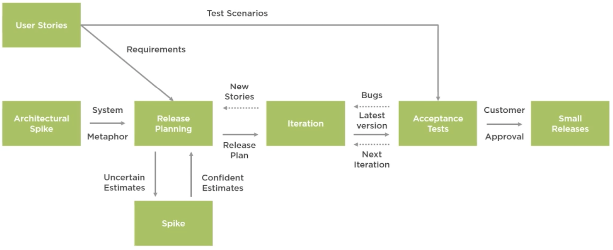

# Agile Fundamentals

by Stephen Haunts – Pluralsight

------

> Agile Fundamentals explores how working on an Agile project has benefits for your development team, your end users, and your organization as a whole

**Available resources**

* [Course materials](.assets/agile-fundamentals-pluralsight.md/agile-fundamentals.zip)

🏷️ Tags: `course`, `2020`, `pluralsight` `agile`, `extreme-programming`, `xp`

------

## Extreme Programming (XP)

### Introduction

* XP is a software development methodology, is intended to **improve software quality** and responsiveness to changing customer requirements
* It advocates **frequent releases** in **shorter cycles** of development
  * Intended to improve productivity
  * Introduce checkpoints where new customer requirements can be adopted
* Other elements of XP include
  * programming in pairs, or doing extensive code reviews
  * unit testing all of the code
  * avoiding programming of features until they're actually needed
  * a flat management structure
  * simplicity and clarity in code
  * expecting changes in customers' requirements as time passes and the problem is later understood
  * frequent communication with the customer
* XP takes its name from the idea that the beneficial elements of traditional software engineering practices are taken to extreme levels
  * As an example, code reviews are considered a beneficial practice → Taken to the extreme, code can be reviewed continuously with the practice of pair programming
* XP was created by Kent Beck during his work on the Chrysler Comprehensive Compensation System (C3) payroll project, around 1996 and 1999
  * C3 team was focused on business value the customers wanted, discarding anything else
  * The XP team at Chrysler was able to deliver their first working system within one year
* The first version of the rules for XP were published in 1999 by Don Wells

### Overview of Extreme Programming

* Software development discipline that organizes people to **produce high‑quality** software
* XP attempts to reduce the cost of changing requirements
  * By having **multiple short** development cycles
  * By **embracing changes**. They are a natural, inescapable, and desirable aspect of software development projects that should be planned for, instead of attempting to define a stable set of requirements up front
* 4xActivities; 5xValues; 3xPrinciples; 12xPractices; 29xRules
* XP introduces **4 activities**
  * Coding
  * Testing
  * Listening
  * Designing
* There are also **5 values** such as
  * Communication
  * Simplicity
  * Feedback
  * Courage
  * Respect
* **3 principles** such as
  * Feedback
  * Assuming simplicity
  * Embracing change
* There're also **12 practices** that split into **4 groups**. These groups are
  * Fine-scale feedback
  * Continuous process
  * Shared understanding
  * Programmer welfare
* Finally, there are **29 rules** split into the following **5 groups**
  * Planning
  * Managing
  * Designing
  * Coding
  * Testing

### Activities

#### Coding

* Is the most important product of the XP process → Writing the application code
* Coding helps to communicate thoughts about programming problems
* A programmer dealing with a complex programming problem and finding it hard to explain the solution to fellow programmers might code it and use the code to demonstrate what he or she means

#### Testing

* You ideally want to automate as much of your testing as possible so that you can repeat the testing frequently → This is done by writing unit tests
* Unit tests will test a small block of code in isolation of any external dependencies
* With XP, the developer will practice Test‑driven development
* The programmer will strive to cover as much of their code in unit tests as they can to give them a good level of overall code coverage

#### Listening

* Programmers must listen to what the customers need the system to do and what business logic is required (*requirements*)
* They must understand these needs and give the customer feedback about the technical aspects of how the problem can be solved or cannot be solved.
* The requirements are documented as a series of user stories
* These help to drive out a series of acceptance tests
  * Which help determine when a user story is completed and working as expected
* Once your user stories and acceptance tests are written, the developers can then start their planning and estimating

#### Designing

* Because software systems are very complicated, you'll need to perform a level of overall system design
* This doesn't mean that you'd need to create a several‑hundred page design document, as that could be quite wastefall
* But there is definite value in producing an overall system design where you look at the overall structure of the system and its dependencies
* In addition, you want to create a system where all of the components are as decoupled from each other as they can be
  * So that a change in one component doesn't require sweeping changes across the rest of the system

### Values

* XP is more a way to work in harmony with your personal and corporate values

#### Communication

* Good communication is essential to any project
* Honest, regular communication allows you to adjust to change
* XP puts developers and customers in constant communication
  * A customer works with you to set business priorities and to answer any questions about how the customer must analyze a project as if it's a real user and from a business point of view
  * The customer sees the team's progress every day and can adjust the work schedule as needed
  * The customer works with the developers to produce tests to verify that a feature is present and works as expected
  * When you have a question about a feature, you should ask the customer directly
* Communicating clearly about goal status and priorities allows you to succeed

#### Simplicity

* Build for simplicity
* Simplicity means building only the system that really needs to be build
* It means solving only today's problems today
  * Complexity costs a lot, and predicting the future is very hard
  * Armed with communication and feedback, it's much easier to know exactly what you need
* If you practice simplicity, it should be as easy to add a feature when it becomes necessary, as it would be to add it today

#### Feedback

* Learning from feedback
* Feedback means
  * Asking questions and learning from the answers
  * The only way to know what a customer really wants is to ask him
  * The only way to know if the code does exactly what it should do is to test it
* The sooner you can get feedback, the more time you have to react to it
* XP provides rapid, frequent feedback. Every XP practice is part of building a feedback loop
* The best way to reduce the cost of change is to listen to and learn from all of those sources as often as possible
* This is why XP concentrates on frequent planning, design, testing, and communicating
  * Rapid feedback reduces the investment of time and resources in ideas with little payoff
  * Failures are found as soon as possible within days or weeks rather than months or years
  * and this feedback helps you to refine your schedule and your plans
* It builds confidence that the system does just what the customer really wants

#### Courage

* Having courage
* Courage means making the hard decisions when necessary
  * If a feature isn't working, fix it
  * If some code isn't up to standard, improve it
  * If you're not going to deliver everything you promised on schedule, be upfront and tell the customer as soon as possible
* Courage is a difficult virtue to apply
  * No one wants to be wrong or to break a promise
  * The only way to recover from a mistake, though, is to admit it and fix it
* Delivering software is challenging, but meeting that challenge instead of avoiding it leads to better software

#### Respect

* Having respect for the team and project
* Respect underlies the other values previously mentioned
  * Every member of the team must care about the project
  * Intrinsic rewards like motivation, enjoyment, and job satisfaction beat extrinsic awards like employee‑of‑the‑month awards or physical rewards every time
  * Everyone gets and feels the respect they deserve as a valued team member
  * Everyone should contribute value to the team, even if it's simply enthusiasm
* Developers should always respect the expertise of the customers and vice versa
* Managers should always respect the developer's right to accept responsibility and receive authority over their work

### Principles

#### Feedback

* XP sees feedback as most useful if this is done frequently and promptly
* It stresses that minimal delay between an action and its feedback is critical to learning and making changes
  * The customer has a clear insight into the system that is being developed
  * They can give feedback and steer the development as needed
* With frequent feedback from the customer, a mistake in design decision made by the developer will be noticed and corrected quickly before the developer spends much time implementing it
* Unit tests contribute greatly to the rapid feedback principle
  * When writing code, running the unit test provides direct feedback as to how the system reacts to the changes made
  * That way, if a developer's changes cause a failure in some other portion of the system that the developer knows little or nothing about, the automated unit test suite will reveal the failure immediately, alerting the developer of the incompatibility of his change within other parts of the system, and the necessity of removing or modifying his change

#### Assuming simplicity

* Assuming simplicity is about treating every problem as if its solution were extremely simple
  * Traditional system development methods say,to plan for the future and to code for reusability
  * XP rejects these ideas
* XP applies incremental changes
  * For example, a system might have small releases every three weeks
  * Where many little steps are made, the customer has more control over the development process in a system that is being developed

#### Embracing change

* The principle of embracing change is about
  * not working against changes, but embracing them
  * For instance, if at one of the iteration planning meetings, it appears the customer's requirements have changed dramatically, programmers are to embrace this and plan new requirements for the next iteration
  * Under a more traditional development process like waterfall, changes in requirements are seen as a very bad and costly thing to happen

### Practices

#### Fine‑scale feedback

##### Pair programming

* Pair programming means that all code is produced by two people programming on one task at one workstation
  * One programmer has control over the workstation, and he's thinking mostly about the coding in detail
  * The other programmer is more focused on the big picture and is continually reviewing the code that is being produced by the first programmer
* Programmers trade roles after short periods of time
* The pairs are not fixed
* Programmers switch partners frequently so
  * everyone knows what everyone else is doing
  * everybody remains familiar with the whole system, even the parts outside their skill sets
* This way, pair programming can also enhance teamwork communication

##### Planning game

* Is the main planning process within XP
* The game is a meeting that occurs once per iteration, typically once a week or every two weeks
* The planning process is divided into two parts
  * The first part is release planning
    * This is focused on determining what requirements are included in which near‑term releases and when they should be delivered
    * The customers and the developers are both part of this meeting
    * Release planning consists of three phases
      * The first is the exploration phase
        * In this phase, the customer will provide a short list of high‑value requirements for the system
        * It will be written down on user story cards
      * Then there's the commitment phase
        * Where the business and developers will commit themselves to the functionality that will be included and the date of the next release
      * Then there's the steering phase
        * The plan can be adjusted, new requirements can be added, and existing requirements can be changed or removed
  * After release planning, we have the iteration planning
    * This plans the activities and tasks of the developers
    * In this process, the customer is not involved
    * Iteration planning is also split down into three phases
      * There's the exploration phase
        * Where the requirements will be translated into different tasks
        * The tasks are recorded on task cards
      * Then there's the commitment phase
        * The task will then be assigned to the programmers
        * The time it takes to complete this will be estimated
      * Then there's the steering phase
        * The tasks are performed and the end result is matched with the original user story
  * The purpose of the planning game is to guide the product into delivery. Instead of predicting the exact dates when deliverables will be needed and reduced, which is difficult to do
  * Tthe aim is to steer the project to completion

##### Test-driven development

* Unit tests are automated tests that test the functionality of pieces of the system being developed
* Within XP, unit tests are written before the code is written
* This approach is intended to stimulate the programmer to think about the conditions in which his or her code could fail
* XP says that a programmer is finished with a certain piece of code when he or she cannot come up with any further conditions in which the code may fail
* TDD proceeds by quickly cycling through a series of steps
  * Each step taking minutes at most, preferably much less
  * First, the programmers write a minimal test that should break the code because a functionality hasn't been fully implemented
  * Then the programmers verify that the code does indeed fail the test
  * Then the programmers will write the minimum amount of code to make the test pass
  * Then the unit tests are run to make sure that they pass
  * Then you should modify or restructure the code to a better design whilst the tests still pass

##### Whole team

* Within XP, the customer is the one who really uses the system
* XP says that the customer should be on hand at all times and available for questions
  * For instance, a team developing a healthcare dispensing system should include the pharmacy business partner to answer questions and assist with the design

#### Continuous process

##### Continuous integration (CI)

* The development team should always be working on the latest version of the software
* Since different team members may have versions saved locally with various changes and improvements, they should try to upload their current version to the code repository every few hours or when a significant break presents itself
* The source code repository should ideally run an automated build against the code as it is checked in and then run the automated unit tests
* This will test the integrity of the code being checked in
* CI will avoid delays later on in the project cycle caused by integration problems

##### Refactoring or design improvement

* Because XP advocates programming only what is needed today and implementing it as simply as possible, at times this may result in a system that is stuck
* One of the symptoms of this is a need for maintenance
  * Functional changes start requiring changes to multiple copies of the same or similar code
  * Another symptom is that changes in one part of the code affect lots of other parts
* XP says that when this occurs, the system is telling you to refactor your code by changing the architecture, making it simpler and more generic

##### Small releases

* The delivery of the software is done by frequent releases of live functionality, creating value for the end user
* The small releases help the customer to gain confidence in the progress of the projects
* This helps maintain the concept of the whole team as a customer can now come up with his suggestions on the project based on real experience

#### Shared understanding

##### Coding standards

* Coding standards is an agreed‑upon set of rules that the entire development team agrees to adhere to throughout the project
  * It specifies a consistent style and format for source code within a chosen programming language
  * as well as various programming constructs and patterns that should be avoided in order to reduce the probability of defects
  * It may be a set of conventions specified by the language vendor or custom defined by the development team
* These days, it's common to use some kind of automated tool to help enforce these standards
  * These tools will be set up with a predefined set of rules
  * these tools will highlight violations of the coding standards and in most cases offer suggestions for fixes
* Tools are excellent for ensuring consistency within a code base

##### Collective code ownership

* It means that everyone is responsible for all of the code
* Do, it means that everybody is allowed to change any part of the code, so all the programmers get to see all the parts of the code
* Pair programming contributes this practice by working in different pairs
* A major advantage for collective code ownership is that it speeds up the development process, because if an error occurs in the code, any programmer can fix it
* By giving every programmer the right to change code, there is a risk of errors being introduced by programmers who think they know what they're doing, but do not foresee certain dependencies
  * Sufficiently role‑defined unit tests help to address this problem
  * If unforeseen dependencies create errors and when the unit tests are run, they will show up as failures

##### Simple design

* Programmers should take a "_simple‑is‑best_" approach to software design
* Whenever a new piece of code is written
  * the developer should ask themselves, is there a simpler way to introduce the same functionality?
  * If the answer is yes, the simpler course should be chosen
* Refactoring should also be used to make complex code simpler

##### System metaphor

* The system metaphor is a story that everyone (customers, programmers, and managers) can tell about how the system works
* It's a naming concept for classes and methods that should make it easier for a team member to guess the functionality of a particular class or method from its name only
* For each class or operation, the functionality is obvious to the entire team

#### Programmer welfare

##### Sustainable pace

* The concept is that software developers should not work any more than 40‑hour weeks
* If there is overtime one week, then the next week should not include any more overtime
* Since development cycles are short cycles of continuous integration, the projects in XP do not follow the typical crunch time that other projects require, which require overtime
* Also included in this concept is that people perform best and most creatively if they are rested
* A key enabler to achieve sustainable pace is to frequently code merge and always have executable and test‑covered, high‑quality code
* The intense collaborative way of working within the team drives the need to recharge over weekends
* Well tested, continuously integrated, frequently deployed code and environments also minimize the frequency of unexpected production problems and outages and associated after hours, nights, and weekend work that is required

### Rules of Extreme Programming

#### Planning

##### User stories were written

* User stories are used to document the use cases for the system being built
  * They're used instead of large requirements documents, and they are written by the customers as things that the system needs to do for them
  * They're also used to create time estimates for the release planning meeting
  * They're in the format of about three sentences of text written by the customer in the customer's language
* The user stories are not meant to be technical
* User stories also help drive the creation of the exceptions tests
  * One or more automated exceptions tests should be created to verify the user story has been correctly implemented

##### Release planning

* A release planning meeting is used to create a release plan which lays out the overall project
  * The release plan is then used to create iteration plans for each individual iteration
  * It is important in this meeting for technical people to make technical decisions
  * and business people to make business decisions
* The essence of the release planning meeting is for the development team to estimate each user story in terms of ideal programming weeks
  * An ideal week is how long do you imagine it will take to implement that story if you had absolutely nothing else to do
* The customer then decides what story is the most important or has the highest priority to be completed

##### Make frequent small releases

* The development team needs to release iterative versions of the system to customers often
* Some teams deploy new software into production every day
  * At the very least, you'll want to get new software into production every week or two
* At the end of every iteration, you will have tested working production‑ready software to demonstrate to your customers
* The customers will then decide where to put that release into production

##### Project divided into iterations

* Iterative development add agility to the development process
* Divide your development schedule into a series of iterations of one's free weeks in length
* You should keep the iteration length consistent as this sets the pace for your project
  * It is this constant that makes measuring progress and planning simple and reliable in XP

##### Iteration planning starts each iteration

* You shouldn't schedule your programming tasks in advance
  * Instead, have an iteration planning meeting at the beginning of each iteration to plan out what will be done
  * Just in time planning is an easy way to stay on top of changing user requirements
  * An iteration planning meeting is called at the beginning of each iteration to produce that iteration's plan of programming tasks
* Each iteration is 1 to 3 weeks in length and user stories are chosen for this iteration by the customer from the release plan in order of the most valuable to the customer first
* Any failed acceptance test from the previous iteration are also selected to be fixed
* The customer selects user stories with estimates that total up to the project velocity of the last iteration
* The user stories and failed tests are broken down into programming tasks that will support them
  * Programming tasks are written for each user story
  * While user stories are in the customer's language, tasks are in the developer's language

#### Managing

##### Give the team an open work space

* Team Communication is very important. You can make communication on your team more effective by just removing any dividing barriers between desks to allow people to talk easier
* The ideal working environment is an open plan area where desks and computers are arranged to make pair programming easier
* The team should even share computers or their own computers are set up with a consistent development environment so the code can be worked on any machine with minimal disruption
* Try to include a large area for daily stand‑up meetings and add a conference table that gives you a home for group discussions that occur spontaneously throughout the day
* Adding white boards for design sketches and important notes or blank walls where user story cards can be taped, adds even more channels for communication

##### Set a sustainable pace

* To set your pace for projects, you need to take your iteration end seriously
  * You want the most completed, tested, integrated, production‑ready software you can get at each iteration
  * Incomplete or buggy software represents an unknown amount of future efforts so you can't measure it
  * If it looks like you'll not be able to get everything finished by the iteration end, have an iteration planning meeting and rescope the inspiration to maximize your project velocity
* Even if there is only one day left in the iteration, it is best just to get the entire team refocused on a single completed task than many incomplete tasks
* Working lots of overtime sucks the life and motivation out of your team
* When your team becomes tired and demoralized, they will get less work done, not more, no matter how many hours are worked
* You can't make realistic plans when your team does more work this month and less work next month
  * So instead of pushing people to do more than humanly possible, use a released pending meeting to change a project scope or timing

##### A stand-up meeting starts each day

* The purpose of a stand‑up meeting is to get the whole team to communicate so everyone knows what everyone else is doing
* A stand‑up meeting every morning is used to communicate problems, solutions and promote team focus
* Everyone stands in a circle to avoid long discussions
* During a stand‑up meeting, developers reports at least three things, what was accomplished yesterday, what will be attempted today, and what problems are causing delays

##### The project velocity is measured

* The project velocity is a measure of how much work is getting done in your project
* To measure the project's velocity
  * simply add up the estimates of the user stories that were finished during the iteration
  * You also total up the estimates for tasks finished during the iteration
* Both of these measurements are used for the iteration planning
  * During the iteration planning meeting, customers are allowed to choose the same number of user stories equal to the project's velocity measured in a previous iteration
  * Those user stories are broken down into technical tasks and the team is allowed to sign up to the same number of tasks equal to the previous iterations project velocity
  * This simple mechanism allows developers to recover and clean up after a difficult iteration and averages out estimates
* Your project velocity goes up by allowing developers to ask the customers for another story when their work is completed early and no cleanup tasks remain

##### Move people around

* You should try to move people around in a team to avoid serious knowledge loss and coding bottlenecks
* Cross training is often an important consideration in companies trying to avoid islands of knowledge, which are so susceptible to loss
  * Moving people around the code base in combination with pair programming, does your cross training for you
* Instead of one person who knows everything about a given section of code, everyone on the team knows much about the code in each section
* A team is much more flexible if everyone knows enough about every part in the system to work on it
* Instead of having a few people overloaded with work while other team members have little to do, the entire team can be productive

##### Fix XP when it breaks

* The XP methodology isn't perfect, it won't fit for all organizations and teams
* Follow the XP rules to start with, but do not hesitate to change what doesn't work out
* It doesn't mean the team can do whatever they want, though
  * The rules must be followed until the team decides to change them
  * All of your developers must know exactly what to expect from each other and having a set of rules is the only way to set these expectations

#### Design

##### Simplicity

* A simple design always takes less time to finish than a complex one
  * So, always do the simplest thing that could possibly work next
  * If you find something that is complex, replace it with something simple
* It's always faster and cheaper to replace complex code now before you waste a lot more time on it

##### Choose a system metaphor

* It's a naming concept for classes and methods that should make it easier for a team member to guess the functionality of a particular class or method from its name only
* The metaphor should be helpful in figuring out the overall design of the system
* The metaphor should also help the team find a common vocabulary, and the metaphor is useful in helping everyone reach agreement about our requirements

##### Use CRC cards for design sections

* Use class‑responsibilities‑collaboration cards (CRC) to help design the system as a team
* The biggest value of CRC cards is to allow people to break away from the procedural mode of thought and more fully appreciate object‑based technologies
* CRC cards allow entire project teams to contribute to a design
* The more people who can help design the system, the greater the number of good ideas incorporated
* Individual CRC cards are used to represent objects
  * The class of the object can be written at the top of the card, and responsibilities are listed down the left‑hand side
  * Collaborating classes are listed to the right of each responsibility
* CRC sessions start with someone simulating the system by talking about which objects send messages to other objects
* By stepping through the process, weaknesses and problems are easily uncovered
* Design alternatives can be explored quickly by simulating the design being proposed

##### Create spike solutions to reduce risk

* When developers are faced with a problem they don't know the answer to straightaway, create spike solutions to figure out the answer
* A spike solution is a very simple program to explore potential solutions
* Build a spike only to address the problem under examination and ignore all other concerns
* Most spikes are not good enough to keep, so expect to throw it away
* The goal is reducing risk of a technical problem or increase of reliability of a user story's estimate
* When a technical difficulty threatens to hold up the system's development, put a pair of developers on the problem for a week or two to help reduce potential risk

##### No functionality is added early

* You should aim to keep the system uncluttered with extra code that you think may be useful later on
* We're all tempted to add functionality now rather than later because we see exactly how to add it or because it would make the system so much better
* We need to constantly remind ourselves that we're not going to actually need it
* Extra functionality will always slow us down and squander our resources

##### Refactor whenever possible

* Keeping your code ready for unexpected changes is about simple design. Adding extra flexibility beyond what you need now always makes a design more complex
* Refactoring is a controlled technique for improving the design of existing code bases
  * It is essentially about applying a series of small behavior‑preserving transformations to your code
  * The cumulative effect of making lots of these code transformations is quite significant
* By doing them in small steps, you reduce the risk of introducing errors
* You also avoid having the system broken while you are carrying out the restructuring, which allows you to gradually refactor a system over an extended period of time

#### Coding

##### Customer is always available

* One of the requirements of XP is to have the customer available
* The customer is available not only to help the development team, but to be a part of the team as well
* All phases of an XP project require communication with the customer, preferably face to face and preferably on site
  * The one downside to this is that the level of involvement expected of the customer might be deemed to be very high if they are not used to working in this way

##### Code written to agreed standards

* Code must be formatted to agreed coding standards
* It's these coding standards that keep the code consistent and easy for the entire team to read and refactor
* Code that looks the same also helps to encourage collective code ownership
* It used to be quite common for a team to have a coding standards document that defines how the code should look including the team's best practices for styling and formatting
  * The problem with this is that people rarely read and let alone follow them
* Nowadays, it's much more common to use a developer productivity tool to automatically guide the user to using best practices
* These tools are so unbelievably powerful that it really makes it ficticious to write code that conforms to a set of coding standards

##### Code the unit test first

* When you create your unit tests first before writing actual code, you'll find it much easier and faster to create the code
* The combined time it takes to create a unit test and create some code to make it pass that test is about the same as just coding it straightaway
* Creating the unit test first helps the developer to really consider what needs to be done and the system's requirements are firmly nailed down by the tests
* There can be no misunderstanding of specification written in the form of executable code, and you also have immediate feedback while you work
* It is often not clear when a developer is finished with the necessary functionality and scope creep can occur as extensions and error conditions are considered, but if you create your unit test first, then you know when you are done
* A common way of working whilst pairing with another developer is to have one developer write a failing test, and then the other developer writes just enough code to make that test pass
* Then the second developer writes the next failing test, ready for the first programmer to write just enough code to make that test pass
* It almost feels like a game when you work in this way. I worked this way for quite a while I was working for an internet bank, and once you get a good piece of your programming pair, you can only be really productive very quickly

##### Production code is pair programmed

* Under XP, all code to be sent to production should be created by two people working together at a single computer
* Pair programming increases software quality without impacting time to deliver
* It can't feel counterintuitive at first, but two people working at a single computer will add as much functionality as two people working separately, except that it would be much higher in quality and with increased code quality comes big savings later in the project
* The best way to pair programming is just to sit side by side in front of the monitor and slide the keyboard and mouse backwards and forwards between the two and both programmers concentrate on the code being written
* Pair programming is a social skill that takes time to learn where you are striving for a cooperative way to work that includes give and take from both partners, regardless of corporate status

##### Only one pair integrates code at a time

* Without force controlling the integration of code, developers test their code and integrate on their machines believing all is well, but because of parallel integration with other programming pairs, there is a combination of source code which has not been tested together, which means integration problems can happen without detection
* Further problems happen when there is no clear cut latest version of the entire source tree. This applies, not only to the source code, but to the unit test suite, which must verify the source code's correctness
* It is now a common practice to use some form of continuous integration system integrated with your source control repository
  *  What this will do is when a developer checks in some code, the code is integrated with a main source code tree built and the tests are executed
  *  If any part of this process fails, the development team will be notified immediately so that the issue can be resolved
* It's also common to have a source control system failure check‑in if the compiling test one fails.
  * Once you submit your code to the repository, the code is compiled on a build server and the tests are executed
  * If this process fails for any reason, the developer will not be able to check in their code
  * This process helps to ensure your code base is in a continual working state and of high quality

##### Integrate often

* Developers should be integrated and committing code into the source code repository at least every few hours or when they have written enough code to make their current unit test pass
* In any case, you should never hold onto changes for more than a day
* Everyone needs to work with the latest version, and changes should not be made to obsolete code causing integration headaches
* Each development pair is responsible for integrating their own code whenever a reasonable break presents itself, and generally, as we discussed previously, will happen via an automated continuous integration system

##### Use a dedicated integration machine

* A single machine dedicated to sequential releases works really well when a development team is code located
* Generally, this will be a build server that is controlled by checking commits from a source control repository
* The latest combined unit test suite can be run before releasing when the code is integrated on the build machine
* Because a single machine is used, the test suite is always up to date
  * If unit tests pass 100%, the changes are committed
  * If they fail for any reason, then the check‑in is rejected and the developers have to fix the problem

##### Use collective ownership

* Collective code ownership encourages everyone to contribute new ideas to all segments of the projects
* Any developer can change any line of code to add functionality, fix bugs, improve designs, or refactor
* Not one person becomes a bottleneck for changes
* It can seem hard to understand at first and it can't feel inconceivable with an entire team can be responsible for a system's design, but it really makes sense not to have developers pegged into their own particular silos
* For a start, if you have developers who only know they're part of a system, what happens if that developer decides to leave?
  * You have a situation where you have to try and cram a lot of knowledge transfer into a short space of time
  * which in my experience, never works out too well as a developer is taking over and not building up a good level of experience in the new area
* By spreading knowledge around the team, regularly swapping pairs and encouraging developers to work on different parts of the system, you minimize risks to not having certain members of staff available

#### Testing

##### All code must have unit tests

* Unit tests are one of the cornerstones of XP
* You should test all the classes in your system except trivial getters and setters as these are usually omitted
* You would also create your test first before writing the actual application code
  * This doesn't mean you have to write all of the tests for the entire system up front
  * But before you tackle a new section, module, or class, you will develop a set of tests as you go along with the coding
* By incrementally building up your tests and writing code to make the tests pass, you will, before you know it, have created a robust testing suite that can be executed over and over again
* Unit tests are released into the code repository along with the code that they test, and code without test should not be released into production
* If a unit test is found to be missing, then it should be created at that time and checked in
* The harder the test is to write, the more you need it because the greater your savings will be
* Another common misconception is that unit tests can be written in the last few months of a project
  * Unfortunately, without unit tests, the development drags on and eats up those last few months of the project and then some
  * Even if the time is available, a good unit test suite takes time to evolve
  * Just having a suite of unit tests is meaningless if any of the tests fail for any reason

##### All code must pass all unit tests

* Should you find that a test is failing, you should fix it straight away and not continue coding until all the tests are passing
* It doesn't matter if it's your test or someone else's, but strive to get it fixed there and then
* If you have an automated continuous integration system set up, then you should be alerted straightaway if any of your tests start to fail
* Even better, you'll be blocked from checking in the code if you have any check‑in policies in force

##### When a bug is found tests are created

* When a bug is found, tests should be created to detect the bug and guard against it coming back
* A bug in production also requires an acceptance test to be written to guard against it
  * Creating an acceptance test first before debugging helps customers concisely define the problem and communicate that problem to the programmers
  * Given a failed acceptance test, developers then create unit tests to show the defects from a more source code‑specific point of view
  * Failing unit tests give immediate feedback to the development effort when the bug has been repaired
* When the unit test runs 100%, then the failing acceptance test can be run again to validate that the bug is fixed

##### Acceptance tests are run often and the score is published

* Acceptance tests are created from users stories
* During an iteration, the user story selected during the iteration planning meeting will be translated into acceptance tests
* The customer specifies scenarios to test when the user story has been correctly implemented
* The story can have one or many acceptance tests, whatever it takes to ensure the functionality works
* Acceptance tests are black box system tests
* Each acceptance test represents some expected result from the system
* Customers are responsible for verifying the correctness of the acceptance tests and reviewing test scores to decide which failed tests are of highest priority
* Acceptance tests also used as regression tests prior to the production release
* A user story is not considered complete until it has passed all of its acceptance tests

### Extreme Programming Diagram

* Once XP has been covered in detail, let's express some of what we have learned as a diagram
* Here we have some of the different stages of XP (*green boxes in the diagram*):
  * User stories
  * The architectural spike
  * Release planning
  * Spikes
  * Iterations
  * Acceptance tests
  * Small releases
* From the **User Story** stage, we end up with a set of **Requirements** and a series of **Test Scenarios** that form our **Acceptance Tests**
* From the **Architectural System Spike**, we end up with a **System Metaphor**, which is a story that everyone (customers, programmers, and managers) can tell about how the system works
* During the **Release Planning** phases, we determine what requirements are included in which near‑term releases and when they should be delivered
  * The customers and developers are both part of this
  * If we're **Uncertain about particular Estimates**, we can create a **Spike application** where a developer or developers spend the timebox amount of time to write a small example program to quickly solve the problem and, therefore, provide a more **Confident Estimate**
* The **Release Plan** then feeds into the **Development Iteration** where the **Unit Tests** and **Code** are developed
* Any **News Stories** that come up during the iteration feeds back into the release planning
* From the iteration, you should have a working piece of software
* This software should pass the **Acceptance Test** set out from the user stories
* If there are any **Bugs**, then they are fixed by the developers
* There'll typically be **multiple iterations for a project**
* Once the acceptance test passed from the iteration and the customer **Approves** a system that has been developed in that iteration, a **Small Release** can take place at that point, which gives the users access to real working code where they can start to reap the benefits early

