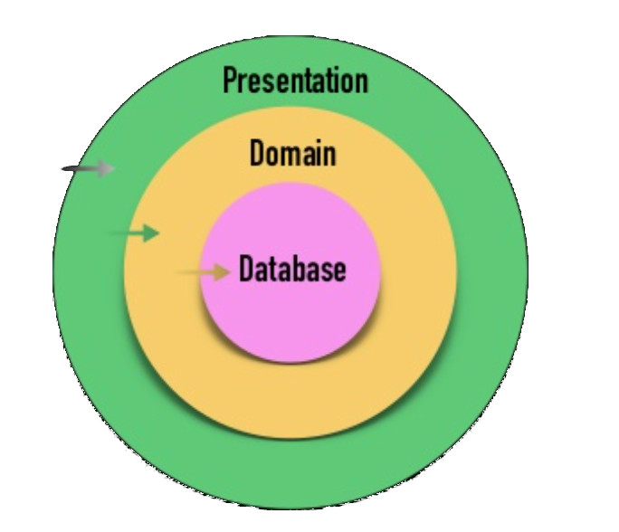
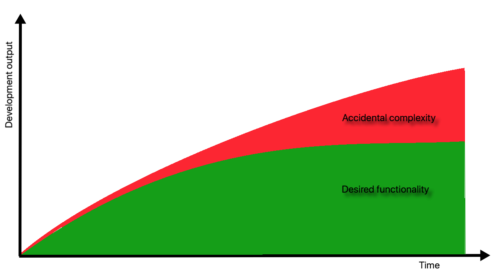

# Arquitectura Hexagonal

## Introducción

* Teoría detrás de una Arquitectura Hexagonal como "Ports & Adapters"
* Ports & Adapters (sinónimo)
* Llevar términos de SOLID (sobretodo la "D", DIP) a nivel de patrón de arquitectura de software
* El curso se basa en dos repositorios de código de ejemplo. En PHP y Java, siendo conceptos agnósticos al lenguaje que se use
* Discutir algunos debates que aparecen cuando te metes en estos temas
  * Diferencia entre un Servicio de Aplicación y uno de Dominio
  * Cómo afecta todo esto a los tests
  * Cómo se modela el Dominio
  * Sobre qué y cómo se extraen las interfaces
* Ver las ventajas e inconvenientes a la hora de implementar una Arquitectura Hexagonal

## Qué es la Arquitectura de Software

* No tiene relación con cloud, o ninguna PaaS, ni con escalado de aplicaciones, ni con infraestructura de software, ni con hardware
* Las arquitecturas de software hacen referencia a reglas autoimpuestas (restricciones) que sirven para definir cómo se debe diseñar el software
* Convenciones que se establecen en el equipo para definir cómo se diseña el software. Ejemplo: "el dominio no puede atacar a la infraestructura" (una regla de arquitectura autoimpuesta)
* Diseño macro y micro. Cuando diseñamos software, modelamos el sisrema a dos niveles. Micro (relación entre clases, diseño de módulos). Macro, cómo comunican / interactúan / se consumen entre sí

### Beneficios de la Arquitectura Hexagonal

* Mantenibilidad y cambiabilidad. Código más propenso a recibir modificaciones o nuevas funcionalidades de un modo menos complicado
  * Evita el crecimiento de la complejidad accidental. La complejidad esencial se mantiene, pero la cantidad de elementos/complejidad accidental necesaria para seguir desarrollando el software, con el paso del tiempo, no se incrementa tanto como en otras arquitecturas (o no arquitecturas)
* Se facilita el testing
* Simplicidad
  * El código se vuelve más simétrico. Es decir, el cómo diseñar cada caso de uso diferente se vuelve más similar unos con otros. Los casos de uso se vuelven más predecibles, al seguir todos los casos unos mismos patrones o pautas
* 
* 

### Inconvenientes

* 

**Referencias**

* [Macro vs micro design](https://codurance.com/2015/05/12/does-tdd-lead-to-good-design/)
* [Debate acerca de la terminología de “Arquitectura”](https://twitter.com/mathiasverraes/status/939096131744817153)
* [Complejidad accidental vs complejidad esencial](https://en.wikipedia.org/wiki/No_Silver_Bullet) ([paper](http://www.itu.dk/people/hesj/BSUP/artikler/no-silver-bullit.pdf))
* [SOLID – Principio de Inversión de Dependencias](https://codely.tv/screencasts/solid-principio-inversion-dependencias/)
* [Tweet acerca de la simetría en código](https://twitter.com/gonedark/status/936275444420268032)

## Qué es la Arquitectura Hexagonal

* La Arquitectura Hexagonal parte del paraguas de las "arquitecturas limpias"/"clean arquitectures"

* Todas las clean architecture tienen lo mismo en común: separan completamente el dominio de la infraestructura
  * Es el objetivo principal: no mezclar detalles de implementación de infraestructura dentro de tu dominio. Y viceversa, no tener NADA de las reglas de negocio ni de la lógica de dominio dentro de las cosas de infraestructura
  * Todas las clean arquitecture siguen la regla de dependencia unidireccional entre las capas
  * En cada arquitectura pueden haber más o menos capas. Por ejemplo la Arquitectura Hexagonal tiene 3 capas, pero pueden haber otras clean architecture que definan más o menos capas
  
* Hay mucha teoría al respecto. La forma más resumida posible de todo es este esquema
  
  
  
  * CA es una serie de capas en nuestra aplicación, y una regla de dependencia entre todas las capas
  * La regla de dependencia va desde la capa más externa hacia la más interna (azul a verder, verde a rojo, rojo a amarillo). De la capa más externa sólo podemos conocer a la inmediatamente siguiente (por ejemplo, de Controllers solo se puede comunicar con Use Cases)
    * La regla de dependencia hace referencia al flujo de nuestras peticiones desde fuera hacia dentro
    * No obstante, por ejemplo en la capa de infraestructura habrá casos donde no nos quedará más remedio que instanciar directamente Value Objects (u otros modelos) de la capa de dominio
  * Por qué esta regla. El beneficio es que desde que nada de interno conoce a lo de afuera, resulta que se podrá cambiar lo de afuera sin que lo de adentro se entere (por ejemplo, cambiar los controladores sin necesidad de modificar nada de los casos de uso, o las entidades)
  
* El dominio de la aplicación es lo que más valioso, está representado por las primeras dos capas más internas
  * Modelos / entidades de negocio que están en nuestro contexto
  * Reglas de negocio que solo van a variar por criterios propios. Es decir, ninguna decisión externa (por ejemplo un cambio de framework, o de tecnología de persistencia) implique un cambio en nuestro dominio. Sin embargo, cualquier cambio o decisión en la lógica de negocio, sí implica un cambio en nuestro dominio
  * 
  
* De estas reglas de clean architecture, se deriva la Arquitectura Hexagonal
  
  * Viene de "hexágono", pero no está relacionado; fue porque queda bien. Debido a que esta terminología no tiene mucho sentido, a esta arquitectura se le conoce también como "Ports & adapters" lo cual tiene más sentido
  
* En Arquitectura Hexagonal, las capas de las que se habla son
  * Infrastructure. Todo lo que va a atacar a IO. Todo lo que cambie un estado externo y/o cosas que pueden variar por decisiones externas (como el ejemplo de framework), es infraestructura.
    * Código que cambia en función de decisiones externas. En esta capa vivirán las implementaciones de las interfaces que definiremos a nivel de dominio. Es decir, nos apoyaremos en el [DIP de SOLID](https://codely.tv/screencasts/solid-principio-inversion-dependencias/) para poder desacoplarnos de las dependencias externas.
  * Application. Es el punto de entrada del dominio de la aplicación, donde están nuestros casos de uso (o también llamados Application Service, o Actions término definido por Sandro Mancuso)
    * La capa de aplicación es donde viven los casos de uso de nuestra aplicación (registrar usuario, publicar producto, añadir producto al carrito, etc).
  * Domain. Es el dominio del software, lo que más importa, donde están las reglas de negocio, modelos de dominio, value objects, etc. Interfaces de los servicios de infraestructura, Domain Services, etc.
    * Conceptos que están en nuestro contexto (Usuario, Producto, Carrito, etc), y reglas de negocio que vienen determinadas en exclusiva por nosotros (servicios de dominio),
  
* En las clean architectures, además de Arquitectura Hexagonal existen otros tipos como por ejemplo una llamada Layered Architecture
  
  
  
  * También es una arquitectura por capas, donde también se sigue la misma regla de dependencia de capas más externas hacia las internas
  * Pero con la principal (e importante) diferencia de que aquí es el dominio quien conoce a la base de datos
  * Aquí los modelos de negocio conocen los detalles de implementación de la capa de persistencia. Por ejemplo, una entidad sabe cómo persistirse a sí misma (patrón Active Record)
  * En este tipo de arquitectura, el acoplamiento entre dominio y persistencia es mayor, por lo que la cambiabilidad (por ejemplo de un tipo de base de datos a otro) se ve comprometido al estar obligado a modificar todos los modelos (e incluso sustituir, que no añadir, el tipo de persistencia de una implementación a otra)
  
* Flujo de interacciones entre capas dentro de una Arquitectura Hexagonal
  * El exterior realiza una petición a (consume) un controlador
  * El controller llama (hace uso) de un caso de uso (servicio de aplicación)
  * El Application Service dentro gestiona servicios de dominio, modelos, y las interfaces (puertos) para repositorios y otras cosas
  * La persistencia se realiza a través de una implementación de la base de datos a modo de adaptador, que usa el puerto definido como una interfaz en la capa de dominio
  * Este flujo se basa en aplicar el DIP de SOLID. Es decir, en vez de comunicar el modelo directamente con la infraestructura (lo cual genera acoplamiento en el dominio), se aplica el DIP para no necesitar acoplar el dominio directamente a la infraestructura, sino añadir una interfaz intermedia que forma parte de la capa de dominio y que se usa en la capa de infraestructura (incrmeentando la cohesión en ambas capas)
  * Además de la mejora en la cambiabilidad, otra ventaja es la mayor posibilidad y facilidad a la hora de testearlo
    * Las capas de aplicación y de dominio se cubren con test unitarios. Donde los tests unitarios testearían las reglas de negocio de nuestro dominio (para los Application Service) y la lógica de nuestro dominio (lógica en los Value Objects y en los otros modelos)
    * La capa de infraestructura se cubre con test de integración
      * No obstante, esta capa también contendrá lógica que debería ser también cubierta con tests unitarios
    * Y todo junto (todas las capas a la vez), desde la capa de UI o controladores, se cubre con test de aceptación
    * A la hora de querer aplicar TDD, la estrategia más natural sería hacer outside-in. Aunque tampoco es obligatorio, porque el orden en el que se implementan las capas no es fijo
      * Por ejemplo, podrías empezar por la capa de dominio haciendo inside-out TDD para implementar primero algunos modelos de dominio
      * Outside-in ATDD es lo más recomendable, al permitirte no centrarte en la parte Micro de tu diseño, tener una vista más global desde arriba y empezar con un test de aceptación que te permita pensar más (y antes) en el diseño Macro que en el Micro
  
* Por resumir la intención de la Arquitectura Hexagonal, ésta no sería más que llevar el DIP de solid al nivel de patrón arquitectónico y pensr en Application Services, Domain Services, y separación de estas capas del resto de código externo a la aplicación (infraestructura)

### FAQ

* Q: ¿Puede haber comunicación entre servicios de la misma capa?
  * A: Sí puede haberlo de forma directa. Pero si se puede usar un QueryBus sería mejor: habrá acoplamiento y se protege más el OCP
* Q: ¿Un caso de uso puede llamar o utilizar otro caso de uso directamente?
  * A: Sí, idem que la respuesta anterior
* Q: ¿Por qué se llama "Repos" el grupo de entidades que engloba a las interfaces? ¿Se trata de un cajón de sastre para todo lo que no es modelo o servicio? ¿Es una nomenclatura común en cualquier tipo de arquitectura, o es un término propio de arquitectura hexagonal?
  * Porque [es un standard](https://es.wikipedia.org/wiki/Repositorio_(contenido_digital)#:~:text=7 Enlaces externos-,Etimología,lugar donde se guarda algo".)
* Q: ¿Infraestructura puede conocer dominio?
  * A: No debería. La capa de infraestructura solo debería conocer los puertos que implementa. Pero en cuanto a servicios o modelos, no debería acoplarse con ellos. En su lugar, infraestructura solo debe comunicarse con la capa de aplicación, y ésta le puede brindar (por ejemplo) clases de factoría para que infraestructura los use y pueda así devolver modelos (a través de las factorías) pero no debería crear las instancias de los modelos por sí misma
* 

**Referencias**

* [Curso de Principios SOLID Aplicados](https://pro.codely.tv/library/principios-solid-aplicados/77070/about/) 👈 Recomendado antes de seguir si no lo has hecho ya! 😊
* [Curso Testing: Introducción y buenas prácticas](https://pro.codely.tv/library/testing-introduccion-y-buenas-practicas/90916/about/) ⏭️ Recomendado después de este curso de Arquitectura Hexagonal 🤟
* [Difference between Outside-In vs Inside-Out TDD?](https://softwareengineering.stackexchange.com/questions/166409/tdd-outside-in-vs-inside-out/166417#166417)
* 

## Primer puerto y adaptador. Patrón Repository

* Para este primer ejemplo vamos a ver una de las piezas más comunes que nos podemos encontrar en una aplicación: La integración con base de datos a través de repositorios
* Patrón DataMapper. Entidades que no conozcen nada relativo a cómo éstas son persistidas en la base de datos
* Patrón criteria/specification. Útil cuando vas a necesitar buscar entidades en base a muchos y variados criterios. Evita la explosión de métodos necesarios para ello en nuestras interfaces e implementaciones de repositorios, en el momento en el que podamos filtrar nuestras búsquedas por una combinatoria de filtros compleja
* 

**Referencias**

* **[Principio de Inversión de Dependencias de SOLID](https://pro.codely.tv/library/principios-solid-aplicados/77070/about/)**
* [Don’t use DAO, use Repository](https://thinkinginobjects.com/2012/08/26/dont-use-dao-use-repository/)
* 

## Servicios de infraestructura y estructura de directorios

* Servicios de infraestructura como por ejemplo los repositorios
* Evitar el acoplamiento estructural en las interfaces, es decir, no acoplando los contratos a conceptos específicos con alguna de las implementaciones
  * Problema con el acoplamiento estructural: Cuando nos hemos desacoplado a nivel de código de una implementación gracias a una interface, pero ésta sigue exponiendo semántica de la implementación, nos obliga a usar los métodos en un determinado orden, o en resumen la interface y su uso se ve influenciado por alguna implementación
* Para ejecutar los tests, se usan implementaciones fake de las interfaces de los servicios de infraestructura

**Referencias**

*  [Errores comunes al diseñar Interfaces – #SOLID – ISP](https://codely.tv/screencasts/errores-comunes-interfaces-solid/)

## Estructura de directorios por módulos

* .

**Referencias**

* [Estructura de carpetas - 🐘 DDD en PHP (y otros lenguajes)](https://www.youtube.com/watch?v=UFnABp2s8Y0)
* [DDD en Java con Spring Framework: Estructura de Carpetas](https://www.youtube.com/watch?v=X2CPc8DLwEQ)

## Servicios de Aplicación vs. Servicios de Dominio

* Un servicio de aplicación actúa como punto de entrada a un caso de uso único de la aplicación. "Caso de uso" es sinónimo de servicio de aplicación
* Cuando el servicio de aplicación empieza a contener lógica de dominio o reglas de negocio, esto puede ser movido a un servicio de dominio
  * Primero para acaparar toda la lógica de dominio y reglas de negocio dentro de su capa pertinente (Domain)
  * Luego para poder reutilizar esa misma lógica en otros otros servicios de aplicación distintos que puedan necesitarlo
* Los servicios de aplicación (nunca los de dominio) van a ser quien comuniquen con infraestructura, a través del puerto definido en Domain
  * Por ejemplo hacer un `->save` utilizando un repositorio)
  * O también quien publique los eventos de dominio que se hayan ido produciendo en el sistema en toda la operación que haya orquestrado el aplication service
  * Es algo que un servicio de dominio nunca hará: transacciones (con bases de datos) o publicación de eventos
* Los servicios de aplicación orquestran el caso de uso. Para ello pueden crear instancias de uno/varios servicios de dominio
  * Por lo tanto se los servicios de dominio se pueden acoplar a los servicios de aplicación
  * No es necesario sacar interfaces para los servicios de dominio, y pasarlos por el contenedor de injección de dependencias
  * Esto es así porque los servicios de dominio son parte de nuestra aplicación (la más interna además) y no contienen ni representan nada del exterior. Por lo tanto se pueden instanciar como parte de la implementación de los servicios de aplicación
  * Los servicios de dominio, por definición, sólo contendrán lógica de negocio. Con lo cuál, no necesitaremos desacoplarnos de ellos como sí necesitábamos desacoplarnos de los servicios de infraestructura
  * Además, al no tocar entrada/salida, tampoco nos interesará inyectar una implementación diferente de nuestro servicio de dominio durante la ejecución de nuestros tests
    * Es más, nos interesará que nuestros tests pasen por el servicio de dominio a la hora de testear el caso de uso para así poder cubrirlo de forma indirecta
* Nunca se deben de hacer mocks de los servicios de dominio. Porque estos solo tienen (siempre) una implemetación única y no contendrá nada externo al dominio, por lo que no se debe falsear

### FAQ

* Q: ¿Encapsularemos siempre nuestra lógica de negocio en servicios de dominio?
  * No es obligatorio
  * Sólo si es necesario reutilizarla desde múltiples casos de uso
  * O si queremos encapsularla por "limpiar" el Servicio de Aplicación y dejarlo más legible en caso de ser complejo
  * O por tener una arquitectura hexagonal mas estricta, y aglomerar en la capa de dominio toda la lógica y reglas de negocio (y no tenerla "desperdigada" en 2 capas)

## Modelando nuestro dominio y publicando eventos

### Value Objects

* Son objetos que encapsulan modelos de nuestro dominio y que se identifican por el valor que representan
* No sólo representan valores sino que encapsulan las lógicas que sean propias de esos valores
* Aportan semántica adicional al resto de modelos que formen todo el dominio, y que usarán los VO como componentes de sí mismos

### Named constructors

* Conocido también como constructor semántico. Son métodos estáticos de factoría del propio objecto que quieras instanciar
* Aportan semántica al proceso de construcción de los objetos
* Reemplazan al constructor por defecto como método de instanciación de los objetos por primera vez, permitiendo relegar al constructor por defecto a ser usado en procesos de deserialización de objetos preexistentes (que provengan de una base de datos, o de datos serializados, etc.)
* El uso de constructores por defecto es también útil para los tests, para permitir seguir haciendo test-dobles con el proceso crudo de instanciación vía el constructor

### Publicar eventos

* Desde las entidades del dominio, se registran (o pueden registrar) eventos pero en ningún caso podrán publicarlos
* La publicación de eventos se realiza siempre desde los servicios de aplicación
* Un servicio de aplicación le viene inyectado un event-publisher, con el que se encargará de publicar los eventos a través de éste
* De este modo, la publicación de eventos queda desacoplada de la creación (registro) de los mismos. Sigue un modelo de consistencia eventual
  * Podría tener la desventaja de olvidar publicar los eventos que hayan sido preregistrados

### FAQ

* Q: ¿Desde dónde publicaremos los eventos de dominio?
  * Desde el caso de uso (Application Service) ya que es éste quien representa la barrera a nivel de transacciones y publicación de eventos
* Q: ¿Qué pasa si falla la publicación de eventos? Cómo garantizamos la atomizidad del Caso de Uso cuando ocurre de que falle la publicación de eventos en un momento dado? (infraestructura no disponible, problema de red, sistema intermedio caído, ...)
  * No hay solución perfecta, y ante estas casuísticas hay que aplicar la solución más óptima para la criticidad, severidad y/o importancia de cada caso
  * Normalmente se querrá asegurar la publicación de los eventos, para garantizar la mayor consistenca pese a la pérdida de disponibilidad eventual sufrida
  * Estrategias:
    * Aplicar una política de reintentos. Pero siempre fijando un número de estos limitado y no muy grande (depende de cada caso)
    * Usar el DQL del/los sistemas de mensajería que dependamos y configurarlos como necesitemos
    * Persistir eventos no publicados en su momento, en una base de datos, para reintentar publicarlos de nuevo
  * Rafa@Codely.tv propone una posible solución combinando varias de estas estrategias
    * Intento publicar los eventos de dominio a la cola de mensajería. Por X motivo, falla la publicación
    * Se ejecuta una política de 3 retries con un backoff exponencial (siendo el primero de 200 ms)
    * Si luego de los retries no he podido publicar, tengo de fallback una tabla en una base de datos que servirá para volver a tratar de enviar todos esos eventos de la tabla hacia el message broker, llevando así más lejos la publicación del evento del momento en el que se produjo

**Referencias**

* [Constructores semánticos – Named constructors](https://codely.tv/blog/screencasts/constructores-semanticos/)

## Testing capa de aplicación y dominio

* Uno de los enfoques propuestos en Arquitectura Hexagonal es que el dominio se testee de forma colateral a la hora de testear los casos de uso
  * Es solo una propuesta, el tipo de decisiones que se pueden tomar o no evaluando pros y contras
* Mapeo entre tipos de test y capas de la arquitectura
  * Aceptación: Todo
  * Unitario: Aplicación y dominio
  * Integración: Infraestructura

### FAQ

* Q: Si nos olvidamos de guardar en base de datos cuando nos hacen un POST a /videos/id-nuevo-video, ¿qué test debería petar?

  * ❌ Test de aceptación y Test de integración (mi respuesta)

  * ❌ Test de aceptación, Test unitario y Test de integración (mi respuesta si hubiera elegido tener en cuenta comprobar el comportamiento del caso de uso que llama al método `save`)

  * ✅ Sólo test unitario (respuesta correcta)

  * Explicación: El test de integración seguro que no fallaría ya que la integración con base de datos sería correcta, el único problema sería que no se estaría haciendo uso de ella. Con lo cuál, lo podemos descartar sobre seguro.

    El test unitario, en caso de estar bien hecho y aquí sí haber especificado que se debe invocar al método save del colaborador VideoRepository, sí fallaría estrepitosamente evidenciando el problema.

    El test de aceptación es el único que podríamos dudar dependiendo de las comprobaciones que hagamos a nivel de aceptación. Por ejemplo, en el caso que veíamos en la lección no petaría, ya que la respuesta seguiría siendo un 201 created. No obstante, sí que es cierto que si nuestros test de aceptación comprueban que el registro existe en la base de datos tras haberse ejecutado, también fallaría.

    Esto es un tema donde puede haber controversia y preferimos dejarlo a gusto del consumidor, así que estamos completamente abiertos a que nos expliques tus argumentos a favor o en contra en los comentarios de abajo!

## Testing capa de Infraestructura

* Para esta capa, el tipo de tests que hay que realizar sería de integración
* Los test de integración nos permitirán comprobar de forma aislada que las distintas implementaciones a nivel de infraestructura (adapters) real funcionan como se espera
* Mientras que en los tests unitarios (realizados en las capas de Dominio y Aplicación) se habrían mockeado las dependencias (adaptadores) que cumplen con las interfaces (puertos) del dominio, en estos tests de la capa de infraestructura lo que se haría es emplear la implementación real de esos adaptadores
  * Los adaptadores reales se testearían a nivel unitario, verificando que sus lógicas funcionan como se espera
  * Pese a ser test que comprueban unitariamente el funcionamiento de cada adaptador, se les considera test de integración porque no están aislados, y dependen de comunicarse con los servicios de infraestructura real a la cual hagan referencia (una base de datos MySQL, una cola de mensajes RabbitMQ, una API REST de notificación a un canal de Slack, etc. lo que sea)

**Referencias**

* [Anti-patrones de test: Infrastructure Mocking](https://www.youtube.com/watch?v=XbkjUz20pOk)
* CodelyTV ha publicado en Youtube una colección de videos sobre Anti-patrones de test

## Resumen

* Uno de los objetivos de las arquitecturas limpias es tratar de reducir lo más posible (lo ideal sería eliminar) la cantidad de complejidad accidental que se añade al proyecto cada vez que se le invierte esfuerzo/trabajo en su desarrollo. La Arquitectura Hexagonal nos ayuda a evitar que la complejidad accidental crezca tanto

  

* Capas de la Arquitectura Hexagonal

* Cómo definir un puerto para nuestros repositorios de base de datos

* Servicios de Aplicación vs. Servicios de Dominio

* Cómo modelar nuestro dominio (patrón de diseño Value Object, named constructors…).

* Cómo publicar eventos de dominio

* Estrategia de testing para test unitarios y de integración

* 

**Referencias**

* Curso [Principios SOLID aplicados](https://pro.codely.tv/library/principios-solid-aplicados/77070/about/)
* 