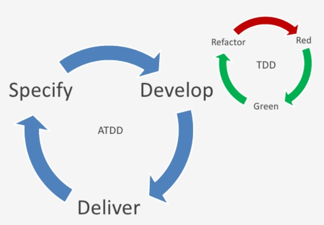
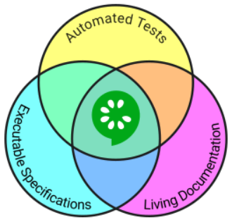

# Buenas prácticas de BDD con Gherkin

by Dani Latorre, Javier Rubio – CodelyTV

------

> Aprenderás desde los conceptos básicos para testear tu aplicación con Cucumber o Behat, hasta consejos de buenas prácticas para hacer que tu suite de tests sea más fácilmente mantenible. ¡Teoría a través de ejemplos de código en Java, JavaScript, y Ruby

**Available resources**

-  [Course materials](https://pro.codely.tv/library/buenas-practicas-de-bdd-con-gherkin-cucumber-behat-30293/)

🏷️ Tags: `course`, `2022`, `codelytv`, `bdd`, `atdd`, `testing`, `qa`, `gherkin`, `cucumber`, `behat`

------

## Introducción

* Cucumber (o similares) usarlas como meras herramientas de testings es un error. Son herramientas que sirven para que distintas personas (no técnicas y técnicas) collaboren en un proyecto común

* Tests de aceptación / ATDD, Behaviour Driven Development / Specification by Example

* BDD
  * In a nutshell: Using examples at multiple levels to create a shared understanding and surface uncertainty to deliver software that matters ([ref](https://twitter.com/tastapod/status/338749038100897792))
  * Usar lenguage expresivo, natural, para las suites y métodos de test
  * Concepto de entendimiento compartido por los distintos roles en el equipo. Y uso de herramientas tipo Cucumber no solo para hacer testing sino como herramienta de comunicación
  * Hay quienes defienden que BDD es "*hacer TDD bien*"
  * 
  
* ATDD
  * Acceptance Test Driven Development
  * Parte centrada en la parte más operacional, en el flujo de trabajo
  
* Specification by Example
  * Concepto anterior a BDD pero menos popularizado. Also known as _example-driven development_ or ATDD
  * Tener ejemplos que nos sirvan como especificaciones
  * Facilita trabajar desde el inicio con una aproximación a TDD Outside-In
  
  

## Cucumber y Gherkin I

* Cucumber
  * Single source of truth. Cohesiona especificaciones y documentación
    * Sabemos/especificamos a nivel funcional lo que hace, o debería hacer, el software
  * Documentación viva. Por la validación a través del testing va evolucionando de forma coherente y siempre está actualizada
  * Foco en el cliente. Minimiza la brecha entre perfiles de desarrollo y otros utilizando el lenguaje de negocio
  * Ayuda a crear un entendimiento compartido, validando además la aceptación del software
  * Originalmente para Ruby, pero existen implementationes en muchos otros lenguages. Ejemplos son [SpecFlow](https://specflow.org/) para .NET, o [Behat](https://docs.behat.org/en/latest/) para PHP
  
  
  
* Gherkin
  * Es un es "*Business Readable, Domain Specific Language*" usado por las implementaciones de Cucumber para describir el comportamiento de un software: sus features y sus diferentes escenarios en lenguaje cercano al negocio
  * Estructuras básicas de Gherkin:  `features`, `scenarios` y `steps`
  * Por convención
    * Un fichero Gherkin sólo contiene la descripción de una única feature
    * La extensión del fichero debe ser `.feature`
  
* Ejemplo: `search_products.feature`

```gherkin
Feature: Search products in the store

Scenario: searching for an existing product
  Given there are "dog" products
  When I search "dog"
  Then I get results

Scenario: searching for a non-existing product
  Given there are "cat" products
  When I search "gamusinos"
  Then I get no results
```

* Aquí se ven la `feature`, varios `scenario` y los distintos steps `Given`, `When`, `Then `
* La salida de Cucumber es es documentación que va por la consola, pero permite exportarla a HTML
* Tips para definir escenarios de una feature
  * Define uno o más escenarios de uso de una sola feature
  * Utiliza lenguaje ubicuo del dominio del proyecto
  * En la medida posible, evita tecnicismos


## Cucumber y Gherkin II

* Con la sintaxis básica vista anteriormente es más que suficiente para la inmensa mayoría de escenarios. Además, ofrece otras características extra Gherkin y Cucumber
* `background`: cuanto una feature tiene una/varias precondiciones comunes para todos sus escenarios. E.g. "Cuando el usuario está autenticado"
* `Scenario outline` y `Examples`: para escenarios con inputs y outputs muy parecidos
* Tags: para identificar alguna feature o scenario con algún tag. E.g. taguear por módulo de sistema, o para identificar happy paths de todo lo demás, etc
  * Se pueden utilizar en `feature`, `scenario`, `scenario outline` y `examples`
* Step arguments: hay 2 tipos
  * Doc strings: para definir un bloque de texto complejo que ocupa más de una línea
  * Data tables: para pasar una colección de múltiples valores a un step

## Tests de aceptación end-to-end

* Con Selenium Web Driver
* Una creencia habitual que los tests de aceptación son siempre de end-to-end
* Antipatrón guión
  * Cuando se empieza a hablar de un guión de testear la aplicación y no la aceptación del producto
  * Tests de UI. Testear todos los casos de error, etc.
  * Tengo que pulsar el botón X. Cuando lo pulso entonces pasa Y, ...
  * Pero se centra en lenguage de negocio, no hay entendimiento compartido
  * Se centra solo en testear la UI / la aplicación
* Patrón Page Object
  * Mejora la mantenibilidad de los tests de UI
  * Encapsula cómo es una aplicación. Expone públicamente métodos que llevan a otros Page Objects, representando la navegación y acciones para que sean ejecutadas en el navegador (seguir un enlace, completar un formulario...) y métodos para conocer el estado de la página

## Example Mapping

* Técnica colaborativa. Actividad de equipo para explorar el dominio y conocer los detalles de una historia de usuario. Facilita llegar a un entendimiento compartido entre los miembros del equipo de una forma estructurada
* Uno de los objetivos de esta actividad es llegar a obtener ejemplos concretos que nos lleven a la especificación. Esto guía a conocer cuáles son los tests de aceptación
* Otro objetivo es extraer y mapear las reglas de negocio, preguntas o dudas que nos surjan de la historia de usuario. O incluso nuevas historias de usuario de las que no nos habíamos percatado inicialmente
* Se usan distintos postit de colores para visualizar la información
  * Amarillo: para las historias de usuarios
  * Azul: para las reglas de negocio
  * Verde: para los ejemplos
  * Rojo: para las preguntas

## Referencias

* [BDD is like TDD if](https://dannorth.net/2012/05/31/bdd-is-like-tdd-if/)
* [SpecificationByExample](https://martinfowler.com/bliki/SpecificationByExample.html)
