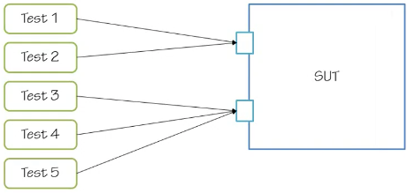

# Outside-In Test-Driven Development

by Mark Seemann

------

> This course teaches how to build an application from the outside in - starting with tests targeting actual features or use cases of an application, but gradually working towards a more and more detailed specification of the components of an application. The focus is on the technical side of TDD, not the business side. Approximately half of the content is a series of C# demos, building a small RESTful service from scratch.

* [Course in Pluralsight](https://www.pluralsight.com/courses/outside-in-tdd)
* [My demo implementation](https://github.com/ebarbeito/running-journal-api)

------

## Module I. Walking skeleton

* In this module you'll learn how to build a walking skeleton by applying Outside-In TDD
* Concepts involved, including the concept of a walking skeleton → BDD, agile testing quadrants, the test pyramid,
* Also a comparison between Outside-In TDD against other types of software testing

### Purpose of Outside-In TDD

* It helps you to align what we're doing as software developers with what the product owner wants the software to actually do
* We do that by starting testing at the boundaries of the system (the UI, or at service layer like a REST or SOAP service), because that's most closely aligned with what the product owner typically wants
* The POs want a new feature, and they can express that in terms of using UI or in terms of service features that the service endpoint should have. And this helps us apply a principle called YAGNI
* By starting to build from the outside and going inwards, it helps to only write the needed code that meets the requirements that we've stated for ourselves by writing the test at the boundaries of the system
* And this helps us to bring better business value

### Outside-In TDD at a glance

* Just like with normal TDD, the first thing you have to do is write a failing test
* Again, just like with normal TDD, now that we have a failing test, we have to produce the real system, in order to make the test pass. This is what we call the system under test (SUT)
* Now, what normally happens with this first test, when doing Outside-In TDD, is that this prompts you to write quite a bit of infrastructure code (illustrated by making the SUT box slightly larger)
* But still, we're trying to write just enough code to make the test pass, and nothing more
* … and each time we do that, we slightly expand the SUT by writing new code to meet the requirements that each of those tests encapsulate

### Isn't this simply BDD?

* BDD is a testing discipline where you work tightly with the PO to specify a set of executable specifications that you can then use to validate whether the software that you're building is actually meeting those requirements or not
* And those executable specifications are usually executed against the boundaries of the system. So that sounds a lot like outside-in TDD. But are not the same, and can be used at the same time. Both  are overlapping and not mutually exclusive concepts

### The agile testing quadrants

* There are many ways to think about software testing
* This diagram, originally introduced by Brian Marick, talks about the many different ways that we can think about testing

### The test pyramid

* Concept developed by Mike Cohn. It describes how automated tests should be distributed among different types
* At the UI level, you should only have a few automated tests. They are very hard to develop and maintain, also typically run rather slowly
* At the service level, you can have more automated tests here. They tend to be more robust, but still quite slow
* Finally, you should have most of your automated tests at the unit testing level. They are a robust way of doing automated testing
* In relationship to outside-in TDD, is that you start at the top of the pyramid here. But then you work your way down. Which means that you write a few automated tests at the service boundaries of your system. But then, to flesh out the behavior of the system, you work your ways into the bottom of the pyramid here. And you should end up having most of your automated tests at the unit testing level
* You can have a couple of tests that test the boundaries of the system. But then you can have tons of more tests that tests the internals of the system at the unit testing level

### Outside-In or Bottom-Up

* There are two different approaches to TDD: Outside-in and bottom-up
  * Outside-in → “London School of TDD”, “Behaviour Verification”, “Mockist”
  * Bottom-up → “Classic TDD”, “State-Based Verification”, “Triangulation”
* London School of TDD vs Classic TDD, behavior-verification vs state-based verification, the mockist vs triangulation styles
* The important point here is that these aren't mutually exclusive approaches
* Even though we work from an overall approach of outside-in TDD, we can still do triangulation or state-based verification
* To learn more about the difference and similarities of outside-in vs bottom-up, read the article "[Classic TDD or London School](http://codemanship.co.uk/parlezuml/blog/?postid=987)" from Jason Gorman

### Walking Skeleton

* The first thing you should do with outside-in TDD is to build a walking skeleton
  * “*an implementation of the thinnest possible slice of real functionality that we can automatically build, deploy and test end-to-end*” (from the book “*Growing Object-Oriented Software, guided by tests*”)
* Walking Skeleton: the outcome of writing the first test and making it pass. The reason why we are talking about a skeleton is that at this point this system may not actually do anything particularly interesting. It just sits there and makes happy noises
* This, also, can be used to drive: Infrastructure (and technology decisions), Process
* Technical constraints
  * A typical process that we would like to arrive at is to automate as much as possible, not only the testing, but also the deployment
  * We want to be able to assume that there's no previous environment setup required, that you don't have to create special directories, neither set up special environment variables, registry keys, etc
  * This is very important in a team environment or when you have a CI system, because you have multiple environments and you don't want to have to maintain and synchronize the settings of all those environments
  * So the only things we can really assume is that we would have general tools, such as the IDE or a text editor and a terminal, for example. And that's the only thing we can really assume from the process
  * And everything else should be automatable

### Demo: introduction

* Now that you understand the principles and theory behind outside-in TDD and a walking skeleton, it's time to see how to do that in practice
* In this demo, I will show you how to write a walking skeleton, using Visual Studio and C#
* The scenario will be a REST API that captures information about a user's exercise runs.
  * The user can go for a run, and then they can upload a journal entry that captures how far they went when they did that and how fast they ran
  * And then later on they can go to the same REST service and review the journal entries that they already made
* The first thing to build a walking skeleton is simply to write a test and make sure that there's something responding on the other end
* So this is the first test that I'm going to write, and it's going to be very, very simple and a little bit boring, because it only tests that something sits on the other end of the service boundary -- in this case, a network address -- and actually responds to the requests that we're giving it

### Demo: Getting a response from a Walking Skeleton

* Building a walking skeleton means starting from scratch. The only thing that I have so far is just a solution called RunningJournalAPI and a single project for my service boundary test, those coarse-grained tests that I'm going to write at the boundary of the system
* The first thing to do is to pick a unit testing framework, or an automated testing framework (xunit)
* Now it's time to write the first automated tests. And I'll do that by adding a class called `HomeJsonTests`
  * And the reason why I call it that is because, if you think about the route resource of a RESTful API as the equivalent of the home page for a -- for a web-based application
  * And the reason why I called it json is because I'm going to use json as the serialization format going back and forth
* The first test I want to write is just a simple test that tests whether the response returns a correct status code
* So remember, at this point I'm just writing a test that pretty much verifies that there's a system at the other end and it's actually listening to the requests that we are sending
  * In order to invoke the external service boundary of the service, I need a client (he uses the new HTTP client class from .NET 4)
  * And we need some more infrastructure in place to actually make this work (an http server)
    * So this prompts us to actually create an http server that's listening at localhost
    * Here is where we might be tempted to set up Apache/nginx/whatever and create a service that's listening on localhost
    * But that would go against a constraint that I should be able to take the source code for this whole system and pull it from the source control from some -- some other machine and just have the system running
    * So I can't have that specific environment setup that requires me to have Apache/nginx/whatever configured in a certain way
    * Luckily, the ASP .NET Web API, which is a new framework for building RESTful services, allows me to do in-process hosting of the service that I want to ride
      * In PHP the most similar option is to use the built-in web server functionality, and infrastructure code to handle HTTP routing (plain or framework code, but something in between)
    * The idea is to host the service from within the specific test case, and don't have to run anything outside the project
* From the client I can get a response, which is what I really care about
  * So I'll just get the route resource here and block until the result comes back
  * And the only thing I really care about at this point is just to see whether the response was some sort of success status code
* The test, as it currently looks, represents the essentials of what it is that I currently want to test
* And what I can do now is that I can create a new server. And I'll say that's going to be a new HTTP self-host server and just pull in that one
* We need to have something happening in between those two lines of code that configure the route. And I prefer that to be the system itself that has that responsibility (routing). So we could imagine that the system itself has this bootstrap class and it has a configure method. And we can pass in that config instance into the config -- into the configure method. And once that's done, we can start serving requests by just patching into specific controllers
* Now, this obviously doesn't exist yet, so we'll have to create the project for the system under test
* Now I'll go and add to the new project. And this can just be a normal library project, and we'll call that RunningJournalAPI
* In order to configure the system, we can add a route to this config instance here. And basically, what we say is that if the controller segment of the URI is empty, we will default to a controller called the JournalController. So let's add a class called the JournalController
* And in order to be a controller for the Web API, it needs to implement an interface called IHTPController. But we can also do that. The easiest way to do that is just by deriving from a class called APIController
* (...) implementation continues in .NET stuff (...)
* So, now I can actually run the test again. And you will see nothing really popped up. But I have one Passed and zero Failed or zero Skipped down in the corner. Just manually show the output here and we'll see that everything is actually passing at that moment

#### Demo recap

* So let's recap what happened. This is a walking skeleton that I'm building. So I just want the simplest possible test to get something up and running
* In this case I'm doing a get request against the root resource of my system. And the only thing that I'm really getting back is just 200 OK
* There's no content in the HTTP response at all, but that's okay for now
* However, if we think about the definition about a walking skeleton, the idea about building a possible slice of real functionality is probably a little bit of a stretch at the moment, because we just have something that responds
* So maybe we should think about doing just a little bit more before we can call it a day
* The next thing we can think about is to post a journal entry, because that would later on allow us to read back from that first resource and see whether we could read what we posted

### Demo: Posting an entry

* It's important to treat your test code as a first-class citizen, because this is something that you're checking into your source control system and you have to maintain it. So the same principles for maintainable code apply in test code.
* What I need to do now is just to make a post against a service, pretty similar to making a GET against the service. In the first instance I just want to test whether the response is still a success status code. We need to change the name of the method here. So we can just call it PostReturnsResponseWithCorrectStatusCode.
* First of all, we need something to post, and I want to post JSON as the running journal entry. And one way to model json is to just create an anonymous type. So you can see json here is just the type quote a, which hasn't been defined yet.
* The journal entry should include a time (DateTimeOffset.Now). We'll also need to log a distance (int, in meters) and a duration (TimeSpan)
* Now we can look at the response when we ask the client to do a post. So we'll do a POST as json async and post the json. And then we're just going to block and wait until the result comes back. Let's run the test and see what happens.

#### Demo recap

* At this point, you may be thinking that I'm cheating a little bit, because I haven't really added any functionality to the service at all. I'm just checking out the boundaries of the system and seeing whether they actually respond or not.

#### Demo: Posting and reading back an entry

* If we look at the journal controller, there's something missing here. We do a post, but we don't really save the value that's being posted at all
* We need to write one or more tests that will prompt us to add the desired functionality. Use a name of the test method to better capture the intent of this particular test case.
  * I can post the json and just wait for the call to return
  * And then I can get the response from a subsequent get request to that same resource
  * That gives me the response back. And in order to make an assertion, I need to read the actual json content out of the response
  * The thing that should contain the expected thing is actual entries
* We don't expect it to succeed at the moment.
* ...

#### Demo recap

* In this demo, I still tested the external boundaries of the system, first by making a post request, posting some json that represented a journal entry into the system, and just got a 200 OK response back
* Then subsequently, I made a get request against the same resource and got back a 200 OK response, with an Entries array, including the entry that I just posted.

#### Did I cheat?

* I cheated a little bit, because instead of using a real persistence engine, like a database or a file, I just used a read-only static list of journal entry models
* This is not the final state that I wish to arrive at. So in the next module, I'll show you how to spike a solution that uses real persistence technology, such as a database.

### Summary

* In this module you learned that Outside-In TDD is one among many testing techniques
* It favors testing of external system boundaries over testing the internal functionality of the system, at least at the beginning
* But still, keep Mike Cohn's test pyramid in mind. So while we start at the top of the pyramid by testing the external boundaries of the system, once we expand on the system, we'll write more and more unit tests to flesh out the behavior of the system
* The demo that I showed in this module demonstrated how to create a walking skeleton with the ASP .NET Web API

## Module II. Spiking

### Introduction

* This module talks about the concepts of spiking,FIRST (an acronym that describes some attractive how your unit test should have when you do TDD) and fixture, setup and teardown (which are part of a pattern called Four Phase Test)
* All of those things are important when we look at Outside-In TDD and this concept of spiking
* We also see how to apply these principles

### Application perspective

* With Outside-In TDD you don't need to have a detailed upfront plan for your applications architecture
* Initially, it often helps to just think about the applications architecture as a box, and then see what happens when you implement the application in response to the automated test that you write against the external boundaries of the system
* This is called Emergent Design, and helps you to adhere to this [YAGNI principle](https://martinfowler.com/bliki/Yagni.html) (*you aren't going to need it*) → only write the code that you actually need to write in order to meet the requirements of the product owner
* The external boundaries describe features of the application (...) But the application of stakeholders also has other concerns for the application than just what can be observed over the external boundary of the system. One of these is the ability to store data in a persistent way
* This means that the application also has some internal boundaries. This is where it communicates with its persistent way
* So you can think about that as going all the way through the external boundary and into the internal boundary to see whether that data was actually stored → We call that spiking because it looks like we're driving a spike all the way through the application. We're not building the entire application, but we're going through the entire application for a very thin slice of functionality and making sure that we're going all the way through.

### FIRST

* Once we introduce persistence technologies to our automated tests, there are some things that we need to be aware of, that up until now hasn't really been an issue
* To understand what those are, we have to take a detour around this acronym called FIRST. Was first described by Tim Uttinger
* The FIRST acronym says that tests:
  * Should be Fast. They should run as quickly as possible
  * Should be Isolated so that each test can run independently on any other test
  * Should be Repeatable, so you can repeat the test over and over again and get the same result every time
  * Should be Self-validating, meaning that they will be able to tell by themselves whether they've passed or failed.
  * Should be Timely, meaning, that they should be written at the correct time in the process, which means before you actually write the production code
* When we talk about persistence technologies isolated and repeatable and specifically the characteristic of being isolated is very important, because when we talk about the persistence technologies, what happens is that we leave behind stayed on the system, and that might actually influence the tests that run after the test that left behind stayed on the system. So we have to clean up after ourselves.

### Four-Phase Test

* When in each test do we do that? The Arrange-Act-Assert pattern for writing unit tests that says that each test should be divided into three phases
  * First phase: Arrange. Where I set up all the things that I need to actually invoke the system
  * Second phase: Act. Where I act on the system on the test that I have, in this case
  * Third phase: Assert. Where I prove that the response that I got back was actually as it was supposed to be
* You might notice that there's an implicit fourth phase in a test, and happens when its scope ends
* It happens when the using scope ends and this is the sort of cleanup that happens
* How does this fourth phase fit into the arrange act assert pattern? And what do we call it? And it turns out that there's a different way to think about this arrange act assert pattern, is actually a superset of that pattern and that pattern is called Four Phase Test
* Instead of calling it arrange-act-assert, we call those phases “fixture setup, exercise SUT verification and fixture teardown”
* You see that we have an explicit fixture teardown where we clean up everything that we created so far
* This is the part of the test where we need to go and clean up any persistent data that each test case left behind

### Setting up and tearing down a database

* To introduce a persistence technology such as a database into your automated test, you need to make sure that any data left behind on that database is deleted again
* The safest way that you can guarantee that is by deleting the database after each test run
* Using the patent language are the Four Phase Test, here's how that might look like
  * First, in the fixture setup phase, you create the database for every test case
  * Then after you set the database you can exercise the system on the test, getting your result verification
  * And then as the test completes, you can tear down the fixture again, which means simply deleting the database
* You should be aware that even though this runs pretty fast on modern computers, compared to a unit test where everything happens in memory, this is a rather slow process
* So we don't want to have too many of our automated tests working in this way. And if you recall, the test pyramid by Mike Cohn, this also fits pretty well with the concept of the pyramid, that we don't want to have too many tests at the top of the pyramid
* But the unit test that we can have, that's the base of the pyramid, shouldn't be using the database in this way. So we can minimize the number of automated tests that we have that actually touch the database, because setting up and tearing down this database for each and every test case will have a performance impact on how fast our test runs.

### Demo: database setup and teardown

* In this demo I will show you how to set up and tear down the database for each test case
* What that's going to do is it's going to give us some hook methods that will inform us when the test actually runs. So the before method here will run before the test case, and then the after hook method will be executed after the test case actually runs
* I'm actually trying to set up the database itself. And I simply think that it's easier to just use those basic tools than to use a complete ORM framework or similar for that
* We also need to write the code for deleting the database after each test run

### Demo recap
* In this demo I created all the infrastructure required to set up the and tear down a database for each test case
* At every test case where I want the database to be set up and torn down before and after each test case executes

### Backdoor Manipulation

* With all that infrastructure in place it's not possible to write automated tests that verify that the application correctly assists data to the database and reach data from the database
* One possible technique we can use to do that is called backdoor manipulation
  * We'll use the fixture setup and fixture teardown phases as before to create and delete the database
  * We can also use the fixture setup to populate the database with the data that we need in order to run a specific test case
  * We can also in the result verification phase talk directly to the database and see whether the database was left in a state that matches our expectations

### Demo introduction

* In the next demo you'll see how to use the backdoor manipulation technique to create a spike through the application
* This test will demonstrate that the application can correctly read data from the database and return it through its external service boundary
* The first part of the test we'll pre-populate the database with a bit of data. This is the backdoor manipulation part of the test. And this happens in the fixture setup phase of the test
* Afterwards, the test will read the data through the SUT's external service boundary and verify that the return data matches what was pre-populated into the database

### Demo: spiking

* To perform backdoor manipulation, I'll need to write code that writes data to the database
* And in the SUT I'll need to read code from the database. Contrary to the setup and teardown of the database, this is within the well-known realm of CRUD
* The database only exists in short time frames while the test is executing
* The first step the test should take is to use a bit of backdoor manipulation to insert a journal entry into the database
* But what about the rest of the test's read? When I run all the tests, it turns out that several other tests are now failing. This is because I changed the implementation of the SUT to expect a database to be present, but several of the existing test cases don't get set up and tear down the database. In order to fix this, I must add the use database attribute to all of the existing acceptance tests
* This repairs most of the tests, but there's still a single failing test left. This is the test from the demos in Module One. You may recall that at first post an entry to the running journal risk ABI and then it tends to read it back with a get request. The reason is that the get method now reads from the database, but the post method doesn't write to the database. Obviously it should do that

### Demo recap

* In this demo you saw how to drive a spike through an application
* I used simple data for both the backdoor manipulations and to implement the site itself

### Summary

* This module looked at the concept of spiking
  * A way to ensure that not only does the application appear to behave correctly at the external service boundary,
  * but it also does the right thing at the internal boundaries
* Spiking completes the walking skeleton
  * If you recall from Module One, the definition of a walking skeleton was a thin slice of real functionality
* The concept of isolated test requires us to deal with the fact that when we work with persistence technologies, we have to make sure that every test cleans up after itself
  * That leads us into the concept of fixture teardown
  * You really should be aware that setting up and tearing down a database after each test case results in a slow test read
  * I'll remind you of test pyramid that says that you should only have a few of those tests, and then you can have in memory-based unit tests that comprise the bulk of your automated tests read
* We also looked at the concept of backdoor manipulation where you go around the SUT and directly deal with the database in order to either test that it was left in the right state or in order to pre-populate it with data required for the test case

## Module III. Triangulation

### Introduction

* Triangulation is one of two major approaches to unit testing
* You'll also learn about a technique called devil's advocate which you can use with test driven development
* There are various names for bottom-up test driven development such as classic TDD or state based verification or triangulation
* Those names are mainly synonymous but I think that triangulation captures the essence of that way of testing very well

### When to use

* Since there are two major approaches to unit testing you may wonder which one should you use when.
* Triangulation is sort of the classic test driven development technique. This is what you typically see when you see a common trait of those examples that they tend to focus very much on systems under test that are algorithmic in nature such as a stack or a scoring system for a bowling game or something like that

### Stimulus/Response

* In essence triangulation works by applying a stimulus to the system under test and then measuring the response
* The response may take the form of a return value but might also be a change of an observable state of the system under test itself
* Together we call return values and the observable state of the system under test again for direct output
* That's what you measure when you verify the results of your test.

### Triangulation

* Triangulation is actually a technique from the physical world where we can use geometry to measure for example the height of the building or the position of a ship at sea

### Sampling

* Imagine for a moment that you have a function or a method that it takes a string as input and returns the string as output, but you cannot see what it does
* In order to figure out what this method does you'll have to measure it. So this is like sampling where you sample the output of example input and form your hypotheses around that
* making this, at some point the hypothesis seems to hold and you may decide to do more sampling just to get a better confidence in your hypothesis
* This is reminiscent of the scientific method. Triangulation is also very similar to this process, the only difference is that at the beginning there is no method

### Test cases as examples

* Test cases are samples of the desired functionality of the system under test. Similar to the sampling process I just described but with measurements taken before the fact
* In science there's a concept known as the observer effect where the mere act of observation has an impact on the subject being observed
* A couple of years ago there was a movement to rename test driven development to example driven development
* Today that seems less important but the term example driven development seems almost synonymous with triangulation
* The process of sampling until we have gained confidence in our hypothesis is very similar to test driven development

### Demo introduction

* in this demo you'll see how adding test cases one at a time gradually causes the system under test to coalesce
* We'll pick up where we left in the demos in module two but this time we drop down to the unit level
* If you recall my calls test pyramid, most tests should be unit tests and indeed, in this scenario there's no need for a full systems test

### Demo: Simple Web Token serialization

* Add authentication and authorization information to the running-journal-api
* In this and the next demo I'm going to triangulate a simple web token class that can serialize and deserialize claims about the user such as the user name
* A simple web token is an independent class implementing passing and formatting logic. So it's a great candidate for triangulation
* A good TDD trick is to start with a so-called ice breaker test. A simple test that mostly serves as a trigger to create the set class

### Demo recap

* In this demo you saw how parameterized tests make triangulation easy by providing example values in inline data attributes
* You also saw how a simple test case can be to a naive implementation and first with more examples does the system on the test solidify and approach the desired implementation

### Devil's Advocate. Motivation

* You may also have been thinking that at times I almost went out of my way to implement the code as naively as possible
* This is actually a deliberate technique called Devil's Advocate
  * One of the challenges in TDD (especially for beginners) is to only write enough production code to pass each test
  * The Devil's Advocate technique can be used to combat that tendency and helps to focus the unit test on the essence of what they attempt to accomplish
  * It's originally a pair programming technique but you can also use it in sole mode as a way to critique your own tests as you write them

### Red/Green/Refactor

* The red green refractor cycle is a way to describe TDD as an intritive process
* First you write a failing test, secondly you add just enough code to make it pass. Finally you may refractor the implementation code
* The Devil's Advocate technique helps you with the second step of writing just enough code to pass the test

### Ping Pong

* The Devil's Advocate technique is a variation of another pair programming technique called Ping Pong which works like this
  * The first developer writes a failing test and passes the keyboard to the second developer
  * The second developer implements the system of the test so that the new test, together with all the existing tests pass
  * According to the red green refractor cycle, both developers can now collaborate on refracting the code but the keyboard stays with the second developer and now new functionality can be added
  * When refactoring is over the second developer writes a new failing test and passes the keyboard to the first developer
  * The first developer modifies the system on the test to make all tests pass
* This cycle can be repeated as long as necessary

### Devil's Advocate

* The Devil's Advocate variation on ping pong goes like this
  * The first developer writes a failing test and passes they keyboard to the second developer
  * The second developer make all tests pass but makes an extra effort to implement the new feature in a naive or even an incorrect way
  * Both developers can see this and as long as it's possible to write a simple but incorrect implementation that passes all the tests it indicates that more test cases are required. Keep in mind that we are in the overall context of triangulation
  * The second developer now writes a new test in order to provoke a better implementation of the system under test
  * The first developer now makes a similar effort to pass the test as naively or incorrectly as possible. If this is possible it may either mean that more test cases are required or that the test wasn't concise enough
* Often this provides valuable feedback of the quality of the unit tests particularly about the result verification step

### Gollum Style

* Although the Devil's Advocate technique is based on bad programming you can also use it while working independently
* All it requires is and ability to constantly shift your perspective in order to play both roles from the pab programming techniques
  * I call this technique Gollum style because it reminds me a bit of the internal dialog kept by Gollum
* You start out as nice Gollum by writing a failing test and then you instantly morph into a nasty Gollum and pass the test as naively or incorrectly as possible
* Rinse and repeat.

### Demo introduction

* Making triangulation with the Gollum style, used more aggressively
* The previous demo serialized a simple Web Token to a string and in this demo you'll see that converse feature passing a string into a simple Web Token instance.

### Demo: Simple Web Token parsing

* In order to parse a simple Web Token I'd like to add a try-parse method
* In the pattern language of xunit test patterns this is called a dummy. The actual result is produced by invoking the `TryParse` method with the invalid string and the dummy
* The tests still pass. Robert C. Martin describes a technique called the transformation priority premise which quickly told provide abstract guidance on what the next test case should be in order to transform the code towards a better implementation
* The most preferred transformation it's possible to perform on the current code, is to introduce a conditional so that it can return both false and true
* The next test case must trigger this transformation so I add the test method try-test valid string returns correct results. The expected result of the test can be expressed as an array of claims

### Demo recap

* In this demo I used triangulation together with the Devil's Advocate technique to implement a parser for Simple Web Tokens. Please be aware that this implementation isn't a full implementation of the simple Web Token standard and that it's not secure
* At the very least is lacks a digital signature and an expiration time but for demo purposes it serves its purpose well enough

### Demo introduction

* So far in this module you've seen triangulation applied on the unit testing level but you're going to also apply triangulation on the system level or in a spike if you will
* The simple Web Token I've been developing throughout this module can be used to supply a user name throughout the spike
* This demo will show you how I tie all of those things together and get rid of the hard coded user name in favor of a user name supplied through a simple Web Token

### Demo: using the Simple Web Token through the Spike

* It's always good when you don't have to spend a lot of time with your infrastructure code because that's a good indication that you've created something robust
* In any case the http client factoring class is the central place I can modify in order to add an http authorization header to all http requests made in the acceptance tests
  * In all the scheme for the authorization header should be bearer and the value should be a simple Web Token
* The running journal api now receives that authorization header with the parameterized user name but since the only user name used so far is FOO all tests still pass

### Demo recap

* To recap this demo show triangulation on a spike. I parameterized an acceptance test and the reason I did that was so that I could use the different test case parameters as part of the authorization http header under the client sends to the service. In the service the journal controller read the user name from the authorization header and used it accordingly

### Concerns

* You may still be left with a nagging feeling that something's not right yet, didn't I just write some pretty awful code? What about defensive coding? (...) What happens if the authorization header is null? What happens if there is no user name claim? What if the authorization scheme isn't bearer? etc.
* Well, all the tests pass but surely this isn't satisfactory. In the next module you'll see how you can use behavior verification to address such concerns

### Summary

* In this module you learned about triangulation which is one of the two major approaches to unit testing. It fits best when testing code with a heavy algorithmic component
* It also helps if the system under test has few or no external dependencies
* Triangulation is a bit like science. The more facts you can gather about a system the greater your confidence in that system will be but ultimately there are no guarantees
* You also learned about the Devil's Advocate technique and it's slightly twisted variation Gollum style
  * It helps you to write the right test code that in test cases table that always move the code forward in a constructive manner

## Module IV. Behavior Verification

## Introduction

* In this module, you'll learn about behavior verification
* You'll also learn about something called characterization tests

### Prerequisites

* Apart from the pre-requisites generally required for this course, in this module I'm going to assume that you know some extra steps. First of all I'm going to touch on the concept of dependency injection but since this isn't a course about dependency injection I'm going to assume that you have at least a general idea about how it works at least in the conceptual level. I'm not going to use any particular library in this course so you don't have to know say Unity Castle Windsor or Ninject to follow along here. Still if you feel that you need to brush up on dependency injection you can view the Pluralsight course on inversion of control. Secondly, I'm going to assume that you are familiar with the concept of dynamic mocks. This was covered in the test first development Part I Pluralsight course. Specifically I'm going to be using the library called mock with a q. Even if you don't know this specific library you should be able to follow along if you understand the general concepts. Still if you'd like to learn about mock, Pluralsight obviously also have a course called mocking with mock.

Outside-In versus Bottom-Up
In Module 1, you learned that there are two major approaches to test-driven development; outside in and bottom up. In the previous module, you learned about the bottom up approach. In this module, you'll learn more about the outside in approach. The names London School of TDD Behavior Verification and mockist are more or less synonyms but I prefer behavioral verification because it's the most descriptive.

Behavior Verification
Quickly told behavior verification can be used to prove that each unit interacts correctly with its dependencies. This can be used to reduce the number of permeations required to fully cover the functionality of a system under test reducing the number of test cases you'd have to write.

How many things can go wrong here?
The last demo in the previous module enabled the client to transmit a user name to the service but the supporting code isn't the most robust code you've ever seen. How many things can go wrong in these three lines of code? If the TryParse method returns false, SWT will be null and the next line of code will grow in our reference exception. If the authorization header is null, another null reference exception will be thrown. If there's no user name claim, the single method will throw an invalid operation exception. If your authorization scheme isn't Bearer, no exception will be thrown but the code might interpret the header incorrectly. Finally, if this request is null, yet another null reference exception will be thrown. What if this request header is null? Well, it turns out that due to the way the http request message class is implemented the header property is never null. No one said that the dot net base class library is consistent. All in all there's 5 ways to fail plus 1 happy path for total of 6 test cases we'll have to write in order to test drive this code block to one or more robust implementation. In the demo code, how many times does this code block appear? It appears in the get method and in the post method so the answer is twice. Keep in mind that getting the user name is a very common thing to do so the only reason it only appears twice is that currently there aren't more controllers in the code base. Wouldn't it help to extract it into a helper method then? Not really because from the internal perspective tests can't verify that this private helper method is being used. All an external test read can see is that the public methods correctly interact with the http request. Tests which still have to test the get method and the post method independently covering all test cases. If they don't, a future developer may change the code so that one or none of the public methods no longer use the private helper method and yet no tests would fail.

Triangulate all the things!
So, if you stay only at the service boundary and try to triangulate the robust implementation you'd have to write not 1 or 2 test cases but 2 times 6 test cases; that's 12 in all just to make the user name code more robust. However, it would be naive to think that only the user name code would need an overhaul. In the post method, the code currently inserts a new user every time a journal entry is being added. So far this has worked because no test cases have tried to add two journal entries for the same user. If you were to try that, an exception would be thrown because you can't add a user with the same user name as an existing user making this code block more robust requires us to check to see if the user already exists and only insert the new row if not. That's 2 test cases instead of just 1. Keep in mind that the user name block is still there requiring 6 test cases to be properly covered.

Triangulate all the things - not
To cover the new brands through the code in combination with all the test cases for the user name it's necessary to write 6 new test cases. This brings the total test cases up to 18 and that's for a very small system. For a larger system, the total number of test cases you'd have to write would be enormous if you only write test against the external boundary of the system. This is one of the forces motivating the test pyramid; it's impractical to test only by the external boundary even if that's the most business centric thing to do clearly triangulation isn't the whole solution.

Cyclomatic Complexity
The number of test cases you have to write is related to the cyclematic complexity of the solution. Cyclematic complexity is an old and established measurement of software complexity. Essentially time counts the number of paths through a member. The minimum possible cyclematic complexity is 1 because there's always going to be 1 path there a member. To measure the complexity of a given block of code start with 1 and add 1 every time you find the key words such as if, else, case, for, for each, do, while, catch. Because cyclematic complexity measures the number of ways through a block of code they also correlate strongly to the number of test cases you'd have to write in order to cover the code.

Code Coverage
A quick note on code coverage is in order. Code coverage is a measure of how much of the code of the system on the test is being exercised by giving test read. It's a relative number between 0 and 100%. That number may not mean a lot in itself but it can be interesting to watch the trend. If coverage decreases regularly, you should look into why that is happening. To keep coverage constant the number of test cases should correlate with the cyclematic complexity of the system. As you add more complexity, you should also add more test cases although in TDD you should add the test cases first. Please be aware that code coverage is not a measure of quality and not even a measure of quality of the test code but the trend can be interesting.

Componentization
Because of the problem of having to test all possible permitations of a system it can help tremendously to split the system into smaller components. Imagine, for example, that we split the user name code into separate public class called SimpleWebTokenUserNameProjection. As you have learned, it takes 6 test cases to turn that into a robust implementation. The code that says a new journal entry into the database can be extracted into a public class called at journal entry command. You just saw how it would be necessary to check whether or not the user already exists so at least 2 test cases are required to cover that class. The code that reads the existing journal entries from the database can be extracted to a public class called journal entries query. So, far we've only identified a single test case for that; that would be great but now we have all these independent classes and we don't know whether or not the journal controller uses them or if it uses them correctly. In order to be sure of that, we'd have to write a single test of the get method using steps to ensure that data flows correctly through the system. Similarly, we'd have to write a single test of the post-method using steps and mock to verify that an entry is being correctly saved. All in all that's 6 plus 2 plus 1 plus 1 plus 1 for a total of 11 test cases. Eleven is less than 18 and that difference is going to be more pronounced the larger the system becomes.

Dependency Injection required
This is where dependency injection or loose coupling is required. In the rest of the module, I'm going to assume that you are familiar with the construction injection pattern and the concept of programming against interfaces. If you want to learn more about dependency injection, you can watch the Pluralsight course inversion of control or you can read my book.

Formal proofs
In the previous module, you learned how triangulation is similar to the scientific method. You measure a stimulus response path until you have gained so much confidence that you decide that you're done. Behavioral verification on the other hand offers something more resembling a formal mathematical proof. Steps can prove how data flows and mocks can prove that side effects occurs or that they don't occur. In the demos, you're going to see some examples.

Data Flow
Looking at the journal control from the outside we don't have to care about every detail of the implementation. Rather we can concentrate on how data flows. When the get method is involved, it should first get the user name then it should use that user name to get the journal entries and return the entries to the client. If we can prove that this flow happens, we're closer to proving that the overall system works correctly with fewer test cases.

Side Effects
Similarly, when methods have side effects such as the post method, we would expect the method to first get the user name and then use that user name to get the posted entry to add the entry to the data store. If we can prove that this happens, we're verifying the behavior of the system unrelated to any specific implementation.

Observation
To contrast behavior verification with triangulation, a major difference lies in what is being observed. With behavior verification we have served what happens between the components whereas with triangulation we have served what is externally visible.

Stimulus/Response
In the pattern language of external test patterns, we say that with behavior verification the stimulus is often in direct input that is input into the system under test from one of its internal components. It may be that it raised an event or that time returned a value from a query. When the system under test supplies data to its components, we call that indirect output. This form of indirection of stimulus and response is very closely related to the concept of back door manipulation you learned about in Module 2. Triangulation on the other hand is more direct. So, we call the stimulus for it direct input and the response for direct output.

Initial coverage from Outside-In
Consider how much coverage we already have components. When you've completed Module 3, only a single path was being exercised through the user name code and the same is true for each other area. Because I strictly follow the TTD rule of only adding code in response to a failing test, the code coverage of the demo code is currently at 100% but it's only exercising a single path through the entire system. Clearly I need to add more tests.

Number of tests per unit
When we look at coverage at the unit level, things are worse. Apart from the simple web token class, which is covered by unit tests, all other code is only exercised by the acceptance tests. This means that while the code is being exercised by automatic tests it's not being exercised by any unit tests. On the unit test level, code coverage of journal control and its sub-components is 0. In order to prove that data flows correctly through the system, unit test coverage of the existing code is required.

Characterization Tests
To cover existing code with unit tests you can write characterization tests which is a term introduced by Michael Feathers. A characterization test is written after the system under test code. Normally that's a bad sign, but in the context of outside in TDD it's sometimes necessary in order to reduce the number of permeations you'd otherwise have to cover. Your write a seemingly redundant tests in order to save yourself from writing a lot of other tests. A characterization test characterizes the current behavior of the system under test. You could say that it captures a snapshot of its externally visible behavior.

Demo introduction
That's a lot of theory to digest. So it's time for a demo. This demo continues the demos from the previous modules but it doesn't quite pick up where the previous demo ended. In between the end of Module 3 and the demo you're about to see, I did some refacturing. Since this isn't a course on refracturing, I didn't want to walk you through every single refracturing step but in the demo I'm going to give you a brief overview of what has changed. If you're interested, the exercise files available for download with this course includes a get repository where you can see all the small green commits I did in order to safely refracture the code. All the way through that process I kept a close eye on the code coverage of the system in order to be sure that I didn't accidently add any new logic while I was refracturing. The coverage stayed steady at 100% throughout. After a quick tour of the refracturing changes, you'll see how to write two characterization tests of the journal controller. These two tests established the overall behavior of and data flow through the journal controller.

Demo: Refactor review; Characterization Tests
The journal controller was the main target of the refracturing, but the overall behavior is the same as in Module 3. The get method now gets the username from a helper method and then uses that user name to get the journal entries from a class field of the interface type journal entries query. The post method also gets the user name from the helper method and saves the entry using a class field of the type at journal entry command. The get user name method is currently a private helper method and as you can see it's just as horrible as where we left it in Module 3. Both class fields are injected into journal controller using the constructor injection pattern. The code that actually reads the entries from the database implements the I journal entries query interface but has been moved to a new public class called general entries query. The code is the same as before. The code that saves a new entry to the database implements the I add journal entry command interface but has been moved to a new public class called add journal entry command. Here as you can see I've also added a piece of logic that checks if the user already exists, but I also wrote an acceptance to cover that test case. In order to enable dependency injection for the asp. net web api, I'm replacing the default I http controller activator with this composition route. You can read more about this in my blog post dependency injection and lifetime management with asp. net web api. For good measure I would like to point out that all tests still pass. While the journal control of classes covered by acceptance tests it's not yet covered by unit tests. So I first have to add a class called journal controller tests. In the new class, I add the first characterization test calling it get returns correct results. Now that journal controller uses constructor injection, I must first define the test toggles to inject into it. The queryStub variable is an instance of mock of I journal entries query. The mock of T class is defined by the mock with a q library. The journal controller also requires a command to save an entry, but I don't need to interact with it in this test case so I simply name it command dummy. It's still required in order to satisfy the compiler, but I don't need it so dummy is the correct term. It's an instance of the mock of I add journal entry command class. The set is the journal controller itself injected with the query stop and the command dummy objects. The journal control is request properties being used in order to find the user name so in order to prevent a non-reference exception it must be assigned a value. Here's a little nasty secret of asp. net web api. When unit testing controllers, you must add the configuration to the request properties. This is a dictionary of objects. The key is well known and defined by the http property keys, http configuration key and the value must be an http configuration instance. If you don't do that, the test is going to throw an exception. Finally, the authorization header of the request should have a Bearer scheme and a simple web token containing a claim of the user name type with a value of foo (phonetic). That's a lot of fixtures set up required to unit test a controller and there's quite a bit of accidental complexity. Normally I have ways to deal with that but in a demo I think it's easier to follow along if I just leave it like this. The query stop must be able to return some entries and these are going to be the entries the test will expect. So it's necessary to find them upfront. It's an array of journal entry model instances each with a time, distance and duration value. I write the first instance copy and paste it twice and added the individual values for slight variations. Everything I need to define the data flow is now in place. I use the query stop to define the data flow stating that if get journal entries is called with value foo it returns the expected array. The test can now get a response by invoking get and get the actual model return by reading the responses content as a journal model instance. Finally, to verify that the result is correct according to the specified data flow the expected array is compared with the actual entries. All test pass including the new test I just wrote. That's different from the normal red green refractor cycle where we would expect the new test to fail, but it makes sense because this is a characterization test. Still, I need to make sure that I wrote a correct assertion and not a so-called false negative, which is a test that always passes even if the system on the test is faulty. In order to verify that, I change the implementation to return an empty array and as expected the test now fails in the correct manner. Good. It means I can go back and undo the change I just made. All tests now pass once more. That was the characterization test for the get method, but I also need to write one for the post method. So I add a new test called post inserts entry. Most of the fixture setup code is the same as before. So I copy that path from the previous test and paste it into the new test method. For the post-test case, I don't need the query test double so I rename it to query dummy to more accurately convey the role it plays in this test. I also rename the command test double to command mock because I'm going to use it as a mock. To exercise the system under test, I create a new journal entry model instance and post it. Finally, I can verify that the add journal entry method was invoked with the entry and the user name foo. All the tests pass including the one I just added. Once again I must change the implementation to verify that I wrote the correct assertion I just comment out the line where it saves to the data store. Now the test fails in the expected manner stating that the mock expected an invocation at least once but that it was never performed. That's good because it means that I wrote the correct test and I can now undo the change that I just made. Now all tests pass once more.

Demo recap
In this demo, I first showed you an overview of the refracturing I've done since the demos in Module 3. The most important points is that I've decoupled the journal controller into multiple units using lose coupling. The other thing I changed was that I implemented a check for the existing user in the post method so that if the user already exists the code doesn't try to insert a new role for that user in the database. After that I wrote a couple of characterization tests of the Get and Post methods. This ensures that the get and post methods are also covered by unit tests as well as the automated acceptance test that we already have.

Demo introduction
Now that you have seen how to write a characterization test it's time to see some test driven behavior verification. In the next demo, you'll see how to define data flow and how to specify that side effects should occur. You'll see both of these variations applied to the journal controller class.

Demo: Data Flow; Side Effects
Once again before this demo I've implemented a few off-screen changes. The only thing I've done is that I've extracted the private get user name method to a class that implements an interface called I username projection, which is injected into the journal controller along with its other dependencies. The public simple web token projection class implements the interface with the same not very robust code you've now seen quite a few times already. In the journal control a test class, I've also modified the characterization test to reflect that change. The projection stuff is a mock of I username projection and injected into the sut. Notice that this is now a parameterized test with the username as the parameter. The projection stop is configured to return this username. Likewise the test of the post method has undergone the exact same changes. Parameterized over the username the projection stop that is injected into the sut are configured to return the username. The whole point of this exercise is to establish what happens in the journal controller if the get username method can't extract a username from the http request. So, I add a new test called get without user name returns correct response. To deal with the complex fixed setup required for these test cases, I copy the code from the previous test and paste it into the new test. Normally I wouldn't be doing so much copy and pasting, but for demo purposes I do it this way because I think it makes the similarities as well as the differences between the various test cases clearer. This test case defines what happens when the get username method can't project a username from an http request. So it doesn't matter which specific request object it is. To indicate that protection wasn't possible, I configure the stop to return null. Here I need to stop and give a warning. Normally I consider returning null at poor design decision but throwing in an exception isn't a good solution either. In cases like this, I'd much rather than a cue from functional programming and return an option type or a maybe monad, but since this isn't a course on multi-parametric design, for educational purposes I use null as a compromise. The response is the result of invoking the get method and I expect the response to have a status code of unauthorized which I compare with the actual status code. The test fails in the expected manner; the actual status code is okay; not unauthorized. The failing test prompts me to check if the username is null and return an error response of unauthorized if that's the case. All tests now pass. That takes care of the get method but I also need to do with the same with the post-method. So I add a new test called post without user name returns correct response. As before, I covered the fixture setup from a previous test but take care to rename command mock to command dummy since this test double isn't being used in this test case. Once again I configure the get user name method to return null. A dummy entry is required in order to invoke the post method. As before, the test expects that the http response is unauthorized which it compares with the actual response from the sut. This test also fails as expected so I go to the post method to make it pass. The scenario is the same as for the get method so I copy the code from there and paste it into the post method. All tests now pass. That's good but just because we're now doing behavior verification we shouldn't forget about the Devil's Advocate technique. Could I change this implementation and still pass all tests? What if I take this username check and move it to after the add journal entry call? All tests still pass. That can't be right because that's going to mean that the add journal entry method can be involved with a null username. That's very likely to throw an exception if the data store can't handle that but even if no exception is thrown, it would be incorrect because that would mean that the entry was actually saved but the client was told that the request failed with an unauthorized status code. It turns out I need the command test double as a mock after all. Using it I want to verify that the add journal entry method is never invoked no matter which journal entry was supplied and no matter the value of the username. To indicate that it should never be invoked, I passed times never. The test now fails because of the mock that states that it expected that an invocation of the mock should never have been performed but was performed at one time. So, in the post method, I move the add journal entry call to a position after the null check. All tests now pass.

Demo recap
In this demo, you saw how to specify data flow. When we combine the language of the command query separation principle with the xunit test patterns language, we can say that specifying data flow is relevant for queries such as the get method and we use stops for the specification. You also saw how I specified side effects using mocks. This makes sense because the post method is a command. Finally, you saw that the devil's advocate technique also makes sense for behavior verification and that we may need to apply a mock to verify that under certain conditions some events don't occur.

Demo introduction
Now that we know that the journal controller interacts correctly with the username protection, we can finally turn our attention to the get username method in order to make it more robust.

Demo: making the user name code robust
Now that we have established the behavior of the journal controller class it's time to turn our attention to the simplewebtokenusername projection class. So I add a new unit test class called simple web token username projection tests. There's no unit test coverage of the simple web token username projection class so the first test must be yet another characterization test. I call it get username from proper simple web token returns correct result. The sut is obviously a new instance of the simple web token username projection class. I also need a request variable as a new http request message instance. To continue simple web token its authorization header must have a scheme of bearer and a value of simple web token with a claim with the username type and foo as a value. The actual value is the result of invoke and get username with the request. Finally, the test asserts that the expected value foo is equal to the actual value. All tests pass. As this is a characterization test, I need to see it fail in order to verify that I wrote the correct assertion. You may find this just a tad compulsive, but you'd be surprised how easy it is to inadvertently add a false/negative. These can be quite subtle and difficult to spot. So I choose to err on the side of caution. At least once a week it prevents me from doing something stupid. In the sut, I hard code bar as a return value and this causes the new test to fail as expected stating that foo was expected but bar was returned. To fix this I undo my change and all tests now pass. Playing devil's advocate on the other hand I realize that if I change the return value to foo, all tests still pass. As you learned in Module 3, the best way to address this is to convert the test to a parameterized test. So, I change the fact attribute into a theory attribute and add an in-line data attribute with a value foo. This is the expected value and in the test method's body I replace all instances of foo with the expected parameter. This is the same test case as before just expressed in a different way. All tests still pass. Now it's easy to add two new test cases -- bar and baz -- which fail as expected. This prompts me to go back into the sut and undo my change. All tests now pass. This fully characterizes the current behavior of the simple web token username projection class. So now it's time to add test cases for all the failure conditions. I start with the simple test case and get username from null request throws. The sut is a new simple web token username projection instance and I assert that it throws an argument null exception when I invoke the get username method with a null request. The test throws a non-reference exception at this line in the sut. This doesn't count as a properly failing test so I must first put the sut into a state where I see that the assertion is being exercised. I add a null guard and return the empty string and run the test again. This time the assertion is exercised stating that it expected an argument null exception but that no exception was thrown. To past that test, I threw an argument null exception from the get user name method. All tests now pass. The next test case is get username from request without authorization header returns correct result. The sut is a new simple web token username protection instance. I also need an http request message instance but now I do something unusual. I add an assertion in the fixture setup face of the test. This is called a got assertion and the reasoning goes like this. The condition for this test case is that the authorization header should be null. The default value for the authorization property is, indeed, null, but I can't be sure that this is always going to be the case. The http request message class doesn't belong to me; it belongs to Microsoft and I don't think it would be a break in change if they decide to change the default in the future. Perhaps they would decide to apply the null object pattern; I know I would. However, since it's an essential part of this test case that the authorization property is null I added this null assertion here. It's not the actual test, but if the http request message defaults, if a change after a service pack, I'll get a correct test failure right there and I'll know that there's nothing wrong with my code but that my assumptions about the default authorization property no longer holds. Anyway, now I can involve the get username with the request and assert that the actual value is null. The test fails with a null reference exception at this line of sut code. I add an if statement that checks whether the authorization property is null and returns foo if it is. This enables me to see that I wrote the correct assertion because it now fails correctly stating that an expected null but that the actual value was foo. Now I can change the return values to null. All tests now pass. The next test case is get user name from request with incorrect authorization scheme returns correct result. The sut is a new simple web token username protection instance and the request is a new http request message instance. This time I assign a value to the authorization property with the scheme value of invalid. Since this is the incorrect input I should keep everything else in the test correct so the authorization value is going to be a simple web token with a claim with a type of username and a value of dummy. Invoking get username with this request I assert that the actual value is null. However, running the tests shows that the actual value is instead dummy; the username value from the simple web token. Now I'm playing devil's advocate again and implement the scheme check exactly as the test case specifies. I check if the scheme is invalid and return null if it is. This passes all tests. By now you should know what that triggers; a parameterized test. I change the fact attribute to a theory attribute and add an inline attribute with the string invalid. In the test method body, I replace the hard-coded string with the invalid scheme test parameter. This is the same test as before and it still passes. Knowing my own gollum tendencies I add new test cases making sure to prevent myself from doing another round of devil's advocate by doing an ends with contains or starts with comparison. As expected, the three new test cases fail so I change the get username method to correctly check for the bearer string. All tests now pass. The next test case is get username from invalid symbol web token returns correct result. The sut is a new simple web token username protection instance and the request a new http request message instance. This time the authorization header gets the correct scheme Bearer but an invalid token value invoking the get user name method the test asserts that the actual value is null. However, when running the test, a null reference exception is thrown at this line of sut code because the S-W-T variable is null. In order to see the test fail correctly, I check the return value from the try pass method and return foo if it's false. Now the test fails as expected stating that it expected null but that the actual value was foo. This causes me to return null instead of foo. All tests now pass. The final test case is get username from simple web token with no username claim returns correct result. The sut is a new simple web token username protection instance and they request a new http request message instance. This time the authorization header gets the correct scheme bearer and correct simple web token with a claim with the type some claim and the value dummy but without a username claim. Invoking the get username method, the test asserts that the actual value is null; however, when running the test, an invalid operation exception is thrown at this line of sut code because the single method doesn't find a username claim. In order to see the test fail correctly, I check to see if there are any username claims in the simple web token and return foo if there's none. Now, the test fails as expected stating that an expected null but that the actual value was foo. This causes me to return null instead of foo. All tests now pass. We shouldn't forget about the red green refractor cycle. I've been doing a lot of red and green but refactoring is long overdue. The last few statements can be turned into a link query so that it includes only the claims where the type is username then selects the claims value and returns the single matching value or the default which is null. All tests still pass and now the get username method looks much more robust.

Demo recap
In this demo, you saw how behavioral verification enabled me to isolate the simple web token username protection class so that I could test it properly 'ceteris paribus' or all other things equal, but did you notice something? I used triangulation on the simple web token username protection class. This is quite normal. The behavior verification technique is more impure than pure triangulation because it mainly concerns itself with verifying that the interaction between units is correct. What each unit does can be tested with more behavioral verification or with triangulation.

Monolith
Throughout this course you've seen me build a single monolithic demo and you may be wondering is this now supposed to be good? What happened to layout architectures? Doesn't this spit in the face of years of best practices? Well, the code base I've created is actually very loosely coupled. This tends to be a side effect of developing code with test-driven development technique. There's nothing preventing me from now decoupling my monolithic code into multiple libraries; however, this isn't a course I'm building loosely coupled systems, but if you want to know more about that you can always read my book.

Summary
In this module, you learned about behavior verification which is one of two major approaches to unit testing. Using steps it enables you to define how data flows through a unit. Using mocks it enables you to measure whether or not side effects happened. While triangulation reminds me of the scientific method, behavior verification is a bit more like math. It's almost as if from established pre-requisites it could be proven that a given unit always behaves in a certain way. Sometimes when starting at the boundary of a system and working our way in, we may leave some classes uncovered by unit tests although they are covered by acceptance tests. In order to establish the behavior of such units, we may sometimes have to write characterization tests to capture the current behavior of a unit. This enables us to properly isolate each unit independently of each other but still verify that they interact correctly with each other. This, again, helps us to reduce the number of tests we have to write. This is the final module of the outside in test driven development course. My name is Mark Seemann, and I hope that you found it as exciting to watch the course as making it was for me.

