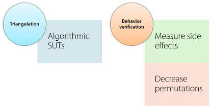
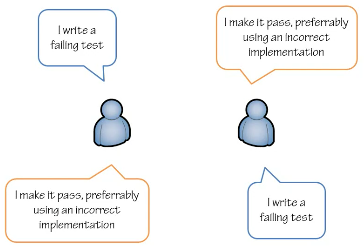

# Outside-In Test-Driven Development

by [Mark Seemann](https://blog.ploeh.dk/)

------

> This course teaches how to build an application **from the outside in** - starting with tests targeting actual features or use cases of an application, but gradually working towards a more and more **detailed specification** of the components of an application. The focus is on the **technical side of TDD**, not the business side. Approximately half of the content is a series of C# demos, building a small RESTful service from scratch.

* [Course in Pluralsight](https://www.pluralsight.com/courses/outside-in-tdd) (also [recommended](https://app.pluralsight.com/library/courses/outside-in-tdd/recommended-courses) ones)
* [Original sample implementation by Mark](https://github.com/ploeh/RunningJournalApi)
* [My demo implementation](https://github.com/ebarbeito/running-journal-api)

🏷️ Tags: `acceptance`, `agile`, `bottom-up`, `outside-in`, `software-design`, `tdd`, `testing`, `unit`, `xp`, `yagni`

------

## Module I. Walking skeleton

* In this module you'll learn how to build a walking skeleton by applying Outside-In TDD
* Also a comparison between Outside-In TDD against other types of software testing

### Purpose of Outside-In TDD

* This approach helps to align what you're doing as software developer with what the product owner wants the software to actually do
* How? → By starting testing **at the boundaries** of the system (the UI, or at service layer like a REST or SOAP service)
  * Because that's most closely aligned with what the product owner typically wants
  * This helps us apply a principle called [YAGNI](https://martinfowler.com/bliki/Yagni.html)
* Build **from the outside and going inwards**, it helps to only write the needed code that meets the requirements that we've stated for ourselves by writing the test at the boundaries of the system
* This helps us to bring better business value

### Outside-In TDD at a glance

* Just like with normal TDD
  * The first thing you have to do is write a failing test
  * Then, we have to produce the real system, in order to make the test pass
  * Again, this is what we call the **system under test**
* What normally happens with this first test (when doing Outside-In TDD) is that this prompts you to write some infrastructure code *(illustrated by making the SUT box slightly larger)*
* Anyway, you'll write **just enough code** to make the test pass; nothing more
* … each time you do that, you slightly expand the SUT by writing new code to meet the requirements that each of those tests encapsulate

### Isn't this simply BDD?

* **BDD**, testing discipline where you work tightly with the PO to specify a set of **executable specifications** that needs to be validated to ensure the software you're building is actually meeting the requirements
* And those executable specifications are usually executed **against the boundaries** of the system
* It sounds a lot like outside-in TDD. But are **not the same**
* BDD and outside-in TDD can be used at the same time → Both  are overlapping and **not mutually exclusive** concepts

### The agile testing quadrants

* There are **many ways** to think about software testing → [The Four Quadrants of Agile Testing](https://www.testing-whiz.com/blog/four-quadrants-of-agile-testing)
* Diagram introduced by Brian Marick. Talks about the many different ways that we can think about testing
* Outside-in TDD focuses mostly on the left-hand side of the quadrant

### The test pyramid

* Concept developed by Mike Cohn. It describes how automated tests should be **distributed** among different types
  * **UI** level. You should only have a few automated tests. They are very hard to develop and maintain, also typically run rather slowly
  * **Service** level. You can have more automated tests here. They tend to be more robust, but still quite slow
  * **Unit** tesing level. You should have most of your automated tests at this point. They are a more robust way
* In relationship to outside-in TDD
  1. You start at the top of the pyramid here. But then you work your way down
  2. So, you write a few automated tests at the service boundaries of your system
  3. Then, to flesh out the behavior of the system, you work your ways into the bottom of the pyramid here
  4. Finally, you should end up having most of your automated tests at the unit testing level

### Outside-In or Bottom-Up

* There are two different approaches to TDD
  * **Outside-in** → “London School of TDD”, “Behaviour Verification”, “Mockist”
  * **Bottom-up** → “Classic TDD”, “State-Based Verification”, “Triangulation”
* London School of TDD vs Classic TDD, behavior-verification vs state-based verification, the mockist vs triangulation styles
* The important point here is that these **aren't mutually exclusive** approaches
* Working with an outside-in TDD approach, you will still do triangulation (aka state-based verification)
* To learn more about the difference and similarities of outside-in vs bottom-up, read the article "[Classic TDD or London School](http://codemanship.co.uk/parlezuml/blog/?postid=987)" from Jason Gorman

### Walking Skeleton

* First thing you should is to **build a walking skeleton**

* A walking skeleton is “An implementation of the **thinnest** possible **slice of real functionality** that we can automatically build, deploy and test **end-to-end**” (from the book “[*Growing Object-Oriented Software, guided by tests*](https://www.goodreads.com/book/show/4268826-growing-object-oriented-software-guided-by-tests)”)

* At this point, this system may not actually do anything particularly interesting. It just sits there and makes "*happy noises*"

* This can be used to drive:

  * **Infrastructure** (and technology decisions, frameworks, persistence, etc.)
  * **Process**, not only TDD itself but also how to deploy the system

* Technical constraints
  * A process you want achieve is **automate as much as possible**, not only the testing, but also the deployment
  * You want to be able to assume that **there's no previous environment setup required**
    * no need to create special directories
    * neither set up special environment variables, registry keys, etc.
  * This is very important in a team environment or when in a CI system
    * You'll have several environments and don't want to have to maintain and synchronize the settings of all of them
  * The only things we can really assume is that we would have **general tools**, such as the IDE or a text editor and a terminal, for example
  * That's the only thing you can **really assume** from the process
  * **Everything else should be automatable**
  

### Demo: introduction

* In this demo, you'll see how to write a walking skeleton, using Visual Studio and C#
* The first thing to build a walking skeleton is simply to write a test and make sure that there's something responding on the other end
  * A very, very simple test and a little bit boring, because it only tests that something sits on the other end of the service boundary
  * And actually responds to the requests that we're giving it

* **Getting a response from a Walking Skeleton**
  * Building a walking skeleton means starting from scratch. An empty project with an acceptance test for the service boundary you want to start with, to those coarse-grained tests that will be written at the boundary of the system
  * Now it's time to write the first automated tests. And I'll do that by adding a class called `HomeJsonTests`
    * The reason why I call it that is because, if you think about the route resource of a RESTful API as the equivalent of the home page for a -- for a web-based application
    * And the reason why I called it json is because I'm going to use json as the serialization format going back and forth
  * The first test I want to write is just a simple test that tests whether the response returns a correct status code
    * So, at this point it's just writing a test that pretty much verifies that there's a system at the other end and it's actually listening to the requests that we are sending
  * In order to invoke the external service boundary of the service, I need a client (*he uses the new HTTP client class from .NET 4*)
  * And we need some more infrastructure in place to actually make this work (an http server)
    * So this prompts us to actually create an http server that's listening at localhost
    * Here is where we might be tempted to set up Apache/nginx/whatever and create a service that's listening on localhost
    * But that would go against a constraint that I should be able to take the source code for this whole system and pull it from the source control from some -- some other machine and just have the system running
    * So I can't have that specific environment setup that requires me to have Apache/nginx/whatever configured in a certain way
    * Luckily, the ASP .NET Web API, which is a new framework for building RESTful services, allows me to do in-process hosting of the service that I want to ride
      * In PHP the most similar option is to use the built-in web server functionality, and infrastructure code to handle HTTP routing (plain or framework code, but something in between)
    * The idea is to host the service from within the specific test case, and don't have to run anything outside the project
  * From the client I can get a response, which is what I really care about
    * So I'll just get the route resource here and block until the result comes back
    * And the only thing I really care about at this point is just to see whether the response was some sort of success status code
  * The test, as it currently looks, represents the essentials of what it is that I currently want to test
* **Recap**
  * This is a walking skeleton that I'm building. So, I just want the simplest possible test to get something up and running
  * In this case I'm doing a get request against the root resource of my system. And the only thing that I'm really getting back is just 200 OK
  * There's no content in the HTTP response at all, but that's okay for now
  * The next thing we can think about is to post a journal entry, because that would later on allow us to read back from that first resource and see whether we could read what we posted

### Demo: Posting an entry

* It's important to treat your test code as a first-class citizen
  * This is something that you're checking into your source control system and you have to maintain it
  * So the same principles for maintainable code apply in test code.

### Demo recap

* At this point, you may be thinking that I'm cheating a little bit, because I haven't really added any functionality to the service at all. I'm just checking out the boundaries of the system and seeing whether they actually respond or not

## Module II. Spiking

### Introduction

* This module talks about the concepts of
  * Spiking
  * FIRST (an acronym that describes some attractive how your unit test should have when you do TDD)
  * Fixture, setup and teardown (which are part of a pattern called Four Phase Test)
* All of those things are important when you look at Outside-In TDD and this concept of spiking

### Application perspective

* With Outside-In TDD you don't need to have a detailed upfront plan for your applications architecture
* Initially, it often helps to just think about the applications architecture as a box, and then see what happens when you implement the application **in response to the automated test** that you write against the external boundaries of the system
* This is called **Emergent Design**, and helps you to adhere to this [YAGNI principle](https://martinfowler.com/bliki/Yagni.html) (*you aren't going to need it*)
  * Only write the code that you **actually need to write** in order to meet the requirements of the product owner
* The external boundaries describe features of the application (...) But the application of stakeholders also has other concerns for the application than just what can be observed over the external boundary of the system. One of these is the ability to store data in a persistent way
* This means that the application also **has some internal boundaries**. This is where it communicates with its persistent way
* So you can think about that as going all the way through the external boundary and into the internal boundary to see whether that data was actually stored
  * **We call that spiking** because **it looks like we're driving a spike all the way through the application**
  * We're not building the entire application, **but we're going through the entire application for a very thin slice of functionality** and making sure that we're going all the way through

### FIRST

* Once we introduce persistence technologies to our automated tests, there are some things that we need to be aware of, that up until now hasn't really been an issue
* To understand what those are, we have to take a detour around this acronym called FIRST. Was first described by Tim Uttinger
* The FIRST acronym says that **tests should be**:
  * **Fast**. They should run as quickly as possible
  * **Isolated**. So that each test can run independently on any other test
  * **Repeatable**. You can repeat the test over and over again and get the same result every time
  * **Self-validating**. Meaning that they will be able to tell by themselves whether they've passed or failed.
  * **Timely**. They should be written at the correct time in the process, which means before you actually write the production code

### Four-Phase Test

* The **Arrange-Act-Assert pattern** for writing unit tests that says that each test should be divided into three phases
  * **First phase: Arrange**. Where I set up all the things that I need to actually invoke the system
  * **Second phase: Act**. Where I act on the system on the test that I have, in this case
  * **Third phase: Assert**. Where I prove that the response that I got back was actually as it was supposed to be
* You might notice that there's an **implicit fourth phase** in a test, and happens **when its scope ends**
  * It happens when the using scope ends and this is the sort of cleanup that happens
* So, there is a superset of the arrange-act-assert pattern, is called [Four Phase Test](http://xunitpatterns.com/Four%20Phase%20Test.html)
  * Instead of calling it arrange-act-assert, we call those phases “fixture setup, exercise SUT verification and fixture teardown”
* You see that we have an **explicit fixture teardown** where we clean up everything that we created so far
* This is the part of the test where we need to go and clean up any persistent data that each test case left behind

### Setting up and tearing down a database

* To introduce a persistence technology such as a database into your automated test, you need to make sure that any data left behind on that database is deleted again
  * The safest way that you can guarantee that is by deleting the database after each test run
* Based on Four Phase Test, here's how that might look like
  * First, in the fixture setup phase, you create the database for every test case
  * Then after you set the database you can exercise the SUT, getting your result verification
  * And then as the test completes, you can tear down the fixture again, which means simply deleting the database
* You should be aware that even though this runs pretty fast on modern computers, compared to a unit test where everything happens in memory, this is a rather slow process
* So we don't want to have too many of our automated tests working in this way
  * And if you recall, the test pyramid by Mike Cohn, this also fits pretty well with the concept of the pyramid, that we don't want to have too many tests at the top of the pyramid

### Demo recap: database setup and teardown

* In this demo I created all the infrastructure required to set up the and tear down a database for each test case
* At every test case where I want the database to be set up and torn down before and after each test case executes

### Backdoor Manipulation

* With all that infrastructure in place it's not possible to write automated tests that verify that the application correctly assists data to the database and reach data from the database
* One possible technique we can use to do that is called [back door manipulation](http://xunitpatterns.com/Back%20Door%20Manipulation.html)
  * We'll use the fixture setup and fixture teardown phases to create and delete the database
  * Using the fixture setup to populate the database with the data that we need in order to run a specific test case
  * In the result verification phase, talk directly to the database and see whether the database was left in a state that matches our expectations

### Demo

* **Introduction**
  * This test will demonstrate that the application can correctly read data from the database and return it through its external service boundary
  * The first part of the test we'll pre-populate the database with a bit of data. **This is the backdoor manipulation part of the test**. And this happens in the fixture setup phase of the test
  * Afterwards, **the test will read the data through the SUT's external service boundary** and verify that the return data matches what was pre-populated into the database
* **Spiking**
  * To perform backdoor manipulation
    * I'll need to write code that writes data to the database
    * In the SUT I'll need to read code from the database
  * The database only exists in short time frames while the test is executing

## Module III. Triangulation

### Introduction

* **Triangulation** is one of two major approaches to unit testing
* You'll also learn about a technique called **devil's advocate** which you can use with TDD
* There are various names for bottom-up TDD such as classic TDD or state based verification or triangulation
* Those names are mainly synonymous but I think that triangulation captures the essence of that way of testing very well

### When to use

* Since there are two major approaches to unit testing you may wonder which one should you use when.
* Triangulation is sort of the **classic TDD technique**. This is what you typically see when you see a common trait of those examples that they tend to focus very much on **SUT that are algorithmic in nature** such as a stack or a scoring system for a bowling game or something like that

### Stimulus/Response

* In essence triangulation works by **applying a stimulus to the SUT and then measuring the response**
* The response may take the form of a return value but might also be a change of an observable state of the SUT itself
* Together we call return values and the observable state of the SUT again for direct output
* That's what you measure when you verify the results of your test

### Triangulation / Sampling

* Triangulation is actually a technique from the physical world where we can use geometry to measure for example the height of the building or the position of a ship at sea
* Imagine for a moment that you have a function or a method that it takes a string as input and returns the string as output, but you cannot see what it does
  * In order to figure out what this method does you'll have to measure it. So this is like sampling where you sample the output of example input and form your hypotheses around that
  * Making this, at some point the hypothesis seems to hold and you may decide to do more sampling just to get a better confidence in your hypothesis
* This is reminiscent of the scientific method. Triangulation is also very similar to this process, the only difference is that at the beginning there is no method

### Test cases as examples

* Test cases are samples of the desired functionality of the SUT. Similar to the sampling process I just described but with measurements taken before the fact
* In science there's a concept known as the observer effect where the mere act of observation has an impact on the subject being observed
* A couple of years ago there was a movement to rename TDD to example driven development
* Today that seems less important but the term example driven development seems almost synonymous with triangulation
* The process of sampling until we have gained confidence in our hypothesis is very similar to TDD

### Devil's Advocate. Motivation

* You may also have been thinking that at times I almost went out of my way to **implement the code as naively as possible**
* This is actually a deliberate technique called Devil's Advocate
  * One of the challenges in TDD (especially for beginners) is to only **write enough production code to pass each test**
  * The Devil's Advocate technique can be used to combat that tendency and helps to focus the unit test on the essence of what they attempt to accomplish
  * It's originally a pair programming technique but you can also use it in sole mode as a way to critique your own tests as you write them

### Red/Green/Refactor

* The red green refractor cycle is a way to describe TDD as an intritive process
* First you write a failing test, secondly you add just enough code to make it pass. Finally you may refractor the implementation code
* The Devil's Advocate technique helps you with the second step of writing just enough code to pass the test

### Ping Pong

* The Devil's Advocate technique is a variation of another pair programming technique called Ping Pong which works like this
  * The first developer writes a failing test and passes the keyboard to the second developer
  * The second developer implements the system of the test so that the new test, together with all the existing tests pass
  * According to the red green refractor cycle, both developers can now collaborate on refracting the code but the keyboard stays with the second developer and now new functionality can be added
  * When refactoring is over the second developer writes a new failing test and passes the keyboard to the first developer
  * The first developer modifies the system on the test to make all tests pass
* This cycle can be repeated as long as necessary

### Devil's Advocate

* The Devil's Advocate variation on ping pong goes like this
  * The first developer writes a failing test and passes they keyboard to the second developer
  * The second developer make all tests pass but makes an extra effort to implement the new feature in a naive or even an incorrect way
  * Both developers can see this and as long as it's possible to write a simple but incorrect implementation that passes all the tests it indicates that more test cases are required. Keep in mind that we are in the overall context of triangulation
  * The second developer now writes a new test in order to provoke a better implementation of the SUT
  * The first developer now makes a similar effort to pass the test as naively or incorrectly as possible. If this is possible it may either mean that more test cases are required or that the test wasn't concise enough
* Often this provides valuable feedback of the quality of the unit tests particularly about the result verification step

### Gollum Style

* Although the Devil's Advocate technique is based on bad programming you can also use it while working independently
* All it requires is and ability to constantly shift your perspective in order to play both roles from the pab programming techniques
  * I call this technique Gollum style because it reminds me a bit of the internal dialog kept by Gollum
* You start out as nice Gollum by writing a failing test and then you instantly morph into a nasty Gollum and pass the test as naively or incorrectly as possible
* Rinse and repeat.

### Demo introduction

* Making triangulation with the Gollum style, used more aggressively
* The previous demo serialized a simple Web Token to a string and in this demo you'll see that converse feature passing a string into a simple Web Token instance.

### Demo: Simple Web Token parsing

* In order to parse a simple Web Token I'd like to add a try-parse method
* In the pattern language of xunit test patterns this is called a dummy. The actual result is produced by invoking the `TryParse` method with the invalid string and the dummy
* The tests still pass. Robert C. Martin describes a technique called the [transformation priority premise](http://blog.cleancoder.com/uncle-bob/2013/05/27/TheTransformationPriorityPremise.html) which quickly told provide abstract guidance on what the next test case should be in order to transform the code towards a better implementation
* The most preferred transformation it's possible to perform on the current code, is to introduce a conditional so that it can return both false and true
* The next test case must trigger this transformation so I add the test method try-test valid string returns correct results. The expected result of the test can be expressed as an array of claims

### Summary

* In this module you learned about triangulation which is one of the two major approaches to unit testing. It fits best when testing code with a heavy algorithmic component
* It also helps if the SUT has few or no external dependencies
* **Triangulation is a bit like science**. The more facts you can gather about a system the greater your confidence in that system will be but ultimately there are no guarantees
* You also learned about the Devil's Advocate technique and it's slightly twisted variation Gollum style
  * It helps you to write the right test code that in test cases table that always move the code forward in a constructive manner

## Module IV. Behavior Verification

### Introduction

* In this module, you'll learn about behavior verification
* You'll also learn about something called characterization tests

### Outside-In versus Bottom-Up

* There are two major approaches to TDD; outside in and bottom up
* In the previous module, you learned about the bottom up approach. In this module, you'll learn more about the outside in approach
* The names London School of TDD Behavior Verification and mockist are more or less synonyms but I prefer behavioral verification because it's the most descriptive

### Behavior Verification

* Quickly told behavior verification can be used to **prove that each unit interacts correctly with its dependencies**
  * This allows to **reduce the number of permeations required** to fully cover the functionality of a SUT, **reducing the number of test cases** you'd have to write

### Triangulate all the things!

* So, if you stay only at the service boundary and try to triangulate the robust implementation you'd have to write not 1 or 2 test cases but 2 times 6 test cases; that's 12 in all just to make the user name code more robust

### Triangulate all the things - not

* Triangulatin all the things bring the total test cases up to 18 and that's for a very small system
* For a larger system, the total number of test cases you'd have to write **would be enormous if you only write test against the external boundary of the system**
* This is one of the forces motivating the test pyramid; it's impractical to test only by the external boundary even if that's the most business centric thing to do clearly triangulation isn't the whole solution

### Cyclomatic Complexity

* The number of test cases you have to write **is related to the cyclomatic complexity** of the solution
* [Cyclomatic complexity](https://en.wikipedia.org/wiki/Cyclomatic_complexity) is an established measurement of software complexity
  * It counts the number of paths through a member
  * The minimum possible cyclomatic complexity is 1
  * Measuring the complexity of a given block of code:
    * start with 1
    * add 1 every time you find the key words such as `if`, `else`, `case`, `for`, `for each`, `do`, `while`, `catch`
* Because cyclomatic complexity measures the number of ways through a block of code, they also correlate strongly to the number of test cases you'd have to write in order to cover the code (to cover the permulations)

### Code Coverage

* Code coverage is a measure of how much of the code of the system is being exercised (covered) by giving test read
* It's a relative number between 0 and 100%. That number may not mean a lot in itself but it can be interesting to watch the trend
  * If coverage decreases regularly, you should look into why that is happening
  * To keep coverage constant the number of test cases should correlate with the cyclomatic complexity of the system
* As you add more complexity, you should also add more test cases although in TDD you should add the test cases first
*  Please be aware that code coverage is not a measure of quality and not even a measure of quality of the test code but the trend can be interesting

### Dependency Injection required

* This is where [dependency injection](https://martinfowler.com/articles/injection.html) or [loose coupling](http://www.principles-wiki.net/principles:low_coupling), and [programming against interfaces](https://tuhrig.de/programming-to-an-interface/) are required

### Formal proofs

* In the previous module, you learned how triangulation is similar to the scientific method
  * You measure a stimulus response path until you have gained so much confidence that you decide that you're done
* Behavioral verification on the other hand offers something more resembling a **formal mathematical proof**
  * **Stubs** can prove how data flows
  * **Mocks** can prove: "that side effect occurs" or "that side effect doesn't occur"

### Data Flow

* Looking at the journal controller from the outside (from the client, eg) we don't have to care about every detail of the implementation
* Rather we can concentrate on how data flows
  * GET method is involved → it should first get the user name → then it should use that user name to get the journal entries → then return the entries to the client
* If we can prove that this flow happens, we're closer to proving that the overall system works correctly with fewer test cases

### Side Effects

* Similarly, when methods have side effects such as the post method
  * we would expect the method to first get the user name → then use that user name to add the entry to the data store
* If we can prove that this happens, we're verifying the behavior of the system unrelated to any specific implementation

### Observation

* To contrast behavior verification with triangulation, a major difference lies in what is being observed
* With behavior verification → we observe what happens between the components
* With triangulation → we observe what is externally visible

### Stimulus/Response

|              | Behavious Verification | Triangulation |
| ------------ | ---------------------- | ------------- |
| **Stimulus** | Indirect Input         | Direct Input  |
| **Response** | Indirect Output        | Direct Output |

* Indirection
  * **Indirect input** → Input into the SUT from one of its internal components (eg: it may be that it raised an event or that time returned a value from a query)
  * **Indirect input** → When the SUT supplies data to its components
  * This form of indirection of stimulus and response is very closely related to the concept of backdoor manipulation
* Triangulation on the other hand is more direct
  * So, we call the stimulus for it direct input and the response for direct output

### Initial coverage from Outside-In

* Consider how much coverage we already have components
* Strictly following the TDD rule of only adding code in response to a failing test, the code coverage of the demo code is currently at 100%
* But it's only exercising a single path through the entire system
* Clearly I need to add more tests

### Characterization Tests

* To cover existing code with unit tests you can write [characterization tests](https://michaelfeathers.silvrback.com/characterization-testing) which is a term introduced by Michael Feathers
* A characterization test is written **after the SUT code**
* Normally that's a bad sign, but in the context of Outside-in TDD it's sometimes necessary **in order to reduce the number of permutations** you'd otherwise have to cover
* Your write a seemingly redundant tests in order to save yourself from writing a lot of other tests
* A characterization test characterizes the current behavior of the SUT
* You could say that it **captures a snapshot** of its externally visible behavior

### Monolith

* Throughout this course you've seen me build a single monolithic demo and you may be wondering is this now supposed to be good? What happened to layout architectures?
* Well, the code base I've created is actually **very loosely coupled**. This tends to be a **side effect** of developing code with TDD technique
* There's nothing preventing me from now decoupling my monolithic code into multiple libraries

### Summary

* In this module, you learned about behavior verification which is one of two major approaches to unit testing
  * **Using stubs** it enables you to define **how data flows through a unit**
  * **Using mocks** it enables you **to measure whether or not side effects happened**
* While triangulation reminds me of the scientific method, behavior verification is a bit more like math
  * It's almost as if from established pre-requisites it could be proven that a given unit always **behaves in a certain way**
* Sometimes when starting at the boundary of a system and working our way in, we may leave some classes uncovered by unit tests although they are covered by acceptance tests
* In order to establish the behavior of such units, we may sometimes have to write characterization tests to **capture the current behavior of a unit**
* This enables us to properly isolate each unit independently of each other but still verify that they interact correctly with each other
  * This, again, helps us to reduce the number of tests we have to write

