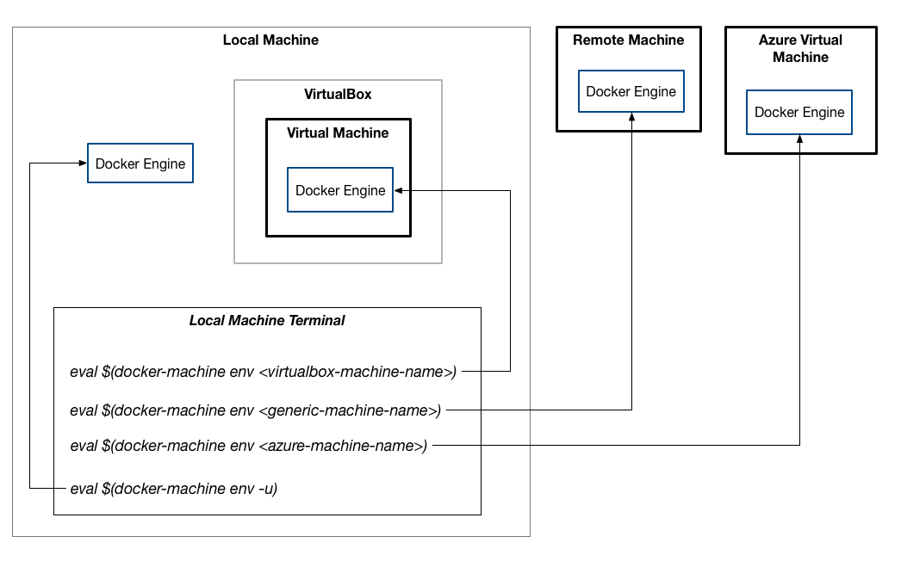
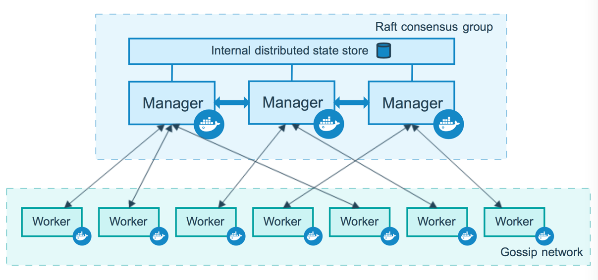

# Shipping Docker

by Chris Fidao

------

>  A deep dive on Docker, from development, to CI, to production

* [Course in Servers for Hackers](https://courses.serversforhackers.com/shipping-docker)

🏷️ Tags: `docker`, `docker-compose`, `docker-machine`, `docker-swarm`, `container`, `environment`, `software-development`, `tooling`, `ci`, `cd`, `jenkins`,  `command-line`

------

## Basics

### The Docker commands

* `docker` the main command, manage the life cycle of docker containers
* `docker-compose` coordinate the use of multiple containers (services) using a yaml file
* `docker-machine` spin up servers, install Docker, and let us control them remotely

### First container

Inspect the current Docker setup

```sh
# Check for running containers:
docker ps

# Check for existing containers, whether running or not
docker ps -a

# View local images
docker images
```

Running an `ubuntu` image, tagged `16.04`

```sh
# Lists out the current working directory
# inside the container
docker run ubuntu:16.04 ls -lah
```

* When you start a container, you need to start the container from its image. So images are the first baseline thing to create a container.
* Since that's not on my machine locally, it gets downloaded from Docker Hub (specifically https://hub.docker.com/_/ubuntu/)
  * This URL is for the “ubuntu official repository”
  * You can identify official repositories of images when the URL has `/_/`
* This container runs the `ls -lah` and then stops
* Since the `ls` command is short-running (runs, then exits), the container will stop once the `ls` command finishes
* **Containers will only run as long as there's a process to run/monitor**.
* The tag `latest` represent the default tag of some image.

We can see this container still exists but no longer is running:

```sh
# No output
docker ps

# Shows our stopped container
docker ps -a

CONTAINER ID    IMAGE           COMMAND    CREATED        STATUS               NAMES
52a27a2dfd75    ubuntu:16.04    "ls -lah"  13 hours ago   Exited (0) 2s ago    condescending_lamarr
```

### Inspecting containers

We can inspect our containers to get some more information out of them, using the `docker inspect` command. The output is JSON.

```sh
# Outputs json, an array of containers
docker inspect container_name_or_id
[{
    "Id": "abcdefghijklmnopqrstuvwxyz",
    ...
}]
```

We can get some specific information out of this in two ways. One way has no dependencies and works with the `docker inspect` command. It uses Golang-style template tags:

```sh
# Get main IP address
docker inspect --format="{{.NetworkSettings.IPAddress}}" container_name_or_id

# Get IP address of all connected networks
docker inspect --format="{{range .NetworkSettings.Networks}}{{.IPAddress}}{{end}}" container_name_or_id
```

Another way I parse this JSON output is with the [`jq` utility](https://stedolan.github.io/jq/). It has nicer output and easier formatting to parse JSON output.

```sh
# "Prettify" the json output:
docker inspect container_name_or_id | jq

# Parse the output, get main IP Address
docker inspect container_name_or_id | jq -r ".[0].NetworkSettings.IPAddress"

# Parse the output, get "bridge" network IP Address (same as above)
docker inspect container_name_or_id | jq -r ".[0].NetworkSettings.Networks.bridge.IPAddress"
```

### Cleaning up

When running a lot of Docker commands, we often end up with a lot of cruft. Here's how to clean up after ourselves.

#### Containers

First, I'll make some more containers. Since each `docker run` command creates a new container, we can re-run our previous command a few more times to create a few more:

```sh
# Create two more containers
docker run ubuntu:16.04 ls -lah
docker run ubuntu:16.04 ls -lah

# See 2-3 stopped containers listed
docker ps -a
```

We can remove a container (permemently):

```sh
docker rm container_name_or_id
```

Or we can remove all containers with this trick:

```sh
docker rm $(docker ps -aq)
```

* The `docker ps -aq` command (with the additional `-q` flag) will list containers but only output their ID.

We can run containers that clean-up after themselves as well. Adding the `--rm` flag ensures the container deletes itself when it's done runnng (when it stops):

```sh
# Remove the container when done running
# via the --rm flag
docker run --rm ubuntu:16.04 ls -lah

# We'll see no new container listed here
docker ps -a
```

#### Images

We can do the same for images:

```sh
# List images
docker images

# Remove a specific image by ID or Name
docker rmi image_id_or_name:tag_combo

# Remove all images
docker rmi $(docker images -q)
```

### Interacting with a container (bash)

Since we can run just about any command within a container, let's try to run `bash`. Bash is an interactive shell, so in theory, if we spin up `bash` within a container, we should be able to interact with that container

```sh
# Run bash, but it exists immediately
docker run ubuntu:16.04 bash

# Container exists (success status code)
docker ps -a

CONTAINER ID    IMAGE           COMMAND    CREATED         STATUS               NAMES
5b56c2bf5dde    ubuntu:16.04    "bash"     13 hours ago    Exited (0) 1s ago    fervent_babbage
```

We need to tell Docker to make this interactive!

```sh
# Add the -i and -t flags
docker run -i -t ubuntu:16.04 bash

# Shorten that to just -it
docker run -it ubuntu:16.04 bash
```

We can run `docker run --help` to see what the `-i` and `-t` flags do:

* `-i, --interactive`: Keep STDIN open even if not attached. This means we can input commands into the running process by typing
* `-t, --tty`: Allocate a pseudo-TTY, letting us get output as if we're logged into the container

This will look like we're logged into the container! We can then run commands against it:

```sh
root@5660cf3be26f:/# pwd
/

root@5660cf3be26f:/# whoami
root

root@5660cf3be26f:/# which apt-get
/usr/bin/apt-get
```

Let's look at the running processes:

```sh
root@5660cf3be26f:/# ps aux

USER       PID %CPU %MEM    VSZ   RSS TTY      STAT START   TIME COMMAND
root         1  1.3  0.1  18240  3280 ?        Ss   00:39   0:00 bash
root        12  0.0  0.1  34424  2864 ?        R+   00:39   0:00 ps aux
```

* There's only two! We usually see a huge list inside of a regular server.
* The container, however, will only run one process (and any secondary processes that single process starts)
* Here we see also our `ps aux` process running as well, which gets us this output.

Note that `bash` is started as PID 1 as well - the first process, which on a regular server is usually the init system that boots everything else.

Now we can exit the container, which will stop `bash` and therefore also the container.

```sh
root@5660cf3be26f:/# exit

docker ps

docker ps -a

CONTAINER ID    IMAGE           COMMAND    CREATED    STATUS                   NAMES
5660cf3be26f    ubuntu:16.04    "bash"     13h ago    Exited (0) 17 minutes    fervent_babbage
```

We can actually restart this stopped container as well!

```sh
docker start 5660cf3be26f

docker ps
```

* The container is running!
* However, we're not "attached" - there's no `-it` equivalent passed when we restarted the container.

We can get that back tho!

```sh
docker stop 5660cf3be26f
docker start -i 5660cf3be26f

root@5660cf3be26f:/# whoami
root
```

* Note that when we re-started it, we didn't need to define an image or command
* It already had that defined based on the `docker run` command used to create it
* So, starting or stopping this existing container was much simpler than creating it - it remembers the settings and variables used when restarting it.

### Nginx & Sharing ports

Let's see how we might install Nginx into a container. We'll first do it a super-manual way so you get an idea of how Docker containers are functioning.

First we'll spin up a new container and run Bash so we can interact with it:

```sh
docker run -it ubuntu:16.04 bash
```

Then we can run some commands to install and run Nginx:

```sh
# Install nginx
apt-get update
apt-get install -y nginx

# Nginx does not start automatically like it
# might on a regular Ubuntu server
# Start nginx manually:
nginx

# See that Nginx is running by listing
# out all running processes
ps aux
```

If we open a new tab in our terminal and attempt to curl request against the container, we'll see it won't work. We haven't made any way to connect to the container externally.

```sh
# From our host machine, not from within the container
curl localhost

# web request against the container's IP address
curl 171.17.0.2
```

Let's see how to do this. We'll exit the container, delete it, and re-try it, this time forwarding port 80 on our host machine into port 80 in the container.

```sh
# exit from container
exit

# remove container
docker rm container_id

# restart new container
docker run -it -p 80:80 ubuntu:16.04 bash
```

Then we can re-install nginx, start it, and try another curl request against it!

```sh
apt-get update && apt-get install -y nginx
nginx
```

From our host machine (my Mac in this case) we can curl request it on `localhost:80`, since we're forwarding my Mac's port 80 to port 80 in the container.

```sh
curl localhost
> Welcome to nginx! (and other html output)
```

So, that works! We can see the default nginx page in a curl request and in our browser.

### Sharing volumes

We want to use Nginx in a container in a way that lets us serve our own content.

To do that, we'll learn a new flag for the Docker run command, the `-v` flag. This stands for "volumes" and it lets us share volumes between our host machine and the container.

Let's see how that might work:

```sh
# Create a new directory and get into to
mkdir dockertest
cd dockertest

# Create a new index.html file to server
echo "Hello, Shipping Docker!" > index.html

# Run a new container that we'll use for Nginx
# Share the current directory with the container
docker run -it -p 80:80 -v ~/dockertest:/var/www/html ubuntu:16.04 bash
```

Then we can quickly install nginx and run it:

```sh
# Install Nginx
apt-get update && apt-get install -y nginx

# Verify the default config is looking in /var/www/html
cat /etc/nginx/sites-available/default

# Check /var/www/html, confirm
# it has our shared index.html
cd /var/www/html && cat index.html

# Run nginx
nginx
```

Then we can `curl` request it from our host machine!

```sh
curl localhost
> Hello, Shipping Docker!
```

We can edit the `index.html` file to verify changes are reflected as well. I added a few exclamation marks to the index.html file and immediately could see the page updated with that content in the browser and in a curl request.

## Docker images & Everyday use

### Commiting changes

We're going to start the process of creating our own images. This lets us start new containers from images of our own. These images can have any software or configuration we need them to.

We'll start by doing this **manually** so you can see how Docker works when committing changes to create a new image.

```sh
# Spin up a new container
docker run -it ubuntu:16.04 bash

# Install Nginx
apt-get update && apt-get install -y nginx
```

Then we can exit that container and inspect what we've done:

```sh
# Exit from the container if you have not

# Verify it has stopped
docker ps -a

# See diferences
docker diff container_name_or_id
```

* This is sort of like Git, in that we can see changes since our last "commit" (differences from the base image that we used to spin up the container).

We can commit changes too. When we commit them, we create a new image with a name and a tag (default tag is `latest`).

```sh
# Get the help menu
docker commit -h

# Commit our changes (installing Nginx)
docker commit -a "Chris Fidao" -m "Installed nginx" container_name_or_id shippingdocker/nginx:0.1.0
```

* That will create a new image

We can see that new image and spin up a new container from it!

```sh
# See our new image
docker images

# Create a new index.html file
echo "Hello, Shipping Docker" > index.html

# Spin up a container from the new image
docker run -it -p 80:80 -v $(pwd):/var/www/html shippingdocker/nginx:0.1.0 nginx
```

Note, however, that the container does not stay up and running! The video goes into more depth, but essentially Nginx daemonizes itself and Docker loses track of the first process that it spun up. It therefore exits, since it has no means of tracking the process that PID 1 spawned before dying.

So, we need to edit the image to set Nginx to no longer daemonize.

```sh
docker run -it -p 80:80 -v $(pwd):/var/www/html shippingdocker/nginx:0.1.0 bash

> echo "daemon off;" >> /etc/nginx/nginx.conf
> exit
```

The we can re-commit this change, incrementing the image's tag:

```sh
docker commit -a "Chris Fidao" -m "Nginx no longer daemonizes" container_name_or_id shippingdocker/nginx:0.2.0
```

Spin up a new container using the new image:

```sh
# Container runs in forgeround:
docker run -it -p 80:80 -v $(pwd):/var/www/html shippingdocker/nginx:0.2.0 nginx

# Or put the container to the background with `-d`
docker run -d -it -p 80:80 -v $(pwd):/var/www/html shippingdocker/nginx:0.2.0 nginx
```

Lastly, we can see the `history` of an *image* as well:

```sh
docker history shippingdocker/nginx:0.1.0
docker history shippingdocker/nginx:0.2.0
```

This will not every command we ran inside of the container, but it will show the commands we used to spin up the container and any commit message made when we commited changes to create the image we're seeing the history of.

### The Dockerfile

..

### Building a PHP image

We want to work up towards running a Laravel PHP application. To do that, we need a container running PHP.

#### Dockerfile

We'll build such a container in this video, using a new `Dockerfile`.

```sh
cd ~/dckr
mkdir php
cd php
vim Dockerfile
```

And we can fill in the `Dockerfile`.

> **Note**: An update not in the video:
>
> Near the top of the following `Dockerfile`, I had to add the installation of the package `locales` in order to set the locale correctly. A newer version of the base Ubuntu image had this package uninstalled by default.

```dockerfile
FROM ubuntu:16.04

MAINTAINER Chris Fidao

RUN apt-get update \
    && apt-get install -y locales \
    && locale-gen en_US.UTF-8

ENV LANG en_US.UTF-8
ENV LANGUAGE en_US:en
ENV LC_ALL en_US.UTF-8

RUN apt-get update \
    && apt-get install -y curl zip unzip git software-properties-common \
    && add-apt-repository -y ppa:ondrej/php \
    && apt-get update \
    && apt-get install -y php7.0-fpm php7.0-cli php7.0-mcrypt php7.0-gd php7.0-mysql \
       php7.0-pgsql php7.0-imap php-memcached php7.0-mbstring php7.0-xml php7.0-curl \
    && php -r "readfile('http://getcomposer.org/installer');" | php -- --install-dir=/usr/bin/ --filename=composer \
    && mkdir /run/php \
    && apt-get remove -y --purge software-properties-common \
    && apt-get clean \
    && rm -rf /var/lib/apt/lists/* /tmp/* /var/tmp/*

ADD php-fpm.conf /etc/php/7.0/fpm/php-fpm.conf
ADD www.conf /etc/php/7.0/fpm/pool.d/www.conf

EXPOSE 9000
CMD ["php-fpm7.0"]
```

#### Configuration Files

Now we `ADD` two files here, which we'll need to create alongside the `Dockerfile`.

**File `php-fpm.conf`**:

```ini
[global]
pid = /run/php/php7.0-fpm.pid
error_log = /proc/self/fd/2
daemonize = no
include=/etc/php/7.0/fpm/pool.d/*.conf
```

* The two changes from the defaults in this file are:

1. `error_log = /proc/self/fd/2`
2. `daemonize = no`

**File `www.conf`**:

```ini
[www]
user = www-data
group = www-data
listen = 0.0.0.0:9000
listen.owner = www-data
listen.group = www-data
pm = dynamic
pm.max_children = 5
pm.start_servers = 2
pm.min_spare_servers = 1
pm.max_spare_servers = 3
access.log = /proc/self/fd/1
```

Again we have only two changes from the defaults:

1. `listen = 0.0.0.0:9000`
2. `access.log = /proc/self/fd/1`

#### Building the Image

We'll build the image in much the same way as we did for the Nginx container:

```sh
docker build -t shippingdocker/php:0.1.0 .
```

Once that's done building, we can test it out:

```sh
docker run --rm -it shippingdocker/php:0.1.0 php -v
docker run --rm -it shippingdocker/php:0.1.0 composer -h
docker run --rm -it shippingdocker/php:0.1.0 which php-fpm7.0
```

In the next video, we'll get the Nginx and PHP containers talking to eachother.

### Linking Nginx & PHP containers

We need to adjust our Nginx image so it expects to serve a PHP application. Then we can get the two containers talking to eachother.

#### Test Files

First, we'll create some PHP to run and test with on our host machine:

```sh
mkdir -p application/public
echo "<?php phpinfo();" > application/public/index.php
```

#### Update the Nginx Image

Next we need to update the Nginx `Dockerfile`. We'll create a new file alongside it called `default`, which will replace the default Nginx server configuration (virtualhost). We'll be changing it so it works with PHP:

**The `default` configuration file:**

```nginx
server {
    listen 80 default_server;

    root /var/www/html/public;

    index index.html index.htm index.php;

    server_name _;

    charset utf-8;

    location = /favicon.ico { log_not_found off; access_log off; }
    location = /robots.txt  { log_not_found off; access_log off; }

    location / {
        try_files $uri $uri/ /index.php$is_args$args;
    }

    location ~ \.php$ {
        include snippets/fastcgi-php.conf;
        fastcgi_pass php:9000;
    }

    error_page 404 /index.php;

    location ~ /\.ht {
        deny all;
    }
}
```

Next we update the Nginx `Dockerfile` to use the new `default` configuration file:

```dockerfile
FROM ubuntu:16.04

MAINTAINER Chris Fidao

RUN apt-get update && apt-get install -y nginx \
    && apt-get clean \
    && rm -rf /var/lib/apt/lists/* /tmp/* /var/tmp/* \
    && echo "daemon off;" >> /etc/nginx/nginx.conf

ADD default /etc/nginx/sites-available/default

# forward request and error logs to docker log collector
RUN ln -sf /dev/stdout /var/log/nginx/access.log \
    && ln -sf /dev/stderr /var/log/nginx/error.log

CMD ["nginx"]
```

Then we can build this again, incrementing our tag from 0.1.0 to 0.2.0:

```sh
docker build -t shippingdocker/nginx:0.2.0 .
```

Here we see Docker using it's cache to speed through some of the commands until it finds a difference in the Dockerfile (or files the Dockerfile pulls in). This makes subsequent builds super fast!

#### Link the PHP and Nginx Containers

Now we're ready to get the two containers talking to eachother.

We'll spin up the PHP container and then the Nginx container:

```sh
# Up to directory with the application dir inside of it
cd ../

# Spin up PHP, naming the container "myphp"
docker run -d --name=myphp -v $(pwd)/application:/var/www/html \
    shippingdocker/php:0.1.0

# Spin up Nginx, linking the container "myphp" and aliasing it to "php"
# so the hostname "php" resolves to the IP address of the "myphp" container
docker run -d --link=myphp:php -p 80:80 -v $(pwd)/application:/var/www/html \
    shippingdocker/nginx:0.2.0
```

If we head to our browser, we should see our `phpinfo();` dump at location `localhost`!

#### Docker exec

We're going to go into our `Nginx` container to see what's going on with the linking and how that makes the `php` hostname work.

We'll use `exec` to run a process inside of an already-created container. In this case, we'll run `bash` so we can interact with the container. This is similar to logging into a running container.

```sh
# Nginx container happens to be named zen_einstein
docker exec -it zen_einstein bash
```

This is very similar to the `docker run -it <image-name> bash` command. In fact, the `-i` and `-it` flags do the same thing.

Then we can play around inside of this running container.

```sh
# See that Nginx is indeed running
ps aux

# Check what hostname "php" resolves to:
getent hosts php
> 127.17.0.2 php 49970c8356b2 myphp
> exit

# Use docker to get the IP address of the php container
# and verify it is also 127.17.0.2
docker inspect myphp | jq -r '.[0].NetworkSettings.IPAddress'
> 127.17.0.2
```

It does match!

### Pushing to Docker Hub

If you create an account on Docker Hub (https://hub.docker.com) you can push up your images and store them there.

Once you have an account, you can login on the command line:

```sh
docker login
> username
> password
```

Once logged in, you can push images to your account:

```sh
docker push shippingdocker/nginx:0.2.0
```

Docker hub is also the default repository for when you `pull` or `run` images that don't yet exist locally.

```sh
# Pull  nginx:alpine, but don't run a container
docker pull nginx:alpine

# Run a container of alpine:latest, which
# will download it first if you don't
# already have it
docker run --rm alpine:latest sh
```

In a future video, we'll also cover hosting your own pricate repostory, backed by S3.

### Linking the Full Stack

We're going to link together a few containers and more of a full stack that we can use for a real application.

We'll run the following containers:

1. Nginx
2. PHP-FPM
3. MySQL
4. Redis

These containers will be linked together so they can communicate with eachother - something like this:

```
Nginx (80:80) --> PHP-FPM (--name, --link)  -> Redis/MySQL (--name, --link)
```

We'll start with the tail end (data containers) and work our way forward to the Nginx containers.

```sh
# Data containers. These don't link to anything 
# as they don't need to communicate externally to other containers.
docker run -d --name=redis redis:alpine

docker run -d --name=mysql \
    -e MYSQL_ROOT_PASSWORD=root \
    -e MYSQL_DATABASE=my-app \
    -e MYSQL_USER=app-user \
    -e MYSQL_PASSWORD=app-pass \
    mysql:5.7

# The PHP container links to the data containers
docker run -d --name=php \
    --link=redis:redis \
    --link=mysql:mysql \
    -v $(pwd)/application:/var/www/html \
    shippingdocker/php:0.1.0

# The Nginx container links to the PHP container
# (It only communciates to the php container, no db or redis)
docker run -d  --name=nginx \
    --link=php:php \
    -p 80:80 \
    -v $(pwd)/application:/var/www/html \
    shippingdocker/nginx:0.2.0
```

We can test this out with a quick PHP script that tests that it can see the IP address of the Redis container and it can connect to the MySQL container:

```php
<pre><?php
echo "Hostname 'redis' can be found at: " . gethostbyname('redis')."\n";

$hostname='mysql';
$username='app-user';
$password='app-pass';
$dbname='my-app';

try {
    $dbh = new PDO("mysql:host=$hostname;dbname=$dbname", $username, $password, [
        PDO::ATTR_ERRMODE => PDO::ERRMODE_EXCEPTION
    ]);
    echo "Connected to the database at hostname 'mysql': " . gethostbyname('mysql') . "\n";
} catch(Exception $e) {
    echo $e->getMessage();
}

?></pre>
```

### Docker Networking

Let's explore using the `docker network` command to more easily setup a way for our containers to speak to eachother.

```sh
# See available commands
docker network -h

# We'll create a new network, with
# default driver "bridge"
docker network create --driver=bridge sd-net
```

Docker has 2 main network types out of the box, however network drivers are based on a plugin system, so 3rd party ones can be used.

- **bridge** - the default network type, used for single-host setups (all containers are on a single server)
- **overlay** - A mesh network that can span multiple hosts (servers) - good for Docker Swarm

For our example here, we just create a default `bridge` network named `sd-net`. We can spin up some new containers just like before, except this time we'll add them into a network instead of link them.

```sh
# Redis
docker run -d --name=redis --network=sd-net redis:alpine

# MySQL
docker run -d --name=mysql \
    --network=sd-net \
    -e MYSQL_ROOT_PASSWORD=root \
    -e MYSQL_DATABASE=my-app \
    -e MYSQL_USER=app-user \
    -e MYSQL_PASSWORD=app-pass \
    mysql:5.7

# PHP
docker run -d --name=php \
    --network=sd-net \
    -v $(pwd)/application:/var/www/html \
    shippingdocker/php:0.1.0

# Nginx
docker run -d  --name=nginx \
    --network=sd-net \
    -p 80:80 \
    -v $(pwd)/application:/var/www/html \
    shippingdocker/nginx:0.2.0
```

That will spin up all 4 containers. They'll be in a network and can communicate with eachother using the same hostnames we used before, since we created the link "aliases" to match the container names.

* Note the distinction there, however. With `--link`, we can create the "hostnames", while with the `--network` option, a container's hostname is based on the container name (or container ID).

### Docker Volumes

```sh
docker volume -h

docker volume ls
```

We'll see two volumes shared between the containers we spun up in the last video and my host machine. The MySQL container and the Redis container Dockerfile's both contain a `VOLUME` entry, which tells Docker to create a named volumed when a container is spun up from those images.

So, the volumes are created and shared to the host machine.

#### Inspecting a Volume

We can see that by inspecting a volume and attempting to locate the files on our host machine.

```sh
docker volume inspect volume_name_or_generated_hash
```

We'll see a `Mountpoint` of something like `/var/lib/docker/volumes/volume_name_or_generated_hash/_data`.

On our Macintosh or Windows machines (but not on our Linux machines which can run Docker natively!) we run into an issue here. Those directories on our host machine do not exist. They only exist within the virtualization layer that is running Docker!

But we can still inspect them using a little trick - spinning up an Alpine linux container and sharing the root of our Macintosh's drive. We'll see the Alpine linux container is able to access the "hidden" Docker files, which contain the named volumes.

```sh
docker run --rm -it -v /:/vm-root \
    alpine:latest ls -lah /vm-root/var/lib/docker/volumes/volume_name_or_generated_hash/_data
```

This outputs the docker volume directory that we couldn't otherwise see directly on our Mac's file system!

#### Creating and Using a Named Volue

We kill our currently running containers and volumes, and then create a new named volume.

```sh
docker stop $(docker ps -aq)
docker rm $(docker ps -aq)

docker volume rm $(docker volume ls -q)

# Create a new volume, giving it a name
docker volume create --driver=local --name=mysqldata

# See that it exists (and is empty at this point)
docker run --rm -it -v /:/vm-root \
    alpine:latest ls -lah /vm-root/var/lib/docker/volumes/mysqldata/_data
```

Let's re-create a MySQL containers, and we'll use this volume for the MySQL container:

```sh
# MySQL
docker run -d --name=mysql \
    -v mysqldata:/var/lib/mysql \
    mysql:5.7
```

If we `exec` into this container, we'll see that our old database (`my-app` and `whatever-test` still is present, and our `root` user still has the same password. The MySQL container is re-using the data that exists in the `mysqldata` named volume!

```sh
docker exec -it mysql bash

> mysql -u root -p
> show databases;
```

## Wrangling containers with Docker Compose

### Introducing Docker Compose

Usefull to configure a development environment that is very easy to spin up and down share with coworkers and teammates

```sh
docker-compose -h
```

We see a quick example of a `docker-compose.yml` file from the [Docker documentation](https://docs.docker.com/compose/compose-file/).

### Docker Compose Basics

Let's dive straight into setting up a working `docker-compose.yml` file

Inside of the directory that has our `application` folder and PHP files, I create a new `docker-compose.yml` file and add the following content:

```yaml
version: '2'
services:
  nginx:
    image: shippingdocker/nginx:0.2.0
    ports:
     - "80:80"
    volumes:
     - ./application:/var/www/html
    networks:
     - sd-net
  php:
    image: shippingdocker/php:0.1.0
    volumes:
     - ./application:/var/www/html
    networks:
     - sd-net
  redis:
    image: redis:alpine
    networks:
     - sd-net
  mysql:
    image: mysql:5.7
    ports:
     - "3306:3306"
    environment:
      MYSQL_ROOT_PASSWORD: root
      MYSQL_DATABASE: my-app
      MYSQL_USER: app-user
      MYSQL_PASSWORD: app-pass
    volumes:
     - mysqldata:/var/lib/mysql
    networks:
     - sd-net
networks:
  sd-net:
    driver: "bridge"
volumes:
  mysqldata:
    driver: "local"
```

* The video explains each portion and shows how to use `docker-compose` with this file
* It also covers how it treats both networks and volumes (it doesn't create and destroy them the same way, as it assumes you want to persist volume data)

### Serving a real application

We start our environment once again using `docker-compose up -d`. Then we can finish the process of running our Laravel application, which includes ensuring our app dependencies are met and then running some `artisan` commands to start hacking the application.

#### Project Dependencies

First, we get our composer dependencies by running a `composer` command using our PHP container:

```sh
# Delete our old application 
rm -rf application/*

# Create a new laravel application
docker run -it --rm \
    -v $(pwd):/opt \
    -w /opt \
    --network=dckr_sd-net \
    shippingdocker/php:0.1.0 \
    composer create-project laravel/laravel application
```

This create a new laravel app in the `application` directory and gets its dependencies, as `composer` usually does.

Then we can run a similar command to install the `predis` library, letting Laravel speak to Redis.

```sh
docker run -it --rm \
    -v $(pwd)/application:/opt \
    -w /opt \
    --network=dckr_sd-net \
    shippingdocker/php:0.1.0 \
    composer require predis/predis
```

#### Project Environment

We next need to edit the `.env` file so the application, which runs inside of the containers, can connect to the MySQL and Redis services.

We make the following changes to the stock `.env` file:

```sh
DB_HOST=mysql
DB_DATABASE=my-app
DB_USERNAME=app-user
DB_PASS=app-pass

CACHE_DRIVER=redis
SESSION_DRIVER=redis

REDIS_HOST=redis
```

#### Hacking on the App

Next we start hacking on the app by using some of Laravel's authentication scaffolding:

```sh
docker run -it --rm \
    -v $(pwd)/application:/opt \
    -w /opt \
    --network=dckr_sd-net \
    shippingdocker/php:0.1.0 \
    php artisan make:auth

docker run -it --rm \
    -v $(pwd)/application:/opt \
    -w /opt \
    --network=dckr_sd-net \
    shippingdocker/php:0.1.0 \
    php artisan migrate
```

We can then register and login new users - we're off to a great start!

### Building images with Docker Compose

We update our `docker-compose.yml` file to `build` Docker images from local resources (`Dockerfile` and config files) instead of attempting to grab from an already existing image.

```yaml
version: '2'
services:
  nginx:
    build: ./nginx
    ...
  php:
    build: ./php
    ...
  redis:
    ...
  mysql:
    ...
networks:
  ...
volumes:
  ...
```

Some notes:

1. We only need to set `build: ./dir-with-Dockerfile`, and it will find a `Dockerfile` within the specified directory
2. This is useful for sharing a Docker environment when you may not be able to just share an already-existing image on Docker Hub or a private repository

### Explaining the `docker-compose up`command

What happens when we run `docker-compose up`? Lets step through what it's doing in a more manually way.

First, we'll see all the commands available with `docker-compose`:

```sh
docker-compose -h
```

The interesting ones for this video are:

- build
- create
- start
- stop

In general, these are the commands that `docker-compose` is doing when we run `up`. We can do a few ourselves:

```sh
# Build but do not start any containers
docker-compose build

# Create containers from images
# but don't start them
docker-compose create
```

The `create` command actually fails, because `docker-compose` attempts to create containers and join a network that is not yet created. It won't resolve the dependency of the network and create it first. There's a github issue about this, where Docker developers basically say `WON'T FIX` (not that I disagree with it, but just so you know that behavior is likely here to stay).

We can get around this by creating the network manually, and then starting the containers.

```sh
# Create the network
docker network create dckr_sd-net

# Create containers
docker-compose create

# Start containers
docker-compose start
```

### Variables with Docker Compose

Let's see how we can use variables in a `docker-compose.yml` file. I first made a new file, `docker-compose.var.yml`.

* The actual name of the file could be anything, although if we name it anything other than `docker-compose.yml`, then we need to use the `-f` flag and add the filename.

The file looks like the following:

```yaml
version: '2'
services:
  nginx:
    build: ./nginx
    ports:
     - "${APP_PORT}:80"
    ...
    environment:
      APP_ENV: ${APP_ENV}
  php:
    build: ./php
    ...
    environment:
      APP_ENV: ${APP_ENV}
  redis:
    image: redis:alpine
    ...
  mysql:
    image: mysql:5.7
    ports:
     - "${DB_PORT}:3306"
    environment:
      MYSQL_ROOT_PASSWORD: root
      MYSQL_DATABASE: my-app
      MYSQL_USER: app-user
      MYSQL_PASSWORD: app-pass
    ...
networks:
  ...
volumes:
  ...
```

We have 3 variables (one used twice):

- `APP_PORT` - The port used to make web requests into the app
- `APP_ENV` - e.g. "`local`", "`dev`", "`production`"
- `DB_PORT` - The port we can use to access the MySQL database from other clients

The `docker-compose` command will fill these in from environment variables, so we can just set those to use this. For example:

```sh
APP_PORT=8888 APP_ENV=local DB_PORT=33060 docker-compose -f docker-compose.var.yml up -d
```

Or in a bash script:

```sh
export APP_PORT=8888
export APP_ENV=local
export DB_PORT=33060

docker-compose -f docker-compose.var.yml up -d
```

### Extending Docker Compose files

We can actually use multiple `docker-compose` files. In this video, I'll show you two ways of "extending" `docker-compose` files, so you can tweak them based on your environment needs.

We'll see:

1. Use a 2nd `docker-compose` file to *add* to a base file
2. Use a 2nd `docker-compose` file that explicitly extends parts of a base file

In both cases, we start with a `docker-compose.base.yml` file, which is essentially a slimmed-down `docker-compose.yml` file.

#### Adding to Base File

We'll start to see how you can use a 2nd file to add onto a base compose file.

File `docker-compose.base.yml`:

```yaml
version: '2'
services:
  nginx:
    build: ./nginx
    volumes:
     - ./application:/var/www/html
    networks:
     - sd-net
  php:
    build: ./php
    volumes:
     - ./application:/var/www/html
    networks:
     - sd-net
  redis:
    image: redis:alpine
    networks:
     - sd-net
  mysql:
    image: mysql:5.7
    volumes:
     - mysqldata:/var/lib/mysql
    networks:
     - sd-net
networks:
  sd-net:
    driver: "bridge"
volumes:
  mysqldata:
    driver: "local"
```

This is pretty basic - no ports or environment settings.

Let's make a new file that we'll use for development:

File `docker-compose.dev.yml`:

```yml
version: '2'
services:
  nginx:
    ports:
     - "80:80"
  php:
    environment:
      APP_ENV: local
  mysql:
    ports:
     - "3306:3306"
    environment:
      MYSQL_ROOT_PASSWORD: root
      MYSQL_DATABASE: my-app
      MYSQL_USER: app-user
      MYSQL_PASSWORD: app-pass
```

This adds just a few items, adding in port and any environment settings we may want to add.

So, what we'll do is use our `docker-compose.base.yml` file and add onto it using the `docker-compose.dev.yml` file, like so:

```sh
docker-compose -f docker-compose.base.yml -f docker-compose.dev.yml up -d
```

We'll see that the port and environment settings were sucked in and used!

#### Extending a Base File

Next we'll use a 2nd compose file which extends the first in a little bit of a nicer way.

File `docker-compose.extends.yml`:

```yaml
version: '2'
services:
  nginx:
    extends:
      file: docker-compose.base.yml
      service: nginx
    ports:
     - "80:80"
  php:
    extends:
      file: docker-compose.base.yml
      service: php
    environment:
      APP_ENV: local
  mysql:
    extends:
      file: docker-compose.base.yml
      service: mysql
    ports:
     - "3306:3306"
    environment:
      MYSQL_ROOT_PASSWORD: root
      MYSQL_DATABASE: my-app
      MYSQL_USER: app-user
      MYSQL_PASSWORD: app-pass
  redis:
    extends:
      file: docker-compose.base.yml
      service: redis
networks:
  sd-net:
    driver: "bridge"
volumes:
  mysqldata:
    driver: "local"
```

We can see that this extends the `base` file and adds to it.

Usage is a bit simpler too, we don't need to refer to two (or more!) compose files:

```sh
docker-compose -f docker-compose.extends.yml up -d
```

**Pros:**

1. Only reference one file in the `docker-compose` file
2. Can extend from multiple base files

**Con:**

1. Need to (re)define the networks/volumes in the extending file, as it does not pull that from the base files. It only pulls from the `services` portion of the yaml file.

This method is generally how I use multiple compose files. I do often use multiple files, which we'll see in later videos.

## Remote servers with Docker Machine

### Introducing Docker Machine

We move to a next section, which is Continious Integration with Docker. A territory where we need to spin up remote servers, install Docker and set some automations.So, before diving into CI we will cover Docker Machine

The command `docker-machine` is used to spin up new servers and install Docker on them. it enables you to provision and manage Docker systems in the cloud directly from your own terminal.

Docker Machine is a tool that lets you install Docker Engine on virtual hosts, and manage the hosts with `docker-machine` commands. You can use Machine to create Docker hosts on your local Mac or Windows box, on your company network, in your data center, or on cloud providers like Azure, AWS, or DigitalOcean.



### Docker Machine with AWS

We'll spin up a server on AWS and use `docker-machine` to have it install and control Docker on that new host.

We'll start by getting the `amazonec2` driver-specific help menu:

```sh
docker-machine create --driver=amazonec2
```

We can see a lot of options. To handle AWS credentials, I'll setup a local profile so I don't accidentally show you my AWS api keys.

```sh
$ ls -lah ~/.aws

total 16
drwxr-xr-x   4 fideloper  staff   136B Sep 14 07:18 .
drwxr-xr-x+ 76 fideloper  staff   2.5K Oct 20 12:33 ..
-rw-------   1 fideloper  staff    88B Aug 16 08:10 config      # Profile default output/region
-rw-------   1 fideloper  staff   348B Sep 14 07:18 credentials # Profile credentials
```

Lets try it out. We'll need to check out our default VPC, a subnet within it, and we can make some tags. The video covers where you can find all of these values.

```sh
# Retrieve our region and credentials
export AWS_PROFILE=shippingdocker

# Setup some specifics for our AWS account
export AWS_VPC=vpc-7199c914
export AWS_SUBNET=subnet-f59bf682
export AWS_AMI=ami-fd6e3bea
export AWS_TAGS="Name,Dckr1,Project,Shipping Docker"

docker-machine create --driver amazonec2 \
                      --amazonec2-vpc-id $AWS_VPC \
                      --amazonec2-subnet-id $AWS_SUBNET \
                      --amazonec2-instance-type t2.medium \
                      --amazonec2-ami $AWS_AMI \
                      --amazonec2-region "us-east-1" \
                      --amazonec2-zone a \
                      --amazonec2-tags $AWS_TAGS \
                      Dckr1
```

Here we let `docker-machine` create a new instance within Amazon EC2.

Notes/Caveats:

1. This will create it's own security group. If you find this fails, you may need to delete that security group manually before trying again.
2. This will create it's own keypair. Again, delete this and let it recreate it if it fails.
3. Create an instance in a subnet that will assign a public IP address and has an Internet Gateway (important if you're not using the default VPC. If you don't know what that means, then you're using the default).

Now we wait a while for it to finish, then:

```sh
docker-machine ls
docker-machine status Dckr1

# Outputs important things!
docker-machine env Dckr1

# Let's use this as if we're running it locally
eval $(docker-machine env Dckr1)
```

Then we can run commands on it as if we're using it locally!

```sh
docker ps
docker images

docker run --rm -p 80:80 nginx:alpine
```

After allowing external port 80 traffic into the server it created (by editing its security group), we can then see the default Nginx page by hitting the server's public IP address in our browser.

To deactive the `docker-machine` environment, we can either close the shell and start a new one, or run the following:

```sh
eval $(docker-machine env -u)
```

### Docker Compose with Docker Machine

I create new `docker-compose.yml` file. This is similar to the other ones we've seen, with a few tweaks.

```yaml
version: '2'
services:
  nginx:
    image: shippingdocker/nginx:latest
    ports:
     - "80:80"
    volumes:
     - /srv/application:/var/www/html
    networks:
     - appnet
    restart: always
  php:
    image: shippingdocker/php:latest
    volumes:
     - /srv/application:/var/www/html
    networks:
     - appnet
  redis:
    image: redis:alpine
    volumes:
     - redisdata:/data
    networks:
     - appnet
    restart: always
  db:
    image: mysql:5.7
    environment:
      MYSQL_ROOT_PASSWORD: secret
      MYSQL_DATABASE: homestead
      MYSQL_USER: homestead
      MYSQL_PASSWORD: secret
    volumes:
     - data:/var/lib/mysql
    networks:
     - appnet
    restart: always
networks:
  appnet:
    driver: "bridge"
volumes:
  data:
    driver: "local"
  redisdata:
    driver: "local"
```

1. Most notably, we use "restart: always" so it will restart if any container fails
2. I use absolute paths for the host machine (`/srv/application`) rather than relative paths, since I don't want my local Mac directories to be used by `docker-compose` within the server that will not have machine directory structures
3. Redis gets a named volume this time, but only because I didn't want it spinning up a new, randomly-named (hash) volume everytime we re-spun up the compose environment

#### Running Compose Commands

```sh
eval $(docker-machine env Docker)

docker-compose ps

# If you get SSL errors with the above `ps` command:
CURL_CA_BUNDLE=~/.docker/machine/machines/Docker/ca.pem

# Run the environment
docker-compose up -d
```

* This env variable will get the certificate authority file used when the machine was created, and Docker Compose commands should then work fine.

## Docker Swarm

### What is Docker Swarm

Docker Swarm is a **cluster management** and **orchestration** tool that makes it easy to scale and manage your already existing docker services. So, it's used with multiple servers.

A swarm consists of multiple Docker **hosts** that run in the so-called **swarm mode** and act eighter as **managers** (managing member relationships) or as **workers** (run the services). A given Docker host can be a manager, worker or can perform both roles.

When creating a **service** in a swarm you define the optimal state of your service (number of replicas, ports of the service, network and storage resources, and more). Docker will try to maintain this desired state by restarting/rescheduling unavailable tasks and balancing the load between different **nodes**.



**References**

* [The definitive guide to Docker Swarm](https://gabrieltanner.org/blog/docker-swarm)

## ADDENDUM

### Using mysqldump With Docker

We'll see how we can use our MySQL container to run operations such as the `mysqldump` command.

#### Exec

First, we'll `exec` into the MySQL container and poke around in it.

```sh
# Get info about the container
docker-compose ps

# Exec into that container
docker exec -it dckr_mysql_1 bash

# Log into mysql and poke around
> mysql -u root -p
> show databases;
> use my-app;
> show tables;
> select * from users;
```

You can alternativevly make this a little easier use `docker-compose`. Then you don't need to run `docker ps` or similar to get a compose-controlled container's name:

```sh
# Format:  docker-compose exec <service-name> <cmd>
docker-compose exec mysql bash
```

In this case, we don't need to define the `-it` flags as docker-compose assumes those. They're there automatically! This command is easier to use.

#### mysqldump

Let's try to dump out a database, saving the result of our host filesystem so we can then do something useful with it.

The following spins up a new container based on the `mysql:5.7` image and connects to the already-running mysql container to run `mysqldump` against it.

```sh
docker run -it --rm \
    --network=dckr_sd-net \
    mysql:5.7 \
    mysqldump -h mysql -u root -proot my-app > my-app.sql
```

The output in this case (`> my-app.sql`) actually gets saved to the host filesystem, as that redirection to the `my-app.sql` file happens on the host machine, not within the container.

Another way to write this, using `docker-compose`:

```sh
docker-compose run --rm \
    mysql \
    mysqldump -h mysql -u root -proot my-app > myapp-.sql
```

