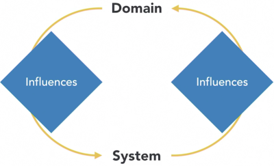
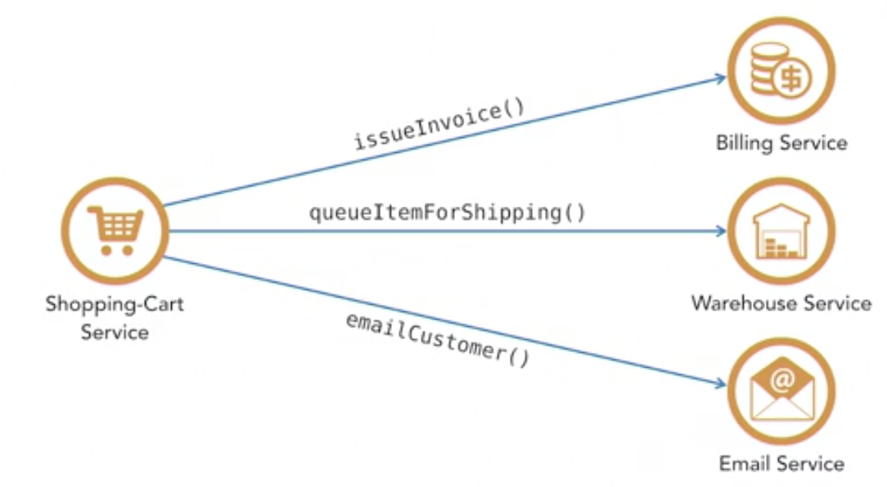
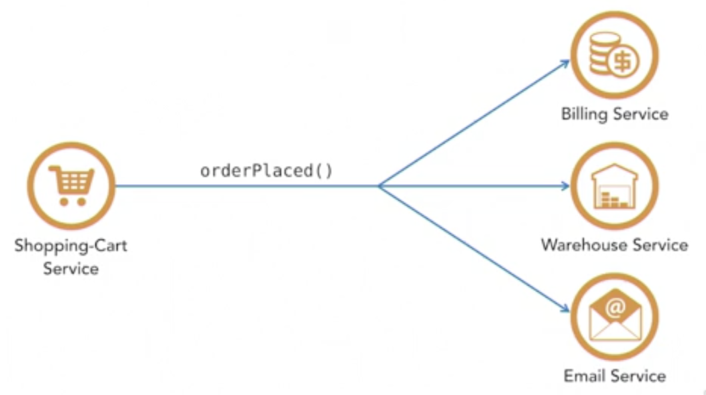
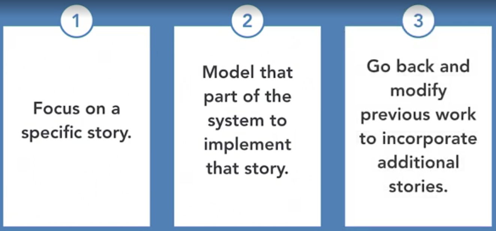

# Software Architecture: Domain-Driven Design

by Allen Holub

----

> It's tough to be agile if you're working with a system that can't handle rapid change. Domain-driven design (DDD)—one of the most effective architectural approaches for both agile environments in general and microservices in particular—can help you build systems that can stand up to change. In this course, Allen Holub provides programmers, software architects, business analysts, and product managers/owners with an overview of this essential architectural process, demonstrating how to use DDD to develop a microservice or other domain-focused system. Alan goes over the basics of DDD (and how it fits with agile), microservices, and bounded contexts and entities. Plus, he compares reactive and declarative systems and details how to approach an event storming session.

Course in [Linkedin Learning](https://www.linkedin.com/learning/software-architecture-domain-driven-design)

🏷️ Tags: `architecture`, `software-design`, `ddd`, `agile`, `microservices`, `event-storming`

---

## Domain-Driven Design

* Domain-driven design is authored by Eric Evans

* Things like microservices and agile didn't really exist at the time. Microservices brought domain-driven design back to the fore because as it turns out, it's an almost ideal way to design a set of microservices

* The techniques that we're going to look at work just as well in the monolith as they do with the set of microservices

* This class are introductory. In order to suplement them and dive into the details, I strongly recommend Vaughn Vernon's book called Domain-Driven Design Distilled
  
  * It covers all of the critical stuff that Eric's book covers but it's a little bit more up-to-date and it's a little bit more concise
  
* Characteristics of Domain-driven design:
  1. It is a **collaborative** process.
    * Business people and developers must work together daily throughout the project
    * The underlying philosophy of DDD and the underlying philosophies of agile are almost identical
  2. It is built on the notion of **modeling**.
    * The structure of the code should model or map to the structure of the domain within which the problem is being solved
    * All collaborators (even business users) can make sense of the structure
    * Changes happen in the domain. They don't happen in the code, they happen in the domain. So when that happens, you need to be able to get the equivalent change in the code as easily and as quickly as possible
  3. It is **incremental**.
    * You don't come up with a big architecture up front before you do any coding. Instead, you come up with just enough architecture to solve the inmediate problem
    * The code evolves as you learn more about the problem, and more architecture is added
      * That means that you have to go and change the architecture in order to accommodate whatever new things you learn as the code evolves
    * That's the agile way of working. DDD was designed with that in mind
    * A domain-driven design architecture will allow your code to grow incrementally over time because the architecture itself grows incrementally over time (it should be designed to grow incrementally over time)
  
* The domain is going to influence the system

  * Changes that are made in the domain influence the underlying software
  * This is really not a linear process. As the domain influences the system but the system also influences the domain
  * DDD is designed for a world in which you are releasing incrementally. So there's actually a cycle here. When you create a little bit of code, you release the code to your users, your users start using that code, and that changes the way they work, which is going to cause other changes to happen within the system itself. It's a cyclic process
  

## Microservices and Monoliths

* The microservice is by far the most common way that DDD is implemented
* It is possible to implement a DDD architecture inside a large monolith
* What microservices actually are
  * They solve a specific problem and that problem is the monolith, the giant program that has everything in it
  * Monoliths very complicated and hard to deal with. That complexity is the biggest problem
  * The idea of the microservice is to take that monolith and make it tractable, to solve some of the problems associated with them
* Problems with the Monolith
  * Lot of internal connections. Lot of dependencies within the monolith that make it almost impossible to work on
  * It is giant, hard to work on and not organize appropriately
  * It tends to focus on data / access to data. So, when the data model changes, the monolith and the code has to change also, but it's so difficult to do it
  * As a consequence, the monolith is very, very hard to update because of all the internal dependencies
  * Hard to deploy just because it's so large. It can take lot of time to deploy a full-size monolith
  * They tend to accrete cruft to grow in an undesirable way where more and more junk accumulates along the way
  * Agility is really impossible in this kind of world because things just take too long
  * In terms of a business, the biggest problems of the monolith is that it's a way to burn money
* Advantages of Microservices
  * They are very small. How small? A general rule of thumb is that everything that you need to know in order to make sense of the service should be something that could hold in your head without having to look it up
  * They are independently deployable. Is possible to deploy a specific service without having to redeploy the system as a whole
    * If you don't need independent deployability, there's no real reason to go to microservices
  * The implementation details have to be hidden from the rest of the system. In other words, if you, service A, know how service B works, if service B changes you don't want to have to change service A
  * Microservices are all modeled around business concepts and that's what domain driven design is all about
    * So there's a direct mapping there
  * They are decentralized
  * Microservices have to be observable in the sense that you have to know when something goes wrong and finally, they have to be autonomous in the sense that they are highly isolated from one another
* So, microservices fit very nicely into a domain driven design world and the reason is because microservices are almost an ideal implementation architecture for a domain driven design system

## Bounded Contexts and Entities

* DDD is organizing code along certain well-defined boundaries
* The first of those is the so called Bounded Context
* A Bounded Context is a natural division within the business
  * Sample, if you were doing a bookstore, the store itself is a context
  * The purpose of that context is to sell books to people
  * Then, there's another context in order to make a bookstore work and that's the warehouse from which the books are shipped
* So we have two distinct contexts here
  * One of them is the store and the responsibilities of things within the store context is primarily sales
  * And the other one is the warehouse, and the responsibilities within the warehouse context are shipping
* What are the responsibilities of the people working within that context?
* Things that happen inside the context stay inside the context. Things go wrong when you end up having objects that are on both sides talking to each other without any regard to the context boundaries
* So that's something that clearly you want to avoid
* An entity
  * Is an individual within a giving context
  * It has one job and it does only one thing
  * And that thing is done in a specific context
* The notion of an aggregate. So the idea of an aggregate is a collection of entities that you talk to through a single portal
* Every entity in domain-driven design, should be associated with only one context
  * Move away from relational database thinking
  * Bad to have single product-object in multiple contexts

### Ubiquitous language

* The idea of the ubiquitous language is that within a given context, the people who are working in that context use a language of their own and the language of one context is different from the language in other contexts
* Not just at the noun level, but also at the verb level
* It is a language that is reflected in the code itself, in that it will provide names for things that appear in the code
* And it's a language that's going to be used up at the domain level itself in order to describe the work that's going on, so it's ubiquitous, but it's ubiquitous within a specific context
* Distinguish between actors (people) and roles (tasks)
* Ubiquitous language tries to identify roles for entities

## Reactive vs. Declarative Systems

* How the entities will communicate with each other as they're getting work done.
* There are two ways to do communication. One easy and the other one better

### Orchestrated / Declararative systems

* The easy way to do things is orchestrated or declarative systems

* The basic idea of an orchestrated system is that one entity tells another entity what to do

* Services in a declarative world will tell each other what to do

  * The shopping cart tells the billing service to issue an invoice
  * It tells the warehousing service to queue an item up for shipping

* Declarative systems can work okay inside a monolith. They cannot work very well inside of a microservice system, due to network connection required stuff. In a monolith, of course, they're just function calls

* Synchronous services

  

* Declarative systems have a very tight coupling relationship between the various services here

* If you make a change to any downstream service, the upstream service will be impacted

### Choreography / Reactive systems

* The other way to organize your system of services is by using choreography or reactive systems

* Choreography is a solution to the problems with declarative systems

* Asynchronous services

  

* So at this point we have solved many of the problems associated with our declarative system

* A reactive system, eliminates the hard, tight coupling relationships between the downstream services and the upstream services

  * I can make as many changes as I want to the billing service, and the shopping cart service doesn't care
  * The shopping cart service doesn't even know that the billing service exists

* In terms of maintenance, we're in a much better position. We can change the way that the downstream services work without impacting the upstream service

  * And at the same time we can add new downstream services and the upstream service doesn't care about it

* In terms of implementation, the best way to do this is by using what's called a messaging system (popular ones are Kafka, ZeroMQ and RabbitMQ)

* My general advice is that this is the way to go. If you're going to be implementing these kinds of DDD systems, go with a reactive model

## Event Storming

* Event storming a technique that can be used

  * to analyze the domain, analyze the business
  * also to develop the code that is going to be modeling the business because by modeling the business you are also coming up with a design for your code

* So, event storming then is a collaborative technique that you do in conjunction with business people

  

* So you sit down with a story and a bunch of business people and a white board and a bunch of sticky notes and you start modeling
* Event. An event is something that happens at the business level that your customers, or end users, or domain experts care about
  * It's a business level thing
  * The events are specified in past tense. An event is something that has happened that will trigger something else to happen next

### How to do it. Physical setup

* This is a very sticky note intensive process
* Use sticky notes
* Decide on domain-level events
* Arrange them left to right on a timeline, in a whiteboard
* It's not necessarily linear
* The colors here matter, too
  * Orange – Event. Is the most important one
    * This is represented in the past tense
    * It's an event that's of interest to the business, at least at first
    * Programming level events might be simple enough that you can just code them and not worry about modeling them first
  * Blue – Actions or activities or what are called commands
    * So the basic idea here is that an event, an orange thing, happens, and that causes an action to occur
  * Red – Questions. Things that we have to do
    * They are questions that occurred in the process of doing the modeling, where the modeling is not complete
  * Purple – Policies / business rules
    * So a policy or a business rule is something that's going to control the way that the action plays out
    * When an event is received, you might then apply a policy and decide what to do next based on what that policy is
    * So policies are ways to indicate that it's not a smooth linear flow. There are decisions that have to be made here based on some set of business rules
  * Yellow – Human activities
    * Those may or may not be worth using with sticky notes
    * They identify the human actors.
    * Sometimes rather than doing this I'll just draw a little stick figure right onto the activity itself
  * Pink – External systems
    * This is something that is occurred from the outside world
* Remember that from the outside an aggregate, which is a collection of entities that act as a single unit, but have a single portal that you use to talk to them, looks like the portal. It looks like a single entity. 
* So when we're done with this what we end up with is a long piece of paper with a lot of sticky notes on it, but what that shows us
  * the entire flow of events through a system as a story is being processed
  * who's handling all those events
  * Contexts to which people belong

### Context maps

* They show relationship between the larger bounded contexts
* Useful diagram when the map gets really large, 'cause this one is not particularly large
* It's only handling one small story
* There are two things that we're trying to capture in these other diagrams
  * The relationship between the larger bounded contexts
  * The individual endings and what sort of work do they have to do?
* What I've drawn here, then, is a map of the system which is showing me the bounded contexts and the relationships that they have between them
* A diagram like this can be extremely useful when you are trying to get a big picture

