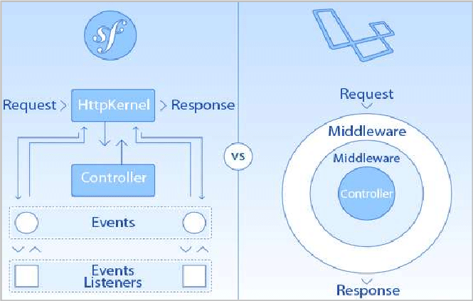
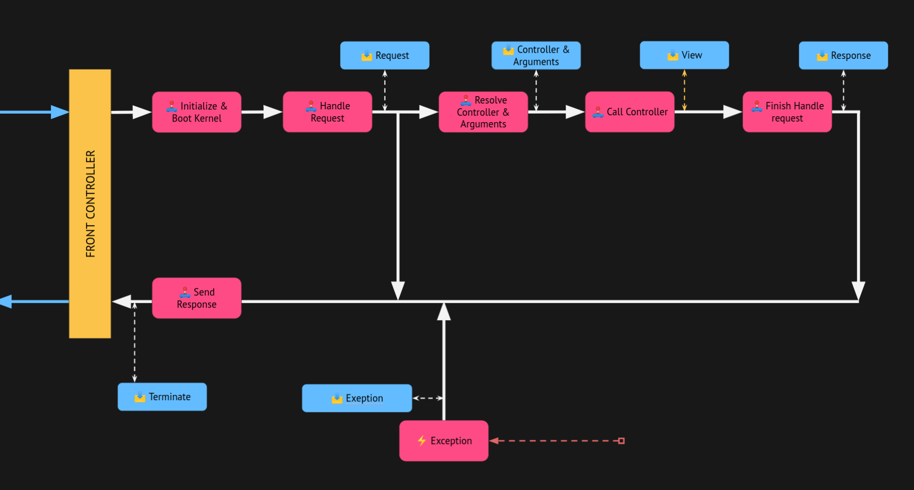

# Symfony mantenible y escalable

by Dani Santamaría, Jabvier Ferrer – CodelyTV

------

> Aprende herramientas y prácticas con Symfony para conseguir una mayor mantenibilidad y escalabilidad de tus aplicaciones.

**Available resources**

-  [Course materials](https://pro.codely.tv/library/symfony-mantenible-y-escalable-127478)
-  [GIt reposiroty](https://github.com/CodelyTV/symfony-maintainable-scalable-course)

🏷️ Tags: `course`, `2021`, `codelytv`, `symfony`, `backend`, ...

------

## Introducción, historia, filosofía, arquitectura Symfony

* Se dan notas históritcas sobre Symfony. Aquí unas notas
* Uso del patrón DataMapper reemplazando al ActiveRecord utilizado inicialmente
* Symfony Flex
* Definición de servicios vía autowiring
* Parametrización vía variables de entorno
* Symfony trata de segregar interfaces con propósitos muy concretos, permitiendo que los clientes puedan usarlas y expandirlas si quieren. Un ejemplo es `\Symfony\Component\HttpKernel\Kernel`
* Componentes Symfony EventDispatcher y Symfony Messenger
* Iteración del framework para permitir difinición de todo como servicios, incluso los controladores. Era típico el buscar cómo definir controladores como servicios
* Uso de event dispatchers de Symfony y middleware de Laravel


([Referencia](https://www.researchgate.net/figure/Event-dispatcher-and-middleware_fig2_330656531))

* Notas de arquitectura
  * Uso de patrón [Front Controller](https://martinfowler.com/eaaCatalog/frontController.html) para manejar todas las peticiones partiendo del mismo punto
  * La página del curso tiene un [resumen](https://pro.codely.com/library/symfony-mantenible-y-escalable-127478/308903/path/step/129421021/) del flujo por escrito
  * Componentes principales: [HttpFoundation](https://symfony.com/components/HttpFoundation), [HttpKernel](https://symfony.com/doc/current/components/http_kernel.html), [EventDispatcher](https://symfony.com/doc/current/components/event_dispatcher.html)




## Migración progresiva del Legacy a Symfony

* La clave del proceso es hacerlo progresivo. No tratar de reemplazar el sistema legacy por el nuevo de un solo golpe, sino ir haciendo cambios y despliegues progresivos
* Explican 2 posibles estrategias para ir reemplazando el legacy por Symfony [*sidenote*: <unque siempre hay más alternativas. Elegir una u otra puede depender de qué tipo de legacy hhay que migrar o de su complejidad]

### Fallback al front controller Legacy

* Se crea un nuevo proyecto Symfony totalmente separado del legacy
* El front controller de Symfony es el punto de entrada a la aplicación (`public/index.php`)
* A grandes rasgos, se modifica el front controller de tal modo que todas aquellas rutas que dan una respuesta 404, se ejecuta el controlador legacy correspondiente para que maneje la petición
* El controlador legacy actuaría de fallback en este caso

### Cargar rutas Legacy

* Aquí se añaden las rutas legacy a la instancia de RouteCollection que Symfony crea en base a la configuración de rutas del nuevo proyecto
* Para las rutas legacy, se crea un nuevo custom Symfony Loader que [se etiqueta](https://symfony.com/doc/current/routing/custom_route_loader.html#creating-a-custom-loader) en el inyector de dependencias como tal para que sea cargado
* En este custom Loader, es donde se crea el nuevo controlador para manejar las rutas legacy, asociando estas rutas legacy a un nuevo controlador manejado en la aplicación de Symfony
* En este controlador es donde se maneja la ejecución del controlador legacy para cuando esta ruta no tenga todavía un reemplazo en la configuración de rutas del proyecto
* Aquí ya no hablamos de fallback, pues las rutas legacy son ahora manejadas como rutas del proyecto Symfony al mismo nivel (e.g. se pueden ver utilzando el comando `debug:router`)

## Configurar y adaptar Symfony para mejorar la mantenibilidad

* Detalles sobre el Contenedor de Inyección de Dependencias de Symfony ([componente](https://symfony.com/doc/current/components/dependency_injection.html))
* Creación de distintos Kernels para distintos front controllers para distintas aplicaciones desarrolladas en un único monorepo
* Uso del autoconfigure de Symfony y la opción `_instanceof`del contenedor para tanguear servicios delegando en Symfony sin tener que hacerlo manualmente. [Autoconfiguring tags](https://symfony.com/doc/current/service_container/tags.html#autoconfiguring-tags) y [Reference tagged services](https://symfony.com/doc/current/service_container/tags.html#reference-tagged-services)

## Optimizaciones habituales en peticiones HTTP

### Gestión de errores

* Control de una excepción no capturada transformándola en una respuesta controlada con un determinado HTTP status code

* Cada vez que en un controlador hay que añadir el control de una nueva excepción, hay que modificar la clase del controlador. Si se quiere aplicar SOLID aquí, se podría no modificar la clase y controlar las excepciones de todos los controladores en un punto común

* Varias formas de hacerlo. La manera propuesta

  ```php
  abstract class ApiController
  {
      public function __construct(
          // ...
          ApiExceptionsHttpStatusCodeMapping $exceptionHandler
      ) {
          each(
              fn(int $httpCode, string $exceptionClass) => $exceptionHandler->register($exceptionClass, $httpCode),
              $this->exceptions()
          );
      }
  
      // ...
  
      abstract protected function exceptions(): array;
  }
  
  final class CoursesCounterGetController extends ApiController
  {
      public function __invoke(): JsonResponse
      { /* ... */ }
  
      protected function exceptions(): array
      {
          return [
              CoursesCounterNotExist::class => Response::HTTP_NOT_FOUND,
              // ...
          ];
      }
  }
  ```

  ```php
  final class ApiExceptionsHttpStatusCodeMapping
  {
      private const DEFAULT_STATUS_CODE = Response::HTTP_INTERNAL_SERVER_ERROR;
  
      // ...
  
      public function statusCodeFor(string $exceptionClass): int
      {
          return get(
              key: $exceptionClass,
              collection: $this->exceptions,
              default: self::DEFAULT_STATUS_CODE
          );
      }
  }
  
  final class ApiExceptionListener
  {
      public function __construct(private ApiExceptionsHttpStatusCodeMapping $exceptionHandler)
      {
      }
  
      public function onException(ExceptionEvent $event): void
      {
          $exception = $event->getThrowable();
  
          $event->setResponse(new JsonResponse(
              [
                  'code'    => $this->exceptionCodeFor($exception),
                  'message' => $exception->getMessage(),
              ],
              $this->exceptionHandler->statusCodeFor($exception::class)
          ));
  
          // ...
      }
  }
  ```

  **ApiController**: Clase abstracta que usa el patron [template method](https://refactoring.guru/design-patterns/template-method) en el método exceptions para que los controladores definan el un diccionario que mapee la excepción con un código de respuesta HTTP

  **ApiExceptionsHttpStatusCodeMapping**: Maneja el mapeo de códigos

  **ApiExceptionListener**: Symfony EventListener donde se hace uso de la clase anterior; reacciona a las excepciones para construir una respuesta de error HTTP

### Optimizar el rendimiento

* Ejemplo de enviar un email tras devolver la respuesta

### **Procesado de eventos de dominio en Event Subscriber**

* Hacer uso del `kernel.terminate` para todo lo que no sea nbecesario procesar para darle la respuesta al usuario

### Otras optimizaciones

#### Parsear JSON del request body

* La solución que se explica es interesante siempre que los argumentos de entrada vengan todos en el body de la petición HTTP (nota: aunque no está limitado al body, y podrían leerse cabeceras o cualquier información pública del objeto de la request)

* El método invocado del controlador recibe un argumento con un DTO ya instanciado (resuelto y deserializado) con los datos de la petición, sin necesidad de tratar el objecto Http Request

* Se hace uso de Symfony [Argument Resolver](https://symfonycasts.com/screencast/deep-dive/argument-resolver)

  ```php
  final class RegisterUserPutController
  {
      public function __invoke(RegisterUserCommand $command): JsonResponse
      {
  // ...
  ```

  ```php
  use CodelyTv\Shared\Domain\Bus\Command\Command;
  use Symfony\Component\HttpFoundation\Request;
  use Symfony\Component\HttpKernel\Controller\ArgumentValueResolverInterface;
  use Symfony\Component\Serializer\SerializerInterface;
  // use ...
  
  final class CommandValueResolver implements ArgumentValueResolverInterface
  {
      public function __construct(private SerializerInterface $serializer)
      {
      }
      
      public function supports(Request $request, ArgumentMetadata $argument): bool
      {
          return is_subclass_of($argument->getType(), Command::class);
      }
  
      public function resolve(Request $request, ArgumentMetadata $argument): Generator
      {
          yield $this->serializer->deserialize($request->getContent(), $argument->getType(), 'json');
      }
  }
  ```

#### Serializar respuestas automáticamente a JSON

* En lugar de devolver un objeto Http Response, se devuelve un DTO de la capa de aplicación que será serializado a JSON por Symfony

  ```php
  final class CourseCounterGetController
  {
      public function __invoke(): CoursesCounterResponse
      {
          // ...
          return new CoursesCounterResponse(10);
      }
  }
  ```

* Implementar un EventListener que escuche al evento KernelView de Symfony

  ```php
  // ...
  public function onKernelView(ViewEvent $event)
  {
     if (!$event->getControllerResult() instanceof Response) { return; }
  
     $event->setResponse(
         new JsonResponse(
             $this->serializer->serialize($event->getControllerResult(), 'json')
         )
     );
  }
  // ...
  ```

#### Añadir headers de forma global

* Si todas las respuestas tienen una o varias cabeceras que son siempre las mismas (e.g. CORS, o caché)

* Se puede hacer también vía Symfony Event Listener

  ```php
  // ...
  public function onKernelResponse(ResponseEvent $event)
  {
     $response = $event->getResponse();
     $response->setMaxAge(180);
     $response->setPublic();
  }
  // ...
  ```

#### Feature flags y Dark Launching

* Tener funcionalidades a producción donde solo ciertos usuarios pueden verlas (dark launching), o que las podamos activar sin necesidad de deployar código (feature flag / toggle)

* Una opción que se ve es para dark launching vía el evento de Symfony Kernel Request

  ```php
  // ...
  public function onKernelRequest(RequestEvent $event)
  {
  		// lógica para determinar si el usuario puede ver la funcionalidad
  
  		// en caso negativo, podemos enviarle una respuesta 404 Not Found
      $event->setResponse($response);
  }
  // ...
  ```

#### Progressive Rollout y A/B testing

* Caso de tener 2 controladores, uno nuevo y otro el actual para un mismo caso, y redirigir peticiones a uno u otro. Se propone varias alternativas

* Modificar el valor de _controller

  * El componente kernel de Symfony define un listener para reaccionar ante una request, es el `kernel.request`. Aquí añade la referencia al controlador en el atributo  `_controller`

    ```php
    // ...
    public function onKernelRequest(RequestEvent $event)
    {
        // lógica para determinar qué controlador usar

        $event->getRequest()->attributes->set('_controller', $controller);
    }
    // ...
    ```

  * Con un EventListener propio se puede modificar esta referencia. Hay que tener en cuenta las prioridades de llamada de los event listener, y usar una prioridad más baja que la usada por Symfony

    ```sh
    $ bin/console debug:event-dispatcher kernel.request
    
    Registered Listeners for "kernel.request" Event
    ===============================================
    
     ------- --------------------------------------------------------------------------------------- ----------
      Order   Callable                                                                                Priority
     ------- --------------------------------------------------------------------------------------- ----------
      #1      Symfony\Component\HttpKernel\EventListener\DebugHandlersListener::configure()           2048
      #2      Symfony\Component\HttpKernel\EventListener\ValidateRequestListener::onKernelRequest()   256
      #3      Symfony\Component\HttpKernel\EventListener\SessionListener::onKernelRequest()           128
      #4      Symfony\Component\HttpKernel\EventListener\LocaleListener::setDefaultLocale()           100
      #5      Symfony\Component\HttpKernel\EventListener\RouterListener::onKernelRequest()            32
      #6      Symfony\Component\HttpKernel\EventListener\LocaleListener::onKernelRequest()            16
     ------- --------------------------------------------------------------------------------------- ----------
    ```

* Reaccionar al evento Controller

  * Settear el método de llamada del controlador justo antes de que se llame al mismo

    ```php
    // ...
    public function onKernelController(ControllerEvent $event)
    {
        // ...
        $event->setController($controllerCallable);
    }
    // ...
    ```

* Implementar un ControllerResolver

  * Crear un controller resolver propio y establecer en él el controlador a llamar
  * Algunas referencias: [1](https://symfony.com/doc/current/create_framework/http_kernel_controller_resolver.html), [2](https://symfonycasts.com/screencast/deep-dive/controller-resolver)


#### Poner la web en estado de mantenimiento

* Una opción es reaccionando de nuevo a `kernel.request`

  ```php
  public function onKernelRequest(RequestEvent $event)
  {
      // ...
      $response->setStatusCode(Response::HTTP_SERVICE_UNAVAILABLE)
      $event->setResponse($response);
  }
  ```
## Persistencia con Doctrine

### ORM, Dbal, SQL ¿Cuándo usar cada uno?

* Si se elige usar ORM, tener siempre en cuenta que las SQL queries que se ejecutarán finalmente van a depender mucho de cómo están modeladas las entidades implicadas. Se puede usar el Symfony profiler para analizar estas queries y ver si se pueden mejorar en caso de ser necesario
* Siempre binding de valores a parámetros tanto con PDO como con Dbal para evitar SQL injection

### Streaming de datos: procesar archivo y enviar respuesta HTTP

* [Symfony\Component\HttpFoundation\StreamedResponse](https://symfony.com/doc/current/components/http_foundation.html#streaming-a-response)
* StreamedResponse allows to serve small chunks of data to the client

```php
$response = new StreamedResponse();
$response->setCallback(function () use ($fileHandle) {
    while (!feof($fileHandle)) {
        if (!$line = fgets($fileHandle)) {
            break;
        }
				echo $line; // sends data
    }

    fclose($fileHandle);
});
$response->headers->set('Content-Type', 'text/plain');
```

* It uses a function callback where is possible to iterate over a set of big data and stream it in small chunks
* Next example is using Doctrine to stream data from the database

```php
$response->setCallback(function() {
    $query = $this->entityManager->createQuery("SELECT f FROM App\Entity\Food f ORDER BY f.id DESC");
    /** @var Food $food */
    foreach ($query->toIterable() as $key => $food) {
        echo $food->id() . ' ' . $food->name() . PHP_EOL;

        $this->entityManager->clear($food);
    }
});
$response->headers->set('Content-Type', 'text/plain');
```

* Doctrine allows it, and if the dbms you are using allows it as well and you have it correctly configured, then the data can be sent streamed to the HTTP responsedoc
* `toIterable()` facility to iterate over the query results step by step instead of loading the whole result into memory at once — [Doctrine Batch Processing, iterating results](https://www.doctrine-project.org/projects/doctrine-orm/en/3.0/reference/batch-processing.html#iterating-results)
* Another reference: [Streaming Files in Symfony](https://www.slingacademy.com/article/streaming-files-in-symfony-complete-guide-examples/)

### Streaming de datos y procesos en batch con Doctrine

* [Doctrine Batch Processing](https://www.doctrine-project.org/projects/doctrine-orm/en/current/reference/batch-processing.html)

## Rendimiento, Profiling y DevEx

### DevEx en Symfony: Profiling, Debug y PHPUnit Bridge

* Componente Symfony [VarDumper](https://symfony.com/doc/current/components/var_dumper.html) como alternativa a `var_dump`
* Debug y profiling con el componente Symfony [Web Profiler](https://symfony.com/doc/current/profiler.html): consta principalmente del Symfony Profiler que recopila toda la información de la ejecución y el Web Debug Toolbar que es el UI con el que se puede acceder y visualizar toda esa información
  * Es extensible y los bundles pueden añadir sus propias plantillas a la web toolbar
  * La API pública del componente [permite acceder](https://symfony.com/doc/current/profiler.html#accessing-profiling-data-programmatically) a toda la información del profiler mediante código usando el servicio `@profiler`
  * [Mitigating Risks: Securing Symfony Profiler from Unwanted Exposure](https://samshadow.medium.com/mitigating-risks-securing-symfony-profiler-from-unwanted-exposure-14e90a53dd65)
* PHPUnit Bridge: [Trigger Deprecation Notices](https://symfony.com/doc/current/components/phpunit_bridge.html#trigger-deprecation-notices)

## Testing de aplicaciones Symfony

### Añadiendo las dependencias mínimas e indispensables con Symfony Flex

* `composer require --dev phpunit/phpunit symphony/test-pack`

* `symfony/test-pack`: Metapaquete de Composer (o un Recipe en Symfony Flex) que agrupa varias dependencias para hacer testing funcional y E2E en una aplicación Symfony

  ```json
  {
      "phpunit/phpunit": "^9.5",
      "symfony/browser-kit": "*",
      "symfony/css-selector": "*",
      "symfony/phpunit-bridge": "*"
  }
  ```

* En una aplicación Symfony, utiliza Symfony Flex para que autoconfigure las dependencias dentro del proyecto

### Test de integración para base de datos

* Preparar una base de datos limpia antes de cada test. Se plantea dos maneras

  * Hacer un `TRUNCATE` de todas las tablas antes de ejecutar cada test

    ```php
    protected function setUp(): void
    {
        $this->clearDatabase();
    }

    protected function clearDatabase(): void
    {
        foreach ($this->connection()->getSchemaManager()->listTableNames() as $tableName) {
            $this->connection()->executeQuery('TRUNCATE ' . $tableName);
        }
    }
    ```

  * Envolver el test en una tranasacción de base de datos, y hacer un `rollback` de la misma al acabar el test para devolver la base de datos al estado inicial

    ```php
    protected function setUp(): void
    {
        $this->connection()->beginTransaction();
    }
    
    protected function tearDown(): void
    {
        $this->connection()->rollBack();
    }
    ```

* La preparación de datos de cada test se encarga el propio test-case, como parte de "arrange" en la típica estructura "arrange - act - assert" de un test-case

* Relacionado con lo anterior, se evita el uso de fixtures globales para popular un estado inicial de datos no vacío / limpio

* Referencias

  * [Symfony Testing documentation](https://symfony.com/doc/current/testing.html)
  * Componente [PHPUnit Bridge](https://symfony.com/doc/current/components/phpunit_bridge.html)

### Test de aceptación de API HTTP con Behat y Mink

* Tests de aceptación con [Behat](https://docs.behat.org/en/latest/), [Mink](https://github.com/minkphp/Mink), [Behat Symfony Extension](https://github.com/FriendsOfBehat/SymfonyExtension) y [Mink Symfony Extension](https://github.com/FriendsOfBehat/SymfonyExtension/blob/master/DOCUMENTATION.md#mink-integration).
* Con Mink Symfony Extension, conseguimos que los tests sean más rápidos al no usar un navegador o web driver real
  * Utiliza el mismo thread de PHP que ejecutó el test para comunicarse con el proyecto Symfony
  * No se realizan llamadas HTTP sino que es el proyecto Symfony quien controla las peticiones directamente
  * Por lo que, a pesar de que puedan ser escritos y poder considerarse como tests de aceptación, no son llegan a ser tests E2E del todo, o son menos E2E al no realizar esas peticiones HTTP que nos ahorramos

* Pequeños ejemplos
  * Testear [peticiones HTTP](https://github.com/CodelyTV/symfony-maintainable-scalable-course/blob/main/72-acceptance-test/apps/mooc/backend/tests/features/courses/course_put.feature)
  * O un caso que se ejecutan como [reacción a un evento](https://github.com/CodelyTV/symfony-maintainable-scalable-course/blob/main/72-acceptance-test/apps/mooc/backend/tests/features/courses_counter/courses_counter_get.feature) que ha ocurrido en nuestro sistema

* Contextos de tests E2E con un propósito

### Test E2E con Panther: Login en Codely Pro

* [Symfony Panther](https://symfony.com/components/Panther) nos permite hacer tests E2E, y al estar implementado como un [Browser Kit](https://symfony.com/doc/current/components/browser_kit.html), podemos reemplazar nuestros test E2E actuales de Symfony por Panther
* Con Panther se puede hacer tanto web scraping como testing de navegador muy real. Testing de caja negra al tener el test que no conoce ni interacciona con ningún elemento interno de la aplicación
* Usado para tests E2E, serán muy fráfiles y lentos. Se vuelven la mejor opción para los tests E2E solo de la/s partes más críticas
* Existen alternativas más maduras a Panther, como el super popular [Cypress](https://www.cypress.io/)

## Autenticación de APIs HTTP y SaaS con JWT

### Autenticación sin estado con JWT: Certificado de curso

* [JSON Web Tokens](https://jwt.io/introduction) (JWT) firmados por el servidor antes de ser enviados
  * El servidor emite tokens firmados con clave asimñetrica que son verificables de forma segura
  * La información que contiene el token es pues verificable de forma segura
* Tokens que caducan que no son persistidos en el servidor, solo emitidos
  * Al no desear almacenarlos, tampoco se tiene por qué revocar
  * Autenticación sin estado, tokens emitidos sin almacenamiento ni posibilidad de revocarlos
  * Invalidación / revocación de tokens introduce persistencia en algún punto del sistema
* No usar JWT para crear un token de autenticación (*access token*) para almacenar variables de sesión
* [LexikJWTAuthenticationBundle](https://github.com/lexik/LexikJWTAuthenticationBundle)

```php
public function __invoke(): Response
{
    // \Lexik\Bundle\JWTAuthenticationBundle\Encoder\JWTEncoderInterface
    $token = $this->jwtEncoder->encode([
        // ...
    ]);
// ...
```

```sh
$ php ./bin/console lexik:jwt:generate-keypair
# --
config/jwt
├── private.pem
└── public.pem

1 directory, 2 files
```

### Autenticación en Symfony 6.0: API HTTP con JWT

`config/packages/security.yaml`

```yaml
security:
    # Deprecated in >=6.2 https://github.com/symfony/symfony/pull/47890
    enable_authenticator_manager: true

    providers:
        jwt_user_provider:
            id: App\Infrastructure\Symfony\Security\JwtUserProvider

    encoders:
        App\Infrastructure\Symfony\Security\JwtUser:
            algorithm: auto

        firewalls:
        dev:
            pattern: ^/(_(profiler|wdt)|css|images|js)/
            security: false

        login:
            pattern: ^/login
            stateless: true
            provider: jwt_user_provider
            json_login:
                check_path: /login
                # successful auth. Service from LexikJWTAuthenticationBundle. Generates JSON response with JWT token
                success_handler: lexik_jwt_authentication.handler.authentication_success
                # login incorrect / not auth. Also by LexikJWTAuthenticationBundle
                failure_handler: lexik_jwt_authentication.handler.authentication_failure

        main:
            stateless: true
            # use the default settings defined by LexikJWTAuthenticationBundle, so no need to manually specify each
            # configuration parameter related to JWT
            jwt: ~

    access_control:
        - { path: ^/login, roles: IS_AUTHENTICATED_ANONYMOUSLY }
        - { path: ^/, roles: IS_AUTHENTICATED_FULLY }
```

`src/Infrastructure/Controller/ProfileGetController.php`

```php
// ...
use Symfony\Component\Security\Core\Security;
// ...
public function __invoke(): Response
{
    $jwtUser = $this->security->getUser();
    $student = ($this->findStudent)(
        new FindStudentRequest($jwtUser->getUserIdentifier())
    );
    return new JsonResponse($student->id());
}
// ...
```

`src/Infrastructure/Symfony/Security/JwtUser.php`

```php
// ..
use Symfony\Component\Security\Core\User\PasswordAuthenticatedUserInterface;
use Symfony\Component\Security\Core\User\UserInterface;

final class JwtUser implements UserInterface, PasswordAuthenticatedUserInterface
{
// ...
```

`src/Infrastructure/Symfony/Security/JwtUserProvider.php`

```php
// ...
use App\Domain\StudentDoesNotExist;
use Symfony\Component\Security\Core\Exception\UserNotFoundException;
use Symfony\Component\Security\Core\User\UserInterface;
use Symfony\Component\Security\Core\User\UserProviderInterface;

final class JwtUserProvider implements UserProviderInterface
{
    public function __construct(
        private FindStudent $findStudent
    ) {}
    // ...
    public function loadUser(string $identifier): JwtUser
    {
        try {
            $student = ($this->findStudent)(new FindStudentRequest($identifier));
            return new JwtUser(
                $student->studentId(),
                $student->studentEmail(),
                $student->studentPassword()
            );
        } catch (StudentDoesNotExist $exception) {
            throw new UserNotFoundException($identifier);
        }
    }
//...
```

### Personalizar la autenticación JWT: Login aplicación SaaS

* Un enfoque con multitenant. Visto ()[link](https://pro.codely.com/library/symfony-mantenible-y-escalable-127478/308903/path/step/132263130/discussion/1800416/))

