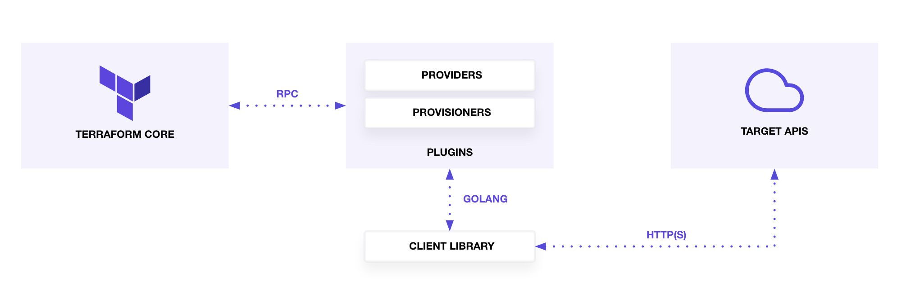

# Using Terraform to Manage Applications and Infrastructure

by Jesse Hoch – A Cloud Guru

------

> Use Terraform to easily deploy applications and infrastructure to a variety of providers, like AWS, Azure, and Kubernetes clusters.
>
> We are about to take an exciting journey into the wonderful world of Terraform. We look at how you, as an admin, can use Terraform to easily deploy infrastructure to a variety of providers. Whether it's a single, simple configuration or a more complex configuration with multiple providers, we'll demonstrate how easy it is to manage infrastructure from one place.

**Available resources**

* [Course materials](https://learn.acloud.guru/course/using-terraform-to-manage-applications-and-infrastructure)

🏷️ Tags: `course`, `2023`, `acloudguru`, `cloud`, `terraform`, `iac`, `infrastructure`, `automation` , `aws`, `hashicorp`, `hcl`

------

## Introduction

* Safely build, change, and version infrastructure, either locally or in the cloud.
* Manage existing service providers as well as custom in-house solutions.
* Key features:
  - **Infrastructure as Code (IaC):** Manage and provision infrastructure using code, enabling automation and consistency.
  - **Execution Plan:** Terraform generates an execution plan that outlines the steps required for infrastructure changes. This functions as a "dry run," helping to prevent unexpected outcomes during deployment.
  - **Resource Graph:** Terraform constructs a dependency graph of all your resources, optimizing the order in which they are created or modified for maximum efficiency.
  - **Change Automation:** Complex infrastructure changes can be automated with minimal manual intervention. By combining the execution plan with the resource graph, Terraform provides transparency into what will change and in what sequence, reducing the likelihood of human errors.

**Typical terraform project structure**


* **Configuration File:** The primary file where infrastructure is defined using Terraform's syntax.
* **Variables File:** A file that stores variable values, allowing for dynamic and reusable configurations.
* **Provisioning Changes to a Cloud Provider:**
  - Using your configuration and variables files, along with any additional configuration files, you can plan and apply these configurations using Terraform.
  - Terraform then interacts with your cloud provider to build the cloud environment and deploy the specified infrastructure and resources.
  - The results of this deployment are then captured and stored by Terraform in a state file.
* **Terraform State File:**
  - A state file acts as a backup or snapshot of the successfully applied Terraform configurations, preserving the state of your infrastructure.

## Command Line Interface

* General command structure: `terraform <subcommand>`
* Enable BASH tab autocompletion: `terraform -install-autocomplete`
* Change the working directory: `terraform -chdir=<path_to/tf> <subcommand>`
* Initialize the current directory: `terraform init`
  - Used when creating a new Terraform configuration or when cloning an existing one
* Create an execution plan:
  - Generate a deployment plan: `terraform plan -out <plan_name>`
  - Generate a destroy plan: `terraform plan -destroy`
* Apply changes:
  - Apply the plan: `terraform apply`
  - Apply a specific plan: `terraform apply <plan_name>`
  - Apply changes to a specific resource: `terraform apply -target=<resource_name>`
  - Pass a variable via the command line: `terraform apply -var my_variable=<value>`
* Destroy the managed infrastructure: `terraform destroy`
* Retrieve provider information used in your configuration: `terraform providers`
* Access the interactive console for evaluating [expressions](https://developer.hashicorp.com/terraform/language/expressions): `terraform console`
* ```shell
  $ terraform console
  > list("newark", "atlanta", "dallas")
  [
    "newark",
    "atlanta",
    "dallas",
  ]
  >`
  ```
  * It is also possible to use Terragrunt in non-interactive scripts by piping newline-separated commands to it.
  * Only the output from the final command is printed, unless an error occurs earlier.
* `terragrunt state list`: Lists all resources tracked in the Terraform state for the Terragrunt module you are currently in.
  * This command essentially acts as a wrapper around `terraform state list`, providing a convenient way to display the managed infrastructure resources.
* Example of using `state show`: `terragrunt state show module.geo_service_command.aws_lambda_function`
  * This command displays detailed information about the `aws_lambda_function` resource within the `geo_service_command` module, as stored in the Terraform state.
  * It allows you to view the attributes and configurations of the specified resource.

## Configuration Language

* The primary purpose of the [Terraform language](https://developer.hashicorp.com/terraform/language) is to declare resources.
  - [Resources](https://developer.hashicorp.com/terraform/language/resources) represent infrastructure objects.
  - Other language features are designed to make resource definitions more flexible and convenient.
* The Terraform language is a superset of the low-level syntax called [HCL (HashiCorp Configuration Language)](https://github.com/hashicorp/hcl), which is also utilized by other configuration languages and tools, particularly within the HashiCorp ecosystem.
* The syntax is organized around these key constructs:
  - **Arguments** — `<IDENTIFIER> = <EXPRESSION>`
  - **Blocks** — `<BLOCK TYPE> "<BLOCK LABEL>" "<BLOCK LABEL>" { }`
  - **Identifiers** — Include argument names, block types, resources, input variables, etc.
  - **Comments** — `#`, `//`, `/* */`
* Two types of syntax:
  - **Native Syntax** — Designed to be human-readable and writable (`.tf` files).
  - **JSON Syntax** — Easier for machines to generate and parse (`.tf.json` files).

### Configuration document

* A *Terraform configuration* is a complete document that instructs Terraform on how to manage a specific set of infrastructure.
* The syntax consists of a few basic elements:
  - ```hcl
    <BLOCK TYPE> "<BLOCK LABEL>" "<BLOCK LABEL>" {
      # Block body
      <IDENTIFIER> = <EXPRESSION> # Argument
    }
    
    # Sample code
    resource "aws_vpc" "main" {
      cidr_block = var.base_cidr_block
    }
    ```
  - **Blocks:** Containers for other content that represent the configuration of objects, such as resources. Blocks have:
    - **Block type:** Can have zero or more labels.
    - **Block body:** Contains any number of arguments and nested blocks.
  - **Arguments:** Assign a value to a specific name.
  - **Expressions:** Represent a value, either literally or by referencing and combining other values.
* The Terraform language is declarative, describing the desired outcome.
  - The order of blocks and the structure of files are generally not significant.
  - Terraform determines the order of operations based solely on implicit and explicit relationships between resources.
* Code is stored in plain text files with the `.tf` file extension.
  - There is also [a JSON-based variant](https://developer.hashicorp.com/terraform/language/syntax/json) that uses the `.tf.json` file extension.

#### Version constraints

* Anywhere that Terraform lets you specify a range of acceptable versions for something, it expects a specially formatted string known as a version constraint. Version constraints are used when configuring: [Modules](https://developer.hashicorp.com/terraform/language/modules), [Provider requirements](https://developer.hashicorp.com/terraform/language/providers/requirements), and [the required Terraform version](https://developer.hashicorp.com/terraform/language/settings#specifying-a-required-terraform-version)
* Syntax — Similar to other dependency management systems like NPM. Sample: `version = ">= 1.2.0, < 2.0.0"` See [Version constraint syntax](https://developer.hashicorp.com/terraform/language/settings#specifying-a-required-terraform-version) for further info

### Configuration module

* A *module* is a collection of `.tf` (and/or `.tf.json`) files stored together in a directory.
* Modules serve as containers for multiple resources.
* A module consists solely of the top-level files in the directory.
  - Nested directories are treated as completely separate modules.
  - Nested directories are not automatically included in the configuration.
* Terraform evaluates all configuration files within a module, treating the entire module as a single document.
* Separating blocks into different files is done for the convenience of readers and maintainers; it does not affect the module's behavior.
* Types of modules:
  - **Root Module:** Terraform always operates within the context of a single *root module.* A complete *configuration* includes a root module and a hierarchy of child modules (including those called by the root module and any further nested modules).
    - In Terraform CLI, the root module is the working directory where Terraform is executed (though you can specify a different directory using command-line options).
    - In Terraform Cloud and Terraform Enterprise, the root module for a workspace defaults to the top level of the configuration directory (provided via version control repository or direct upload), but workspace settings can specify a subdirectory instead.
  - **Child Module:** A Terraform module can use [module calls](https://developer.hashicorp.com/terraform/language/modules) to explicitly include other modules in the configuration. Child modules can be sourced from local directories (either nested within the parent module's directory or elsewhere on disk) or from external sources like the [Terraform Registry](https://registry.terraform.io/).
  - **Published Module:** In addition to local filesystem modules, you can load modules from a public or private registry. The [Terraform Registry](https://registry.terraform.io/browse/modules) hosts a wide range of publicly available modules for configuring various types of common infrastructure.
* Module Block: A module that includes a `module` block is calling a child module.
  - To *call* a module means to incorporate the contents of that module into the configuration, specifying values for its [input variables](https://developer.hashicorp.com/terraform/language/values/variables). Modules are called from within other modules using `module` blocks:
    ```hcl
    module "servers" {
      source  = "./app-cluster"
      servers = 5
    }
    ```

* The `source` argument tells Terraform where to find the source code for the desired child module. It is used during the module installation step of `terraform init` to download the source code to a directory on the local disk, allowing other Terraform commands to use it.
  - The module installer supports installation from a variety of source types: [Local paths](https://developer.hashicorp.com/terraform/language/modules/sources#local-paths), [Terraform Registry](https://developer.hashicorp.com/terraform/language/modules/sources#terraform-registry), [GitHub](https://developer.hashicorp.com/terraform/language/modules/sources#github), [Bitbucket](https://developer.hashicorp.com/terraform/language/modules/sources#bitbucket), generic [Git](https://developer.hashicorp.com/terraform/language/modules/sources#generic-git-repository) and [Mercurial](https://developer.hashicorp.com/terraform/language/modules/sources#generic-mercurial-repository) repositories, [HTTP URLs](https://developer.hashicorp.com/terraform/language/modules/sources#http-urls), [S3 buckets](https://developer.hashicorp.com/terraform/language/modules/sources#s3-bucket), [GCS buckets](https://developer.hashicorp.com/terraform/language/modules/sources#gcs-bucket), and [modules in package sub-directories](https://developer.hashicorp.com/terraform/language/modules/sources#modules-in-package-sub-directories).

### HCL Key Elements

* HCL syntax is structured around *blocks* (also known as *stanzas*), which define various configurations for Terraform.
  - [Provider plugins](https://developer.hashicorp.com/terraform/language/providers/configuration) offer detailed information about available Terraform configurations.
* Blocks consist of key-value pairs. Terraform accepts values of the following types: `string`, `number`, `boolean`, `map`, and `list`.
* **Interpolation Syntax:** Used to reference values stored outside of a configuration block, such as in an input variable or from a Terraform module’s output.
  - Interpolated variable reference is denoted by the `${var.region}` syntax. In this example, `region` is a variable prefixed by `var.`
  - The `${` and `}` symbols indicate the start and end of the interpolation syntax.
* Multi-line strings can be included using the `<<EOF` syntax, with `EOF` on a new line to close the string.
* Strings are enclosed in double quotes.
* Lists of primitive types (`string`, `number`, `boolean`) are enclosed in square brackets `[]`.
* Maps are enclosed in curly braces `{}` and use colons `:` to separate keys and values.

### Resources

* Resources describe infrastructure objects.

* **Resource Types:**
  - **Providers:** Plugins that offer a collection of resource types.
  - **Arguments:** Specific to the selected resource type.
  - **Documentation:** Each provider includes documentation to describe its resource types and arguments.

* [Meta Arguments](https://developer.hashicorp.com/terraform/language/meta-arguments/depends_on) defined by Terraform, which can be used with any resource type to modify its behavior:
  - `depends_on` — Specifies hidden dependencies that Terraform cannot infer automatically.
  - `count` — Creates a fixed number of resource instances.
  - `for_each` — Creates multiple instances based on a map or a set of strings.
  - `provider` — Selects a non-default provider configuration.
  - `lifecycle` — Configures lifecycle customizations.
  - `provisioner` and `connection` — Executes additional actions after resource creation.

* **Timeout Nested Block:** Some resource types support special timeouts to customize the duration allowed for certain operations before timing out.
  - Timeout string examples: `"60m"`, `"10s"`, `"2h"`

* **Application of Configuration Represented by a Resource Block:**
  - The resource identifier is saved in the [Terraform state](https://developer.hashicorp.com/terraform/language/state), allowing it to be updated or destroyed.
  - **Create:** Creates resources specified in the configuration but not yet associated with a real infrastructure object in the state.
  - **Destroy:** Removes resources that exist in the state but are no longer in the configuration.
  - **Update In-Place:** Updates resources whose arguments have changed, provided the API allows it.
  - **Destroy and Re-create:** Updates resources that cannot be updated in-place due to remote API limitations.

### Input Variables

* [Input variables](https://developer.hashicorp.com/terraform/language/values/variables) function like arguments for a function.
* They serve as parameters for a Terraform module, allowing customization of behavior without modifying the source code.
* Input variables must be declared using a `variable` block:

  ```hcl
  variable "image_id" {
    type = string
  }
  
  # Sample code
  variable "availability_zone_names" {
    type    = list(string)
    default = ["eu-central-1"]
  }
  ```

* The name of the variable can be any valid identifier, except `source`, `version`, `providers`, `count`, `for_each`, `lifecycle`, `depends_on`, and `locals`.
* Optional arguments for variable declaration in the `variable` block include `default`, `type`, `description`, `validation`, and `sensitive`.
* By convention, input variables are typically defined in a file named `variables.tf`.
* **Variable Types:** Can be `string`, `number`, `boolean`, `map`, or `list`. If not explicitly defined, the default type is `string`.
* An input variable can have an optional `default` value.
* **Supplying Variable Values:**
  - Variable values can be specified in `.tfvars` files.
  - Terraform automatically loads values from files named `terraform.tfvars` or `*.auto.tfvars`. For files with other names, specify the file using the `-var-file` option when running `terraform apply`.
  - Values can also be set via environment variables, prefixed with `TF_VAR_`. For example: `TF_VAR_token=my-token-value TF_VAR_region=us-west terraform apply`.

### Output Values

* [Output values](https://developer.hashicorp.com/terraform/language/values/outputs) function similarly to return values in programming languages.
* They provide information about your infrastructure and are accessible via the command line. Output values have several uses:
  - A child module can use outputs to expose specific resource attributes to a parent module.
  - A root module can use outputs to display certain values in the CLI output after running `terraform apply`.
  - When using [remote state](https://developer.hashicorp.com/terraform/language/state/remote), root module outputs can be accessed by other configurations through a `terraform_remote_state` data source.
* Each output value exported by a module must be declared using an `output` block:

  ```hcl
  output "instance_ip_addr" {
    value = aws_instance.server.private_ip
  }
  ```

* To access child module outputs in a parent module, use the syntax: `module.<module_name>.<output_name>`.
* **Note:** Outputs are only rendered when Terraform applies your configuration. Running `terraform plan` will not display outputs.

### Local Values

* [Local values](https://developer.hashicorp.com/terraform/language/values/locals) function like temporary local variables in a programming language.
* A local value assigns a name to an [expression](https://developer.hashicorp.com/terraform/language/expressions), allowing the name to be used multiple times within a module instead of repeating the expression.
  - **When to Use:** Local values are useful for avoiding repetition of the same values or expressions within a configuration, but they should be used judiciously.
* A set of related local values can be declared together in a `locals` block:

  ```hcl
  locals {
    service_name = "forum"
    owner        = "Community Team"
  }
  ```

*	To access a local value, use the syntax: `local.<name>`

### Settings

* [Terraform Settings](https://developer.hashicorp.com/terraform/language/settings) — The `terraform` configuration block type is used to configure Terraform's behavior, such as specifying a minimum required Terraform version for applying your configuration.
* Use `terraform` blocks to configure these settings:

  ```hcl
  terraform {
    # ...
  }
  ```

* Each `terraform` block can include various settings related to Terraform's behavior. Within a `terraform` block, only constant values can be used; arguments cannot refer to named objects such as resources or input variables, nor use Terraform language built-in functions.
* **Backend Configuration** — Defines where your state is stored:
  - Each Terraform configuration can specify a backend, which can be a **local** backend (recommended for beginners) or a **remote** backend (suitable for teams or large infrastructures).
  - Backend configuration is only relevant to the Terraform CLI. Terraform Cloud and Enterprise use their own state storage and ignore any `backend` block in the configuration.
  - The backend determines two key behaviors: where the state is stored and where operations are performed.
* **Configuring a Backend** — To configure a backend, add a `backend` block within the top-level `terraform` block.

  ```hcl
  # The following example configures the remote backend
  terraform {
    backend "remote" {
      organization = "example_corp"
  
      workspaces {
        name = "my-app-prod"
      }
    }
  }
  
  # The following example configures the local backend
  terraform {
    backend "local" {
      path = "${path.module}/../../terraform.tfstate"
    }
  }
  ```

  - Important limitations on backend configuration:
    - A configuration can include only one `backend` block.
    - A `backend` block cannot reference named values such as input variables, locals, or data source attributes.


* When changing the backend, you must run `terraform init`.
* Terraform provides an option to migrate the state when the backend changes.
* HashiCorp recommends manually backing up your state by copying the `terraform.tfstate` file.

## Terraform Providers

* Terraform relies on plugins called [providers](https://developer.hashicorp.com/terraform/language/providers) to interact with cloud providers, SaaS providers, and other APIs or services.
* Terraform configurations must declare the required providers so that Terraform can install and use them.
* Some providers also require additional configuration, such as specifying endpoint URLs or cloud regions, before they can be utilized.
* Terraform consists of Terraform Core and [Terraform Plugins](https://developer.hashicorp.com/terraform/plugin).
* 
  1. **Terraform Core** — Reads the configuration and builds the [resource dependency graph](https://developer.hashicorp.com/terraform/internals/graph).
  2. **Terraform Plugins** (providers and provisioners) — Serve as intermediaries between Terraform Core and their respective target APIs. Provider plugins implement resources through basic CRUD (create, read, update, delete) operations to communicate with third-party services.

## State

* Terraform uses a state file to map configuration to real infrastructure. This state file serves several purposes:
  - **Metadata:** Tracks resource dependencies, retaining the most recent set of dependencies within the state file.
  - **Performance:** Stores a cache of attribute values for all resources, which is useful for large configurations.
  - **Syncing:** In a team environment, using a remote state is recommended to ensure all team members work with the same state.

* By default, the state is stored locally in `terraform.tfstate`.
  - It can also be stored remotely, which is preferable for team environments.
  - The state file format is a private API for internal Terraform use only. You should not edit the state files manually or write code that reads them directly. For rare cases where you need to manipulate the state file, use `terraform import` or `terraform state` commands.

* Terraform uses the local state to create plans and make changes to your infrastructure. Before any operation, Terraform performs a [refresh](https://developer.hashicorp.com/terraform/cli/commands/refresh) to update the state with the real infrastructure.

* The `terraform state` command provides tools for basic modifications of the state using the CLI:
  - All `terraform state` subcommands that modify the state create backup files, which cannot be disabled. The path for these backup files can be controlled with the `-backup` option.
  - `terraform state list` — Lists all resources in the state file matching a given [address](https://developer.hashicorp.com/terraform/cli/state/resource-addressing), if any.
  - `terraform state show` — Shows the attributes of a single resource in the state file that matches a given address.
  - `terraform state mv` — Changes the resource address in your configuration associated with a real-world object. Use this to preserve an object when renaming a resource or moving it between modules.
  - `terraform state rm` — Stops managing a resource in the current working directory and workspace, without destroying the real-world object.
  - `terraform state pull` — Manually downloads and outputs the state from [remote state](https://developer.hashicorp.com/terraform/language/state/remote), or upgrades the local copy to the latest state file version. Useful for reading values from state.
  - `terraform state push` — Manually uploads a local state file to [remote state](https://developer.hashicorp.com/terraform/language/state/remote). This should be used rarely.

* If supported by your [backend](https://developer.hashicorp.com/terraform/language/settings/backends/configuration), Terraform will lock your state for all operations that could write to it. This prevents others from acquiring the lock and potentially corrupting the state.
  - State locking happens automatically for all operations that could modify the state. Locking can be disabled with the `-lock` flag, but it is not recommended.

* Terraform includes a [force-unlock command](https://developer.hashicorp.com/terraform/cli/commands/force-unlock) to manually unlock the state if automatic unlocking fails:
  - Use this command with caution. It should only be used to unlock your own lock when automatic unlocking fails.
  - The `force-unlock` command requires a unique lock ID, which Terraform provides if unlocking fails. This lock ID ensures that locks and unlocks target the correct lock.

* Remote state allows Terraform to write the state data to a remote data store, which can be shared among all team members:
  - It facilitates sharing output values with other configurations.
  - It allows teams to share infrastructure resources in a read-only manner.
  - It provides a built-in mechanism for sharing data between configurations.
