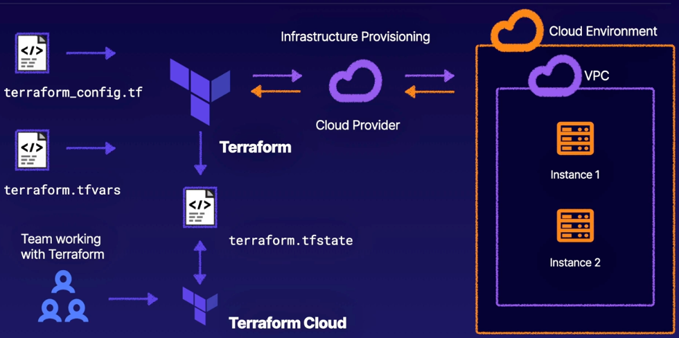

# Using Terraform to Manage Applications and Infrastructure

by Jesse Hoch – A Cloud Guru

------

> Use Terraform to easily deploy applications and infrastructure to a variety of providers, like AWS, Azure, and Kubernetes clusters.
>
> We are about to take an exciting journey into the wonderful world of Terraform. We look at how you, as an admin, can use Terraform to easily deploy infrastructure to a variety of providers. Whether it's a single, simple configuration or a more complex configuration with multiple providers, we'll demonstrate how easy it is to manage infrastructure from one place.

**Available resources**

-  [Course materials](https://localhost)

🏷️ Tags: `course`, `2023`, `acloudguru`, `terraform`, `iac`, `infrastructure`, `automation`, `cloud`, `aws`

------

## Introduction

* Build, change, and version infrastructure safely; can be done locally or in the cloud
* Manage existing service providers, as well as custom in-house solutions
* Key features
  - **Infrastructure as Code** – IaC
  - **Execution plan**. It generates an execution with its “planning” steps. Like a dry-run, avoiding surprises when Terraform manipulates infrastructure
  - **Resource graph**. It builds infrastructure as efficiently as possible, by building a graph of all your resources
  - **Change automation**. Complex changes can be applied to your infrastructure with minimal interaction. Combining the execution plan and resource graph, you will know exactly what Terraform will change and in what order. Avoids many possible human errors

**Typical terraform project structure**



- Configuration file
- Variables file
- Provisioning changes into a Cloud provider
  - With your configuration file, vars file, and other config files if created. You would then plan and use those configuration files with Terraform to apply those configurations to your cloud provider,
  - Which would then in turn build your cloud environment and deploy your infrastructure with your resources
  - That information would then be sent back to Terraform where it would then write it to a Terraform state file
- Terraform state file
  - Is like a backup or snapshot of your successfully applied Terraform configuration.

## Command Line Interface

* `terraform <subcommand>`

* BASH tab autocompletion: `terraform -install-autocomplete`

* Change the working directory: `terraform -chdir=<path_to/tf> <subcommand>`

* Initialize the current directory: `terraform init` (when you create a new terraform configuration, or when you clone one)

* Create execution plan: `terraform plan`
  - Output a deployment plan: `terraform plan -out <plan_name>
  - Output a destroy plan: `terraform plan -destroy`
  
* Apply changes: `terraform apply`
  - Apply a specific plan: `terraform apply <plan_name>`
  - Apply only changes to a targeted resource: `terraform apply -target=<resource_name>`
  - Pass a variable via the command line: `terraform apply -var my_variable=<value>`
  
* Destroy the managed infrastructure: `terraform destroy`

* Get provider info used in your configuration: `terraform providers`

* Use an interactive console for evaluating [expressions](https://developer.hashicorp.com/terraform/language/expressions): terraform cons

* ```shell
  $ terraform console
  > list("newark", "atlanta", "dallas")
  [
    "newark",
    "atlanta",
    "dallas",
  ]
  >`
  ```

  * Is also possible to use it as non-interactive scripts by piping newline-separated commands to it. Only the output from the final command is printed unless an error occurs earlier

* `terragrunt state list`: lists all resources that are tracked in the Terraform state for the Terragrunt module you are located

  * It is basically a wrapper around the `terraform state list`, that helps to show the managed infrastructure resources

* Sample of use of `state show`: `terragrunt state show module.geo_service_command.aws_lambda_function`

  * Shows detailed information regarding `aws_lambda_function` resource within the `geo_service_command` module which is stored in the Terraform state
  * With this you can see the attributes and configurations of the resource

## Configuration Language

- The main purpose of the [Terraform language](https://developer.hashicorp.com/terraform/language) is to declare resources
  - [Resources](https://developer.hashicorp.com/terraform/language/resources) represent infrastructure objects
  - The other language features exist only to make the definition of resources more flexible and convenient
- Terraform language is a superset of the low-level syntax called [HCL, HashiCorp Language](https://github.com/hashicorp/hcl), which is also used by other configuration languages in other tools, in particular, other HashiCorp tools and products
- The syntax is built around these key syntax constructs
  - Arguments — `<IDENTIFIER> = <EXPRESSION>`
  - Blocks — `<BLOCK TYPE> "<BLOCK LABEL>" "<BLOCK LABEL>" { }`
  - Identifiers — argument names, block type names, resources, input variables, etc.
  - Comments — `#`, `//`, `/* */`
- Two types of syntax
  - Native syntax — intended to be pleasant to read and write for humans (`.tf` files)
  - JSON syntax — easier for machines to generate and parse (`.tf.json` files)

### Configuration document

- A *Terraform configuration* is a complete document that specifies Terraform how to manage a given collection of infrastructure

- The syntax consists of only a few basic elements:

  - 

    

    `<BLOCK TYPE> "<BLOCK LABEL>" "<BLOCK LABEL>" {  # Block body  <IDENTIFIER> = <EXPRESSION> # Argument } resource "aws_vpc" "main" {  cidr_block = var.base_cidr_block }`

  - **Blocks** — containers for other content. They represent the configuration of some kind of object, like a resource. Blocks have a

    - *block type —* can have zero or more *labels*
    - *block body —* contains any number of arguments and nested blocks

  - **Arguments** — assign a value to a name

  - **Expressions** — represent a value, either literally or by referencing and combining other values

- The Terraform language is declarative, describing an intended goal

  - The ordering of blocks and the files they are organized into are generally not significant
  - Terraform only considers implicit and explicit relationships between resources when determining an order of operations

- Code is stored in plain text files with the `.tf` file extension

  - There is also [a JSON-based variant](https://developer.hashicorp.com/terraform/language/syntax/json) that uses the `.tf.json` file extension

#### Version constraints

- Anywhere that Terraform lets you specify a range of acceptable versions for something, it expects a specially formatted string known as a version constraint. Version constraints are used when configuring: [Modules](https://developer.hashicorp.com/terraform/language/modules), [Provider requirements](https://developer.hashicorp.com/terraform/language/providers/requirements), and [the required Terraform version](https://developer.hashicorp.com/terraform/language/settings#specifying-a-required-terraform-version)
- Syntax — Similar to other dependency management systems like NPM. Sample: `version = ">= 1.2.0, < 2.0.0"` See [Version constraint syntax](https://developer.hashicorp.com/terraform/language/settings#specifying-a-required-terraform-version) for further info

### Configuration module

- A *module* is a collection of `.tf` (and/or `.tf.json`) files kept together in a directory

- They are container for multiple resources

- It only consists of the top-level files in the directory

  - nested directories are treated as completely separate modules
  - nested directories are not automatically included in the configuration

- Terraform evaluates all of the configuration files in a module, treating the entire module as a single document

- Separating various blocks into different files is purely for the convenience of readers and maintainers, and has no effect on the module's behaviour

- Types of modules

  - **Root module** — Terraform always runs in the context of a single *root module.* A complete *configuration* consists of a root module and the tree of child modules (which includes the modules called by the root module, any modules called by those modules, etc.)
    - In Terraform CLI, the root module is the working directory where Terraform is invoked (use command line options to specify a different one)
    - In Terraform Cloud and Terraform Enterprise, the root module for a workspace defaults to the top level of the configuration directory (supplied via version control repository or direct upload), but the workspace settings can specify a subdirectory to use instead
  - **Child module** — A Terraform module can use [module calls](https://developer.hashicorp.com/terraform/language/modules) to explicitly include other modules in the configuration. These child modules can come from local directories (nested in the parent module's directory, or anywhere else on disk), or from external sources like the [Terraform Registry](https://registry.terraform.io/)
  - **Published module** — In addition to modules from the local filesystem, is possible to load modules from a public or private registry. The [Terraform Registry](https://registry.terraform.io/browse/modules) hosts a broad collection of publicly available Terraform modules for configuring many kinds of common infrastructure

- Module block — A module that includes a `module` block is calling a child module

  - To *call* a module means to include the contents of that module into the configuration with specific values for its [input variables](https://developer.hashicorp.com/terraform/language/values/variables). Modules are called from within other modules using `module` blocks:

    

    

    `module "servers" {  source = "./app-cluster"   servers = 5 }`

- The `source` argument tells Terraform where to find the source code for the desired child module. Is used during the module installation step of `terraform init` to download the source code to a directory on the local disk so that other Terraform commands can use it

  - The module installer supports installation from a number of different source types: [Local paths](https://developer.hashicorp.com/terraform/language/modules/sources#local-paths), [Terraform Registry](https://developer.hashicorp.com/terraform/language/modules/sources#terraform-registry), [GitHub](https://developer.hashicorp.com/terraform/language/modules/sources#github), [Bitbucket](https://developer.hashicorp.com/terraform/language/modules/sources#bitbucket), Generic [Git](https://developer.hashicorp.com/terraform/language/modules/sources#generic-git-repository), [Mercurial](https://developer.hashicorp.com/terraform/language/modules/sources#generic-mercurial-repository) repositories, [HTTP URLs](https://developer.hashicorp.com/terraform/language/modules/sources#http-urls), [S3 buckets](https://developer.hashicorp.com/terraform/language/modules/sources#s3-bucket), [GCS buckets](https://developer.hashicorp.com/terraform/language/modules/sources#gcs-bucket), [Modules in Package Sub-directories](https://developer.hashicorp.com/terraform/language/modules/sources#modules-in-package-sub-directories)

### HCL Key Elements

- HCL syntax comprises *blocks* (aka *stanzas*) that define a variety of configurations available to Terraform
  - [Provider plugins](https://developer.hashicorp.com/terraform/language/providers/configuration) give more details about the available base Terraform configurations
- Stanzas or blocks are comprised of key = value pairs. Terraform accepts values of type `string`, `number`, `boolean`, `map`, and `list`
- Interpolation syntax — can be used to reference values stored outside of a configuration block in an input variable, or from a Terraform module’s output
  - Interpolated variable reference: is constructed with the `${var.region}` syntax. This example references a variable named `region`, which is prefixed by `var.`
  - The opening `${` and closing `}` indicates the start of interpolation syntax
- You can include multi-line strings by using an opening <<EOF, followed by a closing EOF on the line
- Strings are wrapped in double quotes
- Lists of primitive types (`string`, `number`, and `boolean`) are wrapped in square brackets `[]`
- Maps use curly braces `{}` and colons `:`

### Resources

- They describe infrastructure objects
- Resource types
  - **Providers** — which are plugins that offers a collection of resource types
  - **Arguments** — which are specific to the selected resource type
  - **Documentation** — which every provider uses to describe its resource types and arguments
- [Meta arguments](https://developer.hashicorp.com/terraform/language/meta-arguments/depends_on) defined by Terraform, that can be used with any resource type to change behaviour of the resource
  - `depends_on` — Specify hidden dependencies (Terraform cannot infer automatically)
  - `count` — Create a fixed number of resource instances
  - `for_each` — Create multiple instances according to a map or a set of strings
  - `provider` — Select a non-default provider configutation
  - `lifecycle` — Set lifecycle customizations
  - `provisioner` and `connection` — Take extra actions after resource creation
- `timeout` nested block — Some resource types provide special timeouts to customize how long certain operations are allowed to take before time out
  - timeout string examples: `"60m"`, `"10s"`, `"2h"`
- How configuration represented by a resource block is applied
  - The identifier of that resource object is saved in [Terraform state](https://developer.hashicorp.com/terraform/language/state), which allows it to be updated or destroyed
  - **Create** — Create resources that exists in the configuration but are not associated with a real infrastructure object in the state
  - **Destroy** — Destroy resources that exist in the state but are no longer in the configuration
  - **Update in-place** — Update resources whose arguments have changed and API allows it
  - **Destroy and re-create** — Update resources but which cannot be updated in-place due to remote API limitations

### Input Variables

- [Input variables](https://developer.hashicorp.com/terraform/language/values/variables) are like function arguments
- They are Terraform configuration parameters: serve as parameters for a Terraform module, so behaviour can be customized without editing the source
- Input variables must be declared using a variable block


```
variable "image_id" {  type = string } variable "availability_zone_names" {  type    = list(string)  default = ["eu-central-1"] }
```

- The name of the variable can be any valid identifier, except `source`, `version`, `providers`, `count`, `for_each`, `lifecycle`, `depends_on`, `locals`
- Optional arguments for variable declaration used in the variable block: `default`, `type`, `description`, `validation`, `sensitive`
- By convention, input variables are normally defined within a file named `variables.tf`
- Variable type: type can be `string`, `number`, `boolean`, `map`, or `list`. Default type: `string`, if a variable type is not explicitly defined
- Input variable can have a `default` value (optional)
- Supplying Variable Values
  - Variable values can be specified in `.tfvars` files
  - Terraform automatically loads values from filenames which match `terraform.tfvars` or `*.auto.tfvars`. If you store values in a file with another name, you need to specify that file with the `-var-file` option when running `terraform apply`
- Values can also be specified in environment variables when running `terraform apply`. The name of the variable should be prefixed with `TF_VAR_`. Sample `TF_VAR_token=my-token-value TF_VAR_region=us-west terraform apply`

### Output Values

- [Output values](https://developer.hashicorp.com/terraform/language/values/outputs) are like function return values

- They make information about your infrastructure available on the command line. They are similar to return values in programming languages. They have several uses:

  - A child module can use outputs to expose a subset of its resource attributes to a parent module
  - A root module can use outputs to print certain values in the CLI output after running `terraform apply`
  - When using [remote state](https://developer.hashicorp.com/terraform/language/state/remote), root module outputs can be accessed by other configurations via a `terraform_remote_state` data source

- Each output value exported by a module must be declared using an `output` block:

  

  

  `output "instance_ip_addr" {  value = aws_instance.server.private_ip }`

- Accessing child module outputs in a parent module: `module.<module_name>.<output_name>`

- **Note:** Outputs are only rendered when Terraform applies your plan. Running `terraform plan` will not render outputs

### Local Values

- [Local values](https://developer.hashicorp.com/terraform/language/values/locals) are like a function's temporary local variables

- A local value assigns a name to an [expression](https://developer.hashicorp.com/terraform/language/expressions), so you can use the name multiple times within a module instead of repeating the expression

  - When to use it: they can be helpful to avoid repeating the same values or expressions multiple times in a configuration, but don’t overuse them

- A set of related local values can be declared together in a single `locals` block:

  

  

  `locals {  service_name = "forum"  owner        = "Community Team" }`

- Accessing a local value: `local.<name>`

### Settings

- [Terraform Settings](https://developer.hashicorp.com/terraform/language/settings) — The special `terraform` configuration block type is used to configure some behaviours of Terraform itself, such as requiring a minimum Terraform version to apply your configuration.
- Use the `terraform` blocks


```
terraform {  # ... }
```

- Each `terraform` block can contain a number of settings related to Terraform's behaviour. Within a `terraform` block, only constant values can be used; arguments may not refer to named objects such as resources, input variables, etc, and may not use any of the Terraform language built-in functions

- Backend configuration — to store your state in

  - Each Terraform configuration can specify a backend. Can be a **local** backend (recommended for beginners) or a **remote** one (for teams or large infrastructure)
  - Backend configuration is only used by terraform CLI. terraform Cloud and Enterprise always use their own state storage (so these last two ignore any `backend` block in the configuration)
  - Two areas of behaviour are determined by the backend: Where the state is stored, and Where operations are performed

- Using a Backend Block — To configure a backend, add a nested `backend` block within the top-level `terraform` block

  

  

  `# The following example configures the remote backend terraform {  backend "remote" {    organization = "example_corp"     workspaces {      name = "my-app-prod"    }  } } # The following example configures the local backend terraform {  backend "local" {    path = "${path.module}/../../terraform.tfstate"  } }`

  - There are some important limitations on backend configuration:
    - A configuration can only provide one backend block
    - A backend block cannot refer to named values (like input variables, locals, or data source attributes)

- When the backend changes, you must run `terraform init`

- When the backend changes, Terraform gives you the option to migrate the state

- HashiCorp recommends you manually backup your state. This is simply by copying the `terraform.tfstate` file

## Terraform Providers

- Terraform relies on plugins called [providers](https://developer.hashicorp.com/terraform/language/providers) to interact with cloud providers, SaaS providers, and other APIs or Services
- Terraform configurations must declare which providers they require so that Terraform can install and use them
- Additionally, some providers require configuration (like endpoint URLs or cloud regions) before they can be used
- Terraform is comprised of Terraform Core and [Terraform Plugins](https://developer.hashicorp.com/terraform/plugin)
- 
  1. Terraform Core — reads the configuration and builds the [resource dependency graph](https://developer.hashicorp.com/terraform/internals/graph)
  2. Terraform Plugins (providers and provisioners) — bridges Terraform Core and their respective target APIs. Terraform provider plugins implement resources via basic CRUD (create, read, update, and delete) APIs to communicate with third-party services

## State

- Terraform requires some sort of database to map configuration to the real infrastructure. Terraform uses its own state structure to map configuration to resources, keep track of metadata, and improve performance for large infrastructures
  - metadata: Terraform must track it. Sample: resource dependencies; which Terraform retains a copy of the most recent set of dependencies within the state
  - performance: Terraform stores a cache of attribute values for all resources in the state (useful for large configuration)
  - syncing: when working in a team, is recommended to use a remote state. In this scenario, is important that all members are working with the same state
- By default, the state is stored locally in `terraform.tfstate`
  - It can also be stored remotely, which works better in a team environment
  - The state file format is a private API that is meant only for internal use within Terraform. You should never edit the Terraform state files by hand or write code that reads them directly. If for some reason you need to manipulate the state file — which should be a relatively rare occurrence — use the `terraform import` or `terraform state` commands
- Terraform uses this local state to create plans and make changes to your infrastructure. Prior to any operation, Terraform does a [refresh](https://developer.hashicorp.com/terraform/cli/commands/refresh) to update the state with the real infrastructure
- A [terraform state](https://developer.hashicorp.com/terraform/cli/commands/state) command is provided to perform basic modifications of the state using the CLI
  - All `terraform state` subcommands that modify the state write backup files. Those backups cannot be disabled. The path of these backup files can be controlled with `-backup`
  - `terraform state list` — Lists all resources in the state file matching the given [address](https://developer.hashicorp.com/terraform/cli/state/resource-addressing) (if there are any)
  - `terraform state show` — Shows the attributes of a single resource in the state file that matches the given address
  - `terraform state mv` — Changes which resource address in your configuration is associated with a particular real-world object. Use this to preserve an object when renaming a resource, or when moving a resource into or out of a child module
  - `terraform state rm` — tells Terraform to stop managing a resource as part of the current working directory and workspace, without destroying the corresponding real-world object
  - `terraform state pull` — Manually download and output the state from [remote state](https://developer.hashicorp.com/terraform/language/state/remote). This command also works with the local state. It upgrades the local copy to the latest state file version. Useful for reading vañlues out of state
  - `terraform state push` — Manually upload a local state file to a [remote state](https://developer.hashicorp.com/terraform/language/state/remote). This command also works with the local state. This command should rarely be used
- If supported by your [backend](https://developer.hashicorp.com/terraform/language/settings/backends/configuration), Terraform will lock your state for all operations that could write state. This prevents others from acquiring the lock and potentially corrupting your state
  - State locking happens automatically on all operations that could write state. Locking for most commands can be disabled with the `-lock` flag but it is not recommended.
- Terraform has a [force-unlock command](https://developer.hashicorp.com/terraform/cli/commands/force-unlock) to manually unlock the state if unlocking failed
  - Be very careful with this command. Force unlock should only be used to unlock your own lock in a situation where automatic unlocking failed
  - To protect you, the `force-unlock` command requires a unique lock ID. Terraform will output this lock ID if unlocking fails. This lock ID acts as a nonce, ensuring that locks and unlocks target the correct lock
- The remote state allows Terraform to write the state data to a remote data store, which can be shared between all team members
  - It allows sharing output values with other configurations
  - It allows teams to share infrastructure resources in a read-only way
  - It can be a convenient, built-in mechanism for sharing data between configurations
-  

 
