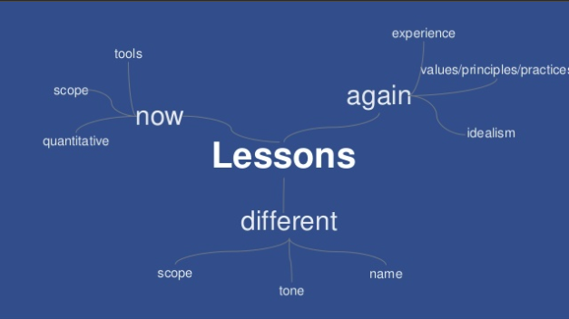

# Extreme Programming 20 years later

Kent Beck - Lean IT Summit 2015

------

**Available resources**

-  [Talk in Youtube](https://youtu.be/cGuTmOUdFbo)
-  [Slides in Slideshare](https://www.slideshare.net/InstitutLeanFrance/extreme-programming-20-years-later-by-kent-beck)

🏷️ Tags: `talk`, `2015`, `leanit15`, `xp`, `agile`, `history`

------

## General notes

* One lesson learned is to always be informed by data
  *  It doesn’t matter what I’m doing, I can find ways to gather data, that will help me make decisions
* When explaining XP, he explained in three levels
  * A value system of comunication, simplicity, feedback, courage and respect
  * A set of principles, like incremental improvement, principle of flow
  * A set of practices that are derived from those principles
* So, when you explain all this you need to be pretty effective to get away from the "staring dog problem"
  * Staring dog problem: “If you try to point something out to a dog, it will look at your finger”
  * If you explain an idea in terms of concrete practices (like Test driven-development, Pair programming, Continuous integration, etc) people will fixate on the practices and stop thinking
  * To break this, you have to find the way of communicating the intent behind ideas and not just people follow things, simply
* There is something he would definitely do differently. The name (XP) has been a big impediment
  * It attracted the wrong kind of people in the early days; people who were looking for an escape from responsibility, instead of a path to responsibility
* Also the tone (of the agile manifesto) and the scope, has been things that he would have done differently
* Question: What are the main cultural shitfs that you've experienced at Facebook?
  * A poster in his office that says: "Nothing at Facebook is someone else's problem". That's it. That's the whole thing
  * The thing is, how do you get 13k employees to take that poster seriously when they're providing an essential service for a billion and a halt people every month
  * There's a culture of personal responsability at Facebook that's just still he can't believe it

