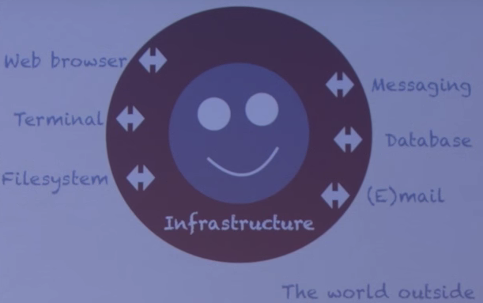
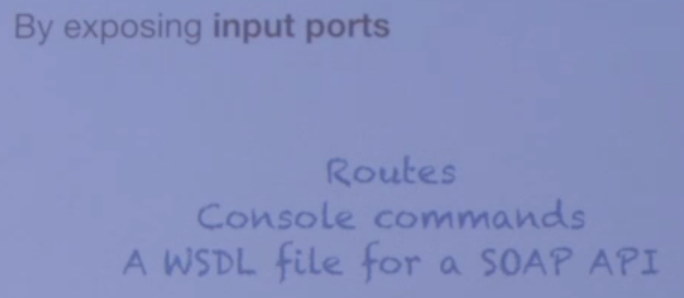
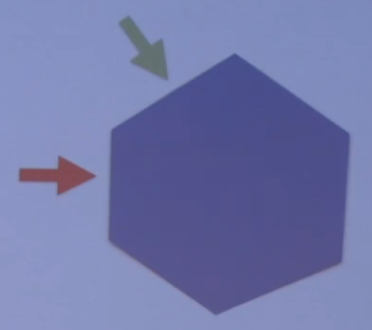
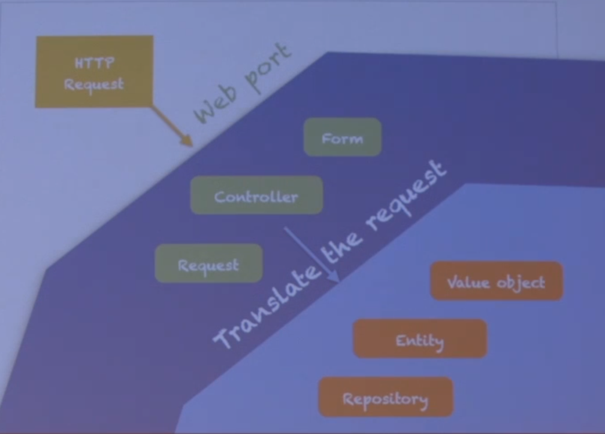
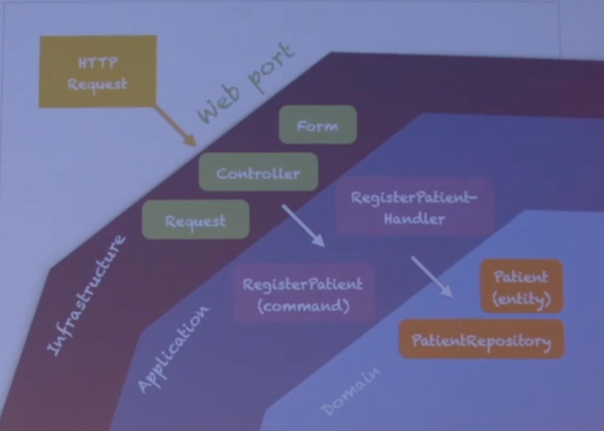
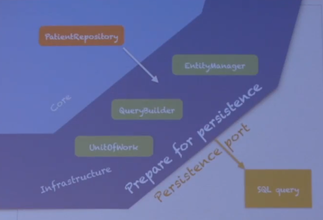

# Hexagonal Architecture, Message-Oriented Software Design

Matthias Noback - PHP Barcelona 2015

------

**Available resources**

- [Talk in Youtube](http://youtu.be/K1EJBmwg9EQ)

------

## General notes

- Most projects start as nice applications. When an application grows, and becomes quite big, everything starts having dependencies with everything, and you start knowing unwritten rules on how everything is working

- At some point, maybe joining more developers, maybe you leave the project, and all these unwritten rules they get lost somehow

- Basically, you don’t know how to get a grip on this application anymore. Your brain isn’t able to handle this kind of mess

- You start looking or some organizing principles, like MVC (a very famous one)

- This is not enough. Another trap is coupling to frameworks, which is very common and is how you usually get into MVC also

- Look for the essential. Isolate from the rest of all (libraries, frameworks)

- Heart of software: resolve domain problems. So, the essential is basically the domain layer (entities, models, value objects, domain services). This make the use cases of your application

- Everything else, is not essential. For instance, infrastructure things like databases, filesystems, message queues or network; or environment things like when do you run the application (on Windows or Linux=, etc.

- The core does need to know about these non essential parts. And you can achieve it in a clean way

- We have the application (smiley face), the world outside and the Infrastructure layer

  

- We have introduced a layer, but an application doesn’t actually have 1, 2 or N layers. The important part of layers is that they allow you to separate stuff (Separation of Concerns)

- Layers allocate things. The layer gives you insights on putting things inside, because it has sort of rules for it. For example, put “this” in “that layer” which is about “something-something”

- Layers have boundaries. And we can have rules for crossing those boundaries.

  - A layer ends at some point, and another begins. And we have some communication that can only go in one direction
  - When you talk in communication from layer to layer, you are talking about dependency relations
  - The dependency rule, by Uncle Bob: if we have dependencies between layers, they should only point inwards and never upwards or the other way around. Communication between layers only can be inwards

- About the application boundary, messages should have to be passed through it

  - This is by exposing input ports

  - Input ports for your application, to allow the outside to communicate

    

- Here is where we start looking at hexagons, because if we are talking about input/output ports, we draw an hexagon

  - Hexagon, where each side represents an input port (or at least on this side of the hexagon)

  - Messages coming in through a port and then being processed in some way

  - The use of a hexagon metaphor has no sense at all, maybe just because it looks nice. Has some sort of symmetry

    

- When you define a port, you need a communication protocol. Each port has its own language

- For example, a Web port talks HTTP

|  |  |  |
| ------------------------------------------------------------ | ------------------------------------------------------------ | ------------------------------------------------------------ |
|                                                              |                                                              |                                                              |

- 
  - When at some port there is some kind of communication, there is also some translation going on inside the application
  - This translation is called adapter code. For instance, a translation from Web-requests to things that can be processed to the domain layer
  - Ports: allow communication to happen. Adapters: translation code. Translate messages from the outside world to inside
  - Intents are encapsulated within command objects
  - A command implies change, so something has to happen
  - Commands are independent from any delivery mechanism (the command can be launched from a web controller, or from a console)
- The core consists of application and domain layers. Making sure that we put the things that we have in application in the right place
- Then, we have standalone use cases. We can have commands and we have command handlers which are basically application services which take the actual actions
- A lot of code that is used to put in the controllers, can be moved to command handlers as long as we are aware of the necessity to actually not depend on anything concrete like the request or the form, or the entity manager, etc.
- Hexagonal architecture is a good fit for TDD, BDD, DDD, CQRS, Event Sourcing. Is very supportive about all this things

