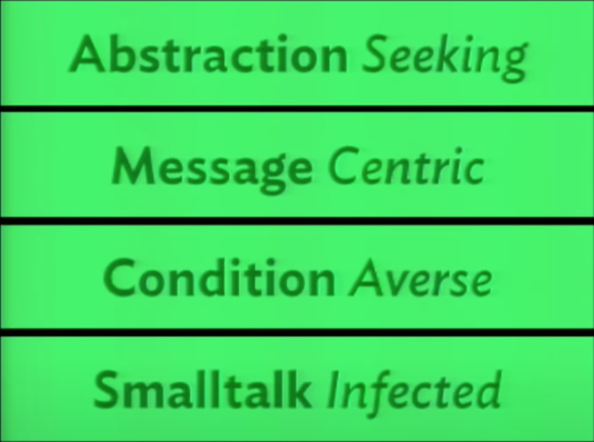

# Nothing is Something

Sandi Metz - RailsConf 2015

> Our code is full of hidden assumptions, things that seem like nothing, secrets that we did not name and thus cannot see. These secrets represent missing concepts and this talk shows you how to expose those concepts with code that is easy to understand, change and extend. Being explicit about hidden ideas makes your code simpler, your apps clearer and your life better. Even very small ideas matter. Everything, even nothing, is something

------

**Available resources**

-  [Talk in Somewhere](https://youtu.be/29MAL8pJImQ)
-  [Slides in Somewhere](https://somewhe.re/EcZ9dI)

🏷️ Tags: `talk`, `2015`, `oop`, `ruby`, `inheritance`, `composition`, `patterns`

------

## General notes

### Smalltalk Infected

* I just want to send a message to an object
  * I don't want to have that syntax (`if (true|false) then ... else ...`)
  * I don't want to choose between two different kinds of behaviour
* If you came to Ruby and OO from procedural language (like most of us did) it probably seems normal, even reasonable, to write long conditions to start with `if`, `for`, `case`, whatever
* IF keyword
  * The presence of this keyword in our language, makes it easy to retain that procedural mindset
  * It keeps you away from learning OO and taking advantage of the power of objects and messages

### Condition Averse

* How would you think about objects if there were no `if` statement? What would it mean in your conception about writing OO code
* Sometimes nil **is** nothing
* If I know what type you are I will supply the behaviour, otherwise I will send a message. This is absolutely terrible
* The problem here is because conditions always get worse. Conditions breed

### Message Centric

* Null Object Pattern
  * Bruce Anderson made up a beautiful term to call this pattern which is the Active Nothing
* Prefer knowing an object rather than duplicate behaviour
  * Colorary: Prefer knowing few objects. I don' want to know very many objects
* The null object pattern is a small concrete instance of a much larger abstraction. It's just an example of a vert very large idea

### Abstraction Seeking

* ..
* Inheritance
  * Is for specialization
  * Is not for sharing behaviour, not for sharing code
* 

## References

* [SmallTalk](https://en.wikipedia.org/wiki/Smalltalk)
* [Shotgun surgery](https://en.wikipedia.org/wiki/Shotgun_surgery)
* Null Object Pattern