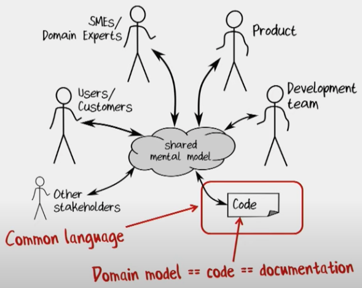

# Domain Modeling Made Functional

Scott Wlaschin - Explore DDD 2019

> Statically typed functional programming languages encourage a very different way of thinking about types. The type system is your friend, not an annoyance, and can be used in many ways that might not be familiar to OO programmers
>
> In this talk, Scott looks at some of the ways you can use types as part of a domain-driven design process, with some simple real-world examples. No jargon, no maths, and no prior FP experience necessary

------

**Available resources**

-  [Talk in Youtube](https://www.youtube.com/watch?v=PLFl95c-IiU)
-  [Slides in Slideshare](https://www.slideshare.net/ScottWlaschin/domain-modeling-made-functional-kandddinsky-2019)

🏷️ Tags: `talk`, `2019`, `eddd`, `ddd`, `domain`, `object-design`,  `functional-programming`

------

## Notes

* There's an intersection between functional programming and domain-driven design, but not a lot of people practice it
* Is FP scary? It isn't, and adopting  it (at least some of its *goodies*) is very powerful while doing DDD
  * FP is really good for Boring Line Of Business Applications (BLOBAs)

### Part I: The importance of DDD



* All involved people have a shared mental model

  * Shared by *everybody*, including the code

* If you can reduce the Garbage-in, the Garbage-out will also be reduced within the software development process

  * Garbage can be bad requirements, or misunderstood
  * This is what software design is, getting the requirements and the modeling right. Reducing garbage in and out

* What DDD source code look like in FP (using F#)

  ```F#
  module CardGame =
    type Suit = Club | Diamond | Spade | Heart
    type Rank = Two | Three | Four | Five | Six | Seven | Eight | Nine | Ten | Jack | Queen | King | Ace
    type Card = Suit * Rank
    type Hand = Card list
    type Deck = Card list
    type Player = { Name:string; Hand:Hand }
    type Game = { Deck:Deck; Players:Player list }
    type Deal = ShuffledDeck -> (ShuffledDeck * Card)
    type PickupCard = (Hand * Card) -> Hand
  ```

  * Shared language: CardGame, Suit, Rank, Club, Diamond, Ten, Jack, Queen, Name, Hand, Deal, ...
  * `|` represents a choice (`OR`). It means "pick one from the list". e.g. `Suit` can be only `Club`, or `Diamond`, or `Spade`, or `Heart`. Nothing more, nothing else
  * `*` represents a pair (`AND`). It means "choose one from each type" e.g. `Card` is a `Suit`and a `Rank`
  * F# has list types built in (`list`keyword)
  * `X -> Y` means a function; input of X, output of Y
    * Scott uses them to represent workflows, or stories, or scenarios, or actions

* Modeling an action with a function

  * FP approach to domain-modeling is to have the actions represented by verbs and as functions
  * `(input) original Deck -> Deal -> (output) remaining Deck * on-table Card`
  * Everything is immutable, so the original Deck's state never changes

* Using this kind of modeling (with rich types) makes the code to be understood for non-programmers

  * So domain experts, non-programmers, can provide useful feedback into the code

* What's a shuffled deck? Expert: "it's a list of cards"

  *  Having a Deck, and now adding a "ShuffledDeck" what I'm doing is adding a new concept to the domain
  * But what I do not do is to add a flag to the original Deck saying is it shuffled or not
  * Because they are a different concept. They can't be used interchangeably

* How do you make a shuffled deck?

  * This is an action, a workflow

    ```F#
    type ShuffledDeck = Card list
    type Shuffle = Deck -> ShuffledDeck
    ```

* The design is domain-driven, not database-driven

  * There's nothing about implementation here, nothing about databases, foreign keys, etc.
  * Design is what Eric Evans calls persistent ignorance
  * Also, it is not "object oriented" either. There's no base classes, no managers, no factories, no inheritance, there's no all that stuff

* The design is based on the real word, using its vocabulary: Suit, Rank, Card, Hand, Deck, ...

  * In your code, you also want to have the same vocabulary
  * The domain code should be in sync with real world vocabuñary
  * If we learn new things about the domain, the code should reflect that

* This is the right way to design our domain. What we shouldn't do the other way around, where the domain contains programmer jargon: something what domain experts do not understand

  * The "domain" code should not use programmer jargon
  * Don't place in the domain things like PlayerManager, DeckBase, AbstractCardProxyFactoryBean, ... This things are not domain concepts, something that domain experts need to know
  * Of course the implementation gets some of this, and you might have this kind of thing. But is in the side of implementation things, and not in the domain modeling side of things

* It's not just about the result of doing things, but actually the process of getting everyone in the same page

  * Like Event Storming and Context Mapping; the process of getting everyone in the same room and talking about it. Is a critical part
  * You don't come out with the document say this is the answer
  * Getting everyone to agree, having debates and having interactions and stuff is a really critical process
  * It's not about the result. The process of building the shared mental model is critical

* Key DDD principle: Communicate design in the code

  * Functional domain modeling can communicate all these decisions: Which values are optional? What are the constraints? Which fields are linked? Any domain logic?

### Part II: Understanding FP type systems

* algebraic types, like "composable types"

* FP principle: types are not classes. The're more like sets `A ∩ B = {x : x ∈ A and x ∈ B}`

* A function is a thing which transforms inputs to outputs, like an algebraic function

* A type in FP is just a name for a set of things

  * e.g. "all the numbers", we call it type `integer`
  * e.g. "all the possible strings", we call it type `string`
  * e.g. "all the possible fruits", we call it `Fruit`
  * Also a type can be a set of functions `Fruit -> Fruit functions` Function inputs and outputs can be functions

* FP principle: Composition everywhere

  * All the pieces are designed to be connected

* In FP, the behaviour is separate from data

  * If you come from OOP, this is like anemic domain models, so is a bad thing in an OO context, but in FP is actually a good thing

* New types are built from smaller ones (composition). Two ways of doing it:

  * Composing with "`AND`"
    * All its fields are required. None of them are optional
  * Composing with "`OR`"

* Examples composing with `AND` are pairs, tuples, records, structs

  ```F#
  type FruitSalad = {
    Apple: AppleVariety
    Banana: BananaVariety
    Cherry: CherryVariety
  }
  ```

* Examples composing with `OR`: `Snack = Apple or Banana or Cherry`

  * Not available in C#/Java or most non-FP languages

  ```F#
  type Snack =
    | Apple of AppleVariety
    | Banana of BananaVariety
    | Cherry of CherryVariety
  ```

  * Then, a snack will be just one thing but an apple, or a banana or a cherry. Nothing more, nothing else. Also, if it is an apple then what kind of apple is it (variety), if it is a banana then what kind of, etc.
  * These are called choice types, also called discriminated unions, or also some types, or co-product types. Scott likes to use "choice types" because is how you think about it in domain modeling

* While modeling domain, we get rid of primitives

* Is usual to think that types are for type checking. The type it just stops you passing in a string by mistake

  * A lot of people find the type checking an annoyance, especially when it's kind of very verbose
  * But Scott thinks of type as a domain modeling tool

* So, it is possible to use types for both, for type checking and as a domain modeling tool. Is a powerful technique

* A good static type system is like having compile-time unit tests

  * Start statically typing all the things. This is the way to go forward

### Paret III: Domain modeling with composable types

* Original code (with poor domain modeling)

  ```F#
  type PersonalName = {
    FIrstName: string      // required
    MiddleInitial: string  // optional
    LastName: string       // required
  }
  ```

* How represent optional values

  * `null` is not the right answer
  * `null` is the Saruman of static typing. It's like something pretends to be your friend principle good but they said they're going to turn around and stab you in the back
  * Do not use `null` anywhere, even to don't represent something if is missing

* How to represent something which is missing

  * e.g. having a set of strings "a", "b", "c", or *missing*

  * So, we talk about if there's a string `OR` it's missing

  * So it's a choice either is it one of the things in the set of strings or it's missing, which is like the empty set

  * So we can combine them, and write a new type

    ```F#
    type SomeString of string
    type OptionalString =
      | SomeString of string
      | Nothing
    ```

* Then, we can want to have optional integers, optional booleans, etc. Too much duplicated code, so it can be generic

  ```F#
  type Option<'T> =
    | Some of 'T
    | None
  ```

* This is a way to model optional values. In F# is built-in, but also is easier to write it in any other language

* So the MiddleInitial value can be changed to: `MiddleInitial: string option`

* Use required by default. So, if a value is not optional then is required

* Modeling simple values

  * Avoid "primitive obsession". Don't use ints, floats, strings, etc. in your domain
  * e.g. "float" jeans nothing to the domain expert, or to the average non-developer

* Modeling constrained values

  * Is really unusual to have an unbounded value. Like a string which can be a million characters long
  * Normally there's some sort of constraints

* What we do in FP domain modeling is create wrapper types around this primitives

  * This provides two benefits: Clearer domain modeling, and can't mix them up accidentally

* The original code can be better modeled with

  ```F#
  type PersonalName = {
    FIrstName: String50
    MiddleInitial: String1 option
    LastName: String50
  }
  ```

* "Make illegal states unrepresentable!" — Yaron Minsky

  * If there's something you don't want somebody to do, don't even allow it to compile
  * Don't say: let it compile, then I'll have some validation. No, don't make it even possible

* Communication is a two-way street, so it's OK to push back

### Summary

* Use code to represent the shared mental model and ubiquitous language
* Designs will evolve Embrace change
  * Refactor towards deeper insight
  * Static types give you confidence to make changes
* The power of a composable type system
  * Choices rather than inheritance
  * Options instead of null
  * Wrappers for constrained types
  * Make illegal states unrepresentable

### References

* Book "[Domain Modeling Made Functional](https://fsharpforfunandprofit.com/ddd/#book)"

