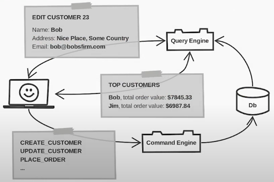
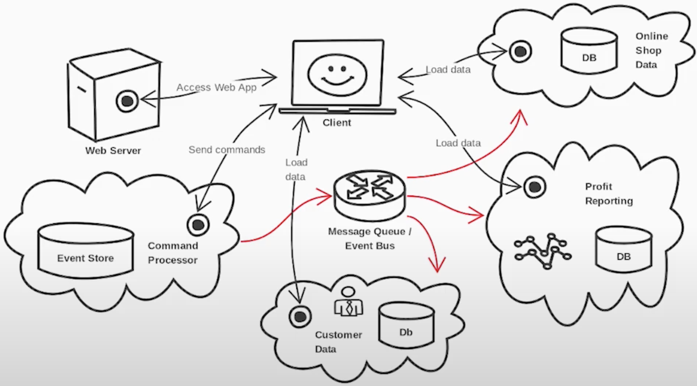
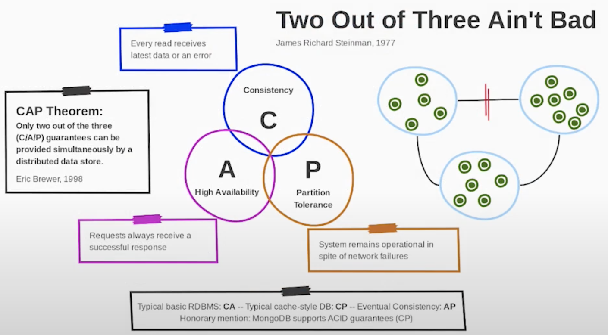

# CQRS and Event Sourcing

Oliver Sturm - International PHP Conference 2019

Data storage and data access are subjects of this talk. CQRS is quite a simple pattern to split responsibilities when working with data, but incredibly complicated papers have been written about it! Event Sourcing can be viewed as a natural extension of CQRS, though in reality a decision for or against it is independent and comes with its own consequences. Oliver uses practical examples in this talk to demonstrate implementation and combination of both patterns

------

**Available resources**

-  [Talk in Youtube](https://youtu.be/Cq0Qal_atgY)
-  [Slides](http://oliversturm.github.io/cqrs-event-sourcing)
-  [Demo code](http://github.com/oliversturm/one-day-fullstack-complete)

🏷️ Tags: `talk`, `2019`, `ipc19`, `architecture`, `cqrs`, `event-sourcing`, `data-storage`, `data-access`, `separation-of-concerns`

------

## CQRS

* The main idea behind it is to separate execution paths for two different aspects of your application
* These aspects are commands and queries
  * Commands are sent to the system when something actually happens. They are also the business processes you model about your system
  * Queries are those processes that retrieve information for display or for other purpose where the data is required (data analysis, report generation, etc)
* We work with different data models for those two aspects
  * Information that is sent or received is not always the same
  * Frequently there are multiple processes involved for the same scenario

* 

  * The data modules that are exchanged by each of the operations in here, are different from each other and they are specifically structured for whatever purpose (depending of each data modules purpose)

### But, why?

* **Loading data** for visualisation (or analysis, or reporting, etc.) doesn't have the same requirements as **persisting data**
* One **loading process** can be different from another
* One **persistent process** can be different from another
* We can save time in **page cycle** environments
  * If page cycles are required for operations in your system, then you will basically be saving quite a lot of time by being able to keep these page cycles logically separate
  * "Logically separate", means that you don't have to perform more work than is absolutely necessary in each case
* Separate execution paths are **easier to test and maintain**
  * Viewing these execution paths separately, means that
    * you will maintain them separately
    * you can deploy them separately
    * handle their performance characteristics as needed
    * test them separately as well

### When to use it?

* Almost anytime
  * Not only in a set of services, if you're thinking in a microservices type of architecture
  * In reality, what the pattern is really about is mostly just the structural aspect of it; the assigning of responsibilities to those individual logical modules of your application
  * So, you can do the same thing in a monolithic
* Structural advantages benefit any architecture

### How

* Separate execution paths for data reading and writing
  * Anything that your users do, can be a command
* Consider modeling changes as commands
* Consider efficient data models to support business operations

## Event Sourcing (ES)

* Not directly connected to CQRS
* Here, you also have separate execution paths in an ES system
* Using ES system, we still send commands to the system
* The difference is that
  * Primarily, it persists events, instead of data
  * The only persistence we have absolutely necessary is the event store itself
  * Append-only event log
  * Derive entity store at any time, for any point in time
* In an ES system, we don't store a snapshot of data (like a relational database, for instance, where you have a snapshot of the data right now)
  * Instead of that, we persist everything that happens in the system (events)
* Entities / Aggregates / domain objects
  * The commands are the entities that make things happen
  * As long as you persist all the commands (in a called event log) you could always begin from your logical state 0
* Optimizations: snapshots, projections, (persistent) read models
* The event log is the only available kind of persistence in an ES system
  * Pretty simple type of persistence, cause is append-only
  * Should be very performant
  * Also is very fast

### Why?

* Great for long-term maintenance
  * We can find any point in time what the system actually does
  * Events describe what the system was asked to do
* Tracking functionality
* Clean, extensible and scalable structure that supports strict separation of concerns

### When to use it?

* ES does have a certain complexity with the messages, then commands you send the events, etc. That's a bit of architecture complexity
* Nevertheless, he suggests checking it out as a pattern if you are not in a highly heavy monolithic application where it does not make sense to care about all the aspects of possibly scaling bits of the application

## Eventual Consistency

* In any distributed system (e.g. a microservices one) there will be multiple copies of any piece of data
* This is what automatically happens not only when using Event Sourcing, but also CQRS, for the simple reason that there's a split in the timeline between the point a command is sent to the command-processor and the point in time where a read reflects the relation updates
* It means to be separate, because it mean to be decoupled. So, how eventual are things in your system?
* Eventual Consistency is a logical consequence
  * But this doesn't mean that "maybe is consistent, and maybe it isn't"
  * It means that at the end it'll be consistent

### CAP Theorem

* You can't always achieve all different criteria of persistence systems that you would like to see

