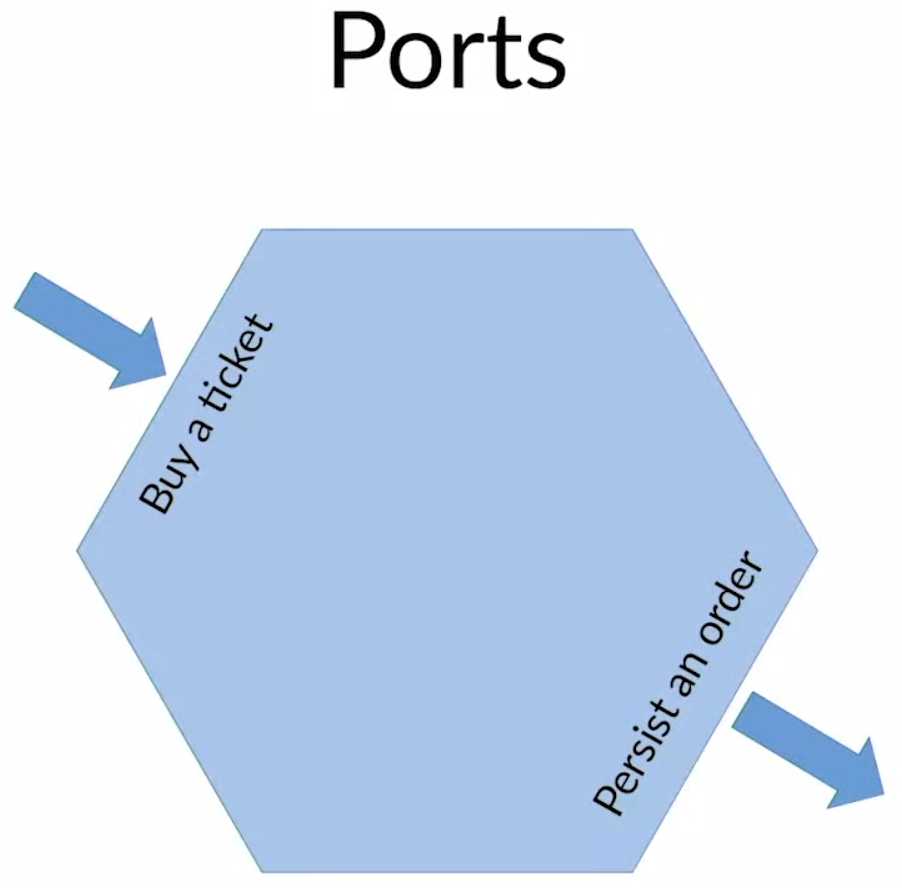
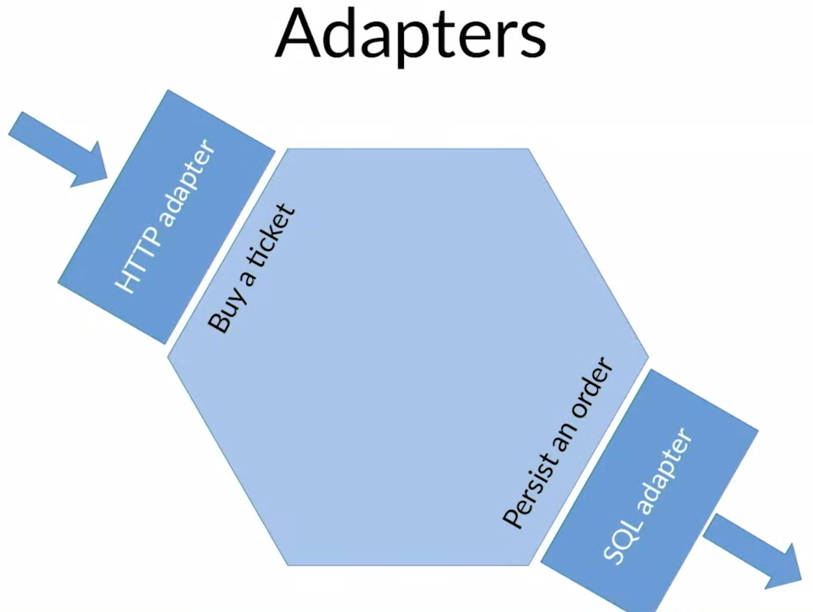

# Advanced Web Application Architecture

Matthias Noback - PHP Barcelona 2019

------

**Available resources**

- [Talk in Youtube](https://youtu.be/-Fe-qUSUl7Q)

🏷️ Tags: `talk`, `conference`, `2019`, `phpbcn19`, `architecture`, `xp`, `solid`, `hexagonal`, `domain`, `infrastructure`, `framework-agnostic`, `ports-adapters`, `dependencies`

------

## General notes

- Advice comes from the experience. It should be rooted in experiences, to be a good ones

- Not follow any advance. Listen to them, but never follow at any of them

- Heuristics are things that provide a way to find an answer. Not the answer, but help you finding your answer by taking a very simple steps

- Instead of collecting advices or rules or principles, just collect heuristics: things that worked well in your situation

- eXtreme Programming explained. Is a very interesting book, because it gives examples on how code can give you feedback

- Embrace change, the motto of the book. We are constantly changing

- Single responsibility for architecture

  - What changes for the same reason should be grouped together
  - SRP for classes where a class should have one reason to change
  - Examples
    - All the things related to your framework
    - All the things related to your domain model
    - All the things related to you database

- But not too may groups, because now you don't where how to look 

  - The most important distinction is Domain vs. Infrastructure

    

  - If you separate both two, you will be in a very better position and, maybe, you need any other groups as well

- So this two main groups are the most important ones

  - Step 1. Introduce layers
    - Each one is a group; Domain (domain logic) and Infrastructure (Web framework and Database integration)
    - The domain is the core of your application. Is what is your application about, what use cases support, the concepts that are specific to your business domain
    - The infrastructure makes the connection between your use cases and the actual users (the browsers and other system that are connected to your app, like your databases, file systems, etc)
  - Step 2. After we have layers, we should also think about ports and adapters
    - To determine the ports and the adapters, we first think about what are the actors that interacts with this application
    - Primary ones, like your Users or Cron Jobs. And secondary like remote web servers or databases
    - Then determine why they do want to interact with your application
    - This is the intention that they have
    -  So, make a distinction between what they want and how they actually can do that -> distinction between intention for communication and the supporting implementation

|  |  |
| ------------------------------------------------------------ | ------------------------------------------------------------ |

-  
  -  
    - **Ports**. A way of communicating intention
    - **Adapters**. Are the implementations that make it possible to support this communication
    - Adapters can be replaced without affecting ports
- Separating domain from infrastructure, automatically increases the testability
- Also, it allows you more easily to postpone the choice of your database vendor, framework, ORM, etc. and first learn about what is our code going to do, what are the actual needs of our application
- About dispatching domain events (Q&A 01:08)
  - Where is better to dispatch them from the Application Service or the Domain Service using a middleware?
- Dispatching belongs to the application layer, where there is coordination or orchestration
- About orchestration. Is domain services also able to orchestrate or should be delegated (Q&A 01:32)
  - Noback don't usually use domain services for orchestration, but this does not means that would be wrong to do it
- Can we use 3rd-party code in our domain code? (Q&A 01:04)
  - Yes you can. Because 3rd-party code is sometimes meant to be like just code reuse that saves you some time from writing for your own
  - Example: if you want to have a valid email address in your domain, then you don't want to write the code yourself to check email validation. You just import a library that does it for you. There is code reuse
  - But as soon as you start using something like the ORM, or like a file functions, or try to use an HTTP client to talk to some external service in my domain, ..all of this is a warning sign that is not vendor code or reusable code in general
  - It's about which code makes (or uses) I/O, like a network connection, file system operations. As soon as a library does that, it should not be used in the domain

