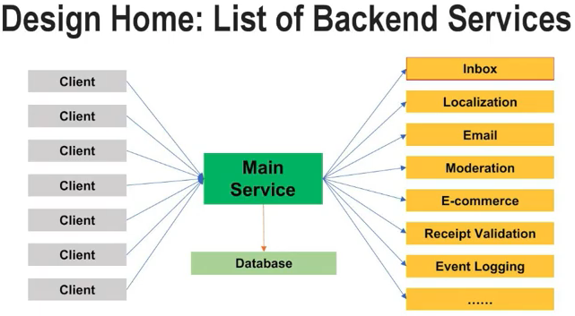
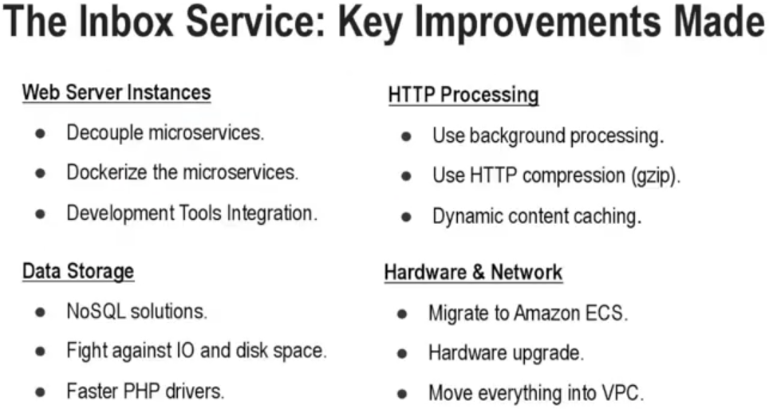
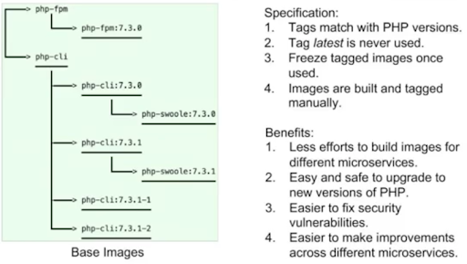

# Massively Scaled High Performance Web Services with PHP

Demin Yin - PHP UK Conference 2019

------

**Available resources**

-  [Talk in Youtube](https://youtu.be/_Yjk7EcZ2dI)

🏷️ Tags: `talk`, `2019`, `phpuk19`, `microservice`, `php`, `docker`, `performance`, `high-scalability`, `http`, `cloud`, `conference`

------

## General notes

- Talk about how performance microservice is with PHP. How to build high-performance microservices, running extremely fast on production.

- Overview of the microservice “Inbox Service” he is going to talk

  - Web server: Dockerized PHP7 containers (PHP7, nginx, composer, NoSQL, Docker, AWS, Development Tools for logging, for testing, for debugging, for secure check purposes, …)
  - HTTP Processing: Background processing, HTTP compression, etc.
  - Data Storage: Uses a NoSQL system with Redis + Couchbase (to store the messages)
  - Hardware and Network: Migration to AWS
  - Provides several REST APIs with different CRUD endpoints to manage inbox messages

- This microservice is part of Design Home, a mobile game with this backendlk

  

  - The main microservice talks with the database, and the rest of services are behind the main service. None of the microservices has access to the database (from Q&A)
  - Each microservice of the backend could have their own database, so they don't talk to the database for the main microservice. They don't share the same database (from Q&A)

- They made this improvements in performance in about **three years** (tens, or even hundreds of improvements to speed up their whole microservices)

- In this talk, he discusses only a few key improvements, ordered in 4 different categories. See bellow

  

## Concrete topic

- Use dockerized environments for each microservice

- Better development envs. Easier to upgrade each environment

- Easier to troubleshoot and debug issues

- They use docker to deploy their images into Amazon SES

- Docker is a must-have tool for PHP, today

- They have built 3 base images on their own. To avoid that developers use different images as they want (ubuntu ones of them, debian other, etc.)

  - Images:

    - `php-fpm`: for HTTP/REST microservices
    - `php-cli`: for job worker instances
    - `php-swoole` (based on the php-cli image): for asynchronous microservices

  - This avoids undesired upgrades of PHP versions or other critical software that will happen when you need to rebuild the image.

  - Gain real control of their own envs, consuming their own images

  - … see image below

    

- These images are being built and deployed manually. They don’t have any CI jobs to do that automatically (because it’s dangerous)

- They compile their own versions of PHP, and do not use pre built packages. They don’t use apt to install PHP or any other package (get from the Q&A section, 48:17)

- They combine PHP, PHP-FPM processes and nginx in the same container. It’s better to put them in the same image, because if you put them into separate ones that doesn’t help much, and you will need to use TCP connections between the two containers for the communication between PHP-FPM and nginx. But, if you use a socket file for the communication between both is going to be more efficient. (get from the Q&A section, min 47:50)

- They also use supervisord in order to run the containers. They use it everywhere they can (get from the Q&A section, min 49:35)

- Development Tools integration (inside their images, or using SaaS)

  - For error handling, error reporting and system monitoring: New Relic, Bugsnag, Amazon CloudWatch
  - For security check: SonarQube, SensioLabs Security Checker
    - This tools for different parts of their own source code (SonarQube), and also for checking security vulnerabilities in third-party libraries (SensioLabs Security Checker)
  - For debugging and profiling: Blackfire, Xdebug (integrated in their images)

## HTTP Processing

### Background processing

- They use background processing for several things: error handling, data reposting, for the ongoing emails, for push notifications, etc.
- We can do background processing in several ways (exec() external program, register_shutdown_function()'s, use queue job servers like RabbitMQ, fastcgi_finish_request() under PHP-FPM, etc.)
- For their PHP microservices, they use mostly the fastcgi_finish_request() approach
- Before run background operations, they validate input data first making sure will not cause any issue in background processing
- They do exponential back-off to make sure these background ops perform properly

### HTTP Compression

- Lots of CMS and frameworks have enabled HTTP compression by default. So, by following the same practices, we will want to enable it by default in our microservices
- But, we have to ensure that HTTP compression is actually working in our microservices; because probably not.
- So, how to improve HTTP compression in our microservices?
- HTTP compression in nginx: “gzip on” and “gzip_types text/plain text/css application/json ...”
- But, these directives were not enough for them. For example using Amazon CloudFront as CDN
  - If you have nginx running behind this CDN or some proxy server, then nginx does not know that your CDN or proxy server support HTTP compression
  - In this case,m your HTTP responses won’t be compressed by nginx, if it is running behind a CDN or proxy server
- To make sure the HTTP compression will always work (behind or not in a CDN/proxy server) in nginx, you also need the directives
  - `gzip_proxied any;`
  - `gzip_comp_level 5;` → to set a compression level average response between 1 to 9
  - `gzip_min_length 1280;` → the minimal length of a response that should be compressed

## Data storage

- Redis is very handy, especially for supporting simple data
- Couchbase is just like memcache but with persistent data storage and some more features
- Both of them are extremely fast and also they can expire data automatically from your system
- Take care with this NoSQL solutions because they also have limitations (do not treat them like other RDBMS like MySQL for instance)
  - Limitation on queries
  - There is no indexes
  - Make sure to compress and serialization your data properly in order to save disk space
- Fight against IO and Disk space. Data compression to reduce network IO and save disk space. Compress larger messages before saving, for instance
- Use faster PHP drivers. For instance, to speed-up redis in PHP, use the PHP redis extension (PhpRedis)

## Hardware and network

- Deploy to Amazon ECS following these targets: zero downtime deployments, quick rollback, ELB health checks, autoscaling
- Use multiple deployment environments in AWS: test, dev, RS, staging, production
- Move everything into VPC. Not only to make all your microservices safe, but also to speed up the overall execution
- Move our instances closer to each other, and move them to same locations and also for communication between microservices and databases
- Migrating all their APIs to AWS, makes them faster. But took lot of time, and lot of different efforts to make it in the right way

## More steps forward

- Use other network protocols: HTTP/2, Tars
- Tars protocol, is a binary protocol different from other solutions like plain JSON. For example, can convert some kilobytes of JSON into a binary data that requires less space

