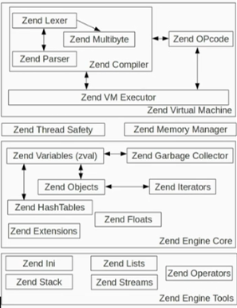
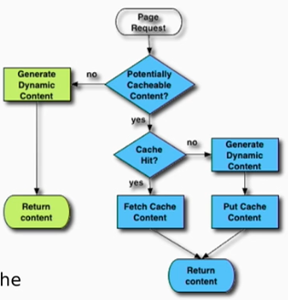

# A view in the PHP Virtual Machine

Julien Pauli - SymfonyCon 2019 Amsterdam

> This talk is about how PHP works. We'll learn together how PHP compiles, optimizes then executes your scripts, both in the Web environment and CLI apps. We'll dive into PHP's source code - written in C - to extract some parts of interest and study them to better understand PHP's behaviors as well as best practices in terms of performances (CPU cycles and memory allocations)

------

**Available resources**

-  [SymfonyCasts](https://symfonycasts.com/screencast/symfonycon2019/a-view-in-the-php-virtual-machine)
-  [Slides](https://www.slideshare.net/jpauli/php-engine/)
-  [SymfonyCon - Amsterdam 2019](https://github.com/SymfonyCon/2019-talks) Github repository

🏷️ Tags: `talk`, `2029`, `symfonycon19`, `php`, `internals`, `virtual-machine`, `c`

------

## General notes

* A look into the engine

```
.---------------------------------.
|               SAPI              |
:-------------------------:-------:
     ^                    ^
     |                    |
     v                    v
.----------.        .-------------.
| PHP Core |  <-->  | Zend Engine |
:----------:        :-------------:
    ^                    ^
    |                    |
    v                    v
.---------------------------------.
|           Extensions            |
:-------------------------:-------:
```

  * A global look about its big parts

      * SAPI
      * Two big parts
          * PHP Core
          * Zend Engine
      * Extensions

* Zend Engine: ZendE VM, ZendE Core, ZendE Tools

  

* [ext/standard](https://github.com/php/php-src/tree/master/ext/standard). (`str_`, `array_`, files and streams)

  * main extension, mandatory one

* Extensions (ext/...) and Zend Extensions

     * There are some mandatory which cannot be disabled: core, date, pcre, reflection, SPL, standard, hash
     * `php -m`, `php --re <extension_name>`

* PHP is absolutely not parallelized. Is mono thread, mono process. It runs from top to bottom, and if it's blocking it will block. It's by design

* Automatic dynamic memory management, with a memory manager + garbage collector, so you don't have to allocate/free memory

     * PHP has a nice garbage collector. No memory leaks

* When it ends with a request, it starts from scratch with the next one

* Request steps

     ```
         .---------.                0. Startup (memory allocations)
         | Startup |                1. Compilation Process
         :-----|---:                   * Lexical and syntaxic analysis
               |                       * Compilation (OP Code generation)
               |                    2. Execution Process
         .-----v---------------.       * OPCode interpretation
     .-->| zend_compile_file() |       * Several VM flavors
     |   :-----|---------------:       * Include/require/eval (= go back to compilation)
     |         |                    3. Shutdown Process (free resources)
     |         |                       * "Share nothing architecture"
     |  .------v--------------.
     :--- zend_execute()      |
        :----|----------------:
             |
             |
        .----v-----.
        | Shutdown |
        :----------:
     ```

* Lexical analysis

     * In order to transform chars to tokens, it uses the lexer generator [re2c](http://re2c.org/) (regular expressions to C)
          * The lexer is generated by regular expressions. Then, they are compiled using the lexer
          * Not only used by php-src, but also within the PDO extension
     * [List of Parser tokens](https://www.php.net/manual/en/tokens.php)
     * Accessing the lexer from PHP userland
          * [PHP Parser](https://github.com/nikic/PHP-Parser)
          * [phptok](https://github.com/sebastianbergmann/phptok), a tool for quickly dumping the tokens of a PHP sourcecode file (archived)
          * [ext tokenizer](https://www.php.net/manual/en/book.tokenizer.php)

* Semantical analysis

     * It uses GNU/Bison ([LALR](https://en.wikipedia.org/wiki/LALR_parser)) as a parser generator

* Compilation

     * The resulting AST from the parser is compiled by Zend Compiler

          * AST PHP userland, [php-ast](https://github.com/nikic/php-ast) extension

     * Creates an OPCode array (OP Code, somehow similar to assembly)

     * Compilation step is very heavy

          * As an optimization, the compiled OPCodes are used in next incoming HTTP requests

     * You can see which OP Codes are generated from a PHP file, with `phpdbg`

          ```
          $ cat hello.php
          <?php
          print 'foo';

          $ phpdbg -p hello.php
          function name: (null)
          L1-3 {main}() /private/tmp/hello.php - 0x10e27d000 + 2 ops
           L2    #0     ECHO<1>                 "foo"
           L3    #1     RETURN<-1>              1
          [Script ended normally]
          ```

          We can see the "OP array", which is called the list of generated OP Codes which will be run one after another, except if you have `null`

* Execution

     * Most complex part of Zend Engine (VM executor / `zend_vm_execute.h`). It executes the OPCodes
     * This [header file](https://github.com/php/php-src/blob/master/Zend/zend_vm_execute.h) is huge (~2MB size)
     * Each OP Code is run by a handler (`zend_vm_handler()`)

* OPCode cache

     

* Memory consumption

     * Very very low in PHP 7
     * It uses Zend Memory Manager (ZendMM). Is the php-src layer on top of the operating system to handle memory allocation, so no direct `malloc()`/`mmap()` is used in PHP code
          * `zend_alloc.c/h`
          * Used by PHP, Zend Engine and extensions while a request is handled
          * It handles its own heap in order to don't fragment it, so it doesn't ask memory to the OS. It preallocates blocks of memory of known sizes
     * PHP userland functions to get the current size consumed
          * At runtime: `memory_get_usage()`
          * Size allocated thought the OS `memory_get_usage(true)`
          * Use flag `true` to be accurate
          * `gc_mem_caches()` to reclaim memory if needed
          * Anyway, `memory_get_usage()` only gives you information about memory that has been allocated by the ZendMM, but not by the extensions or any other component that doesn't use it
               * So, the size you can get from the PHP userland should be always considered as an  approximation

* Q&A

     * Do you think like the future of PHP is something like Java, running in memory rether than request-based?
          * No. The nature of PHP is request basded, from the ground up. And it's very very optimized for that. The ZendMM is an example of this
     * What is your opinion about using the opcache with long run CLI scripts. Does it make sense to enable it or not?
          * Is good to have opcache enabled on long run CLI scripts (i.e PHPUnit executions) to benefit from the optimizer, so the runtime would be a little bit faster than without
